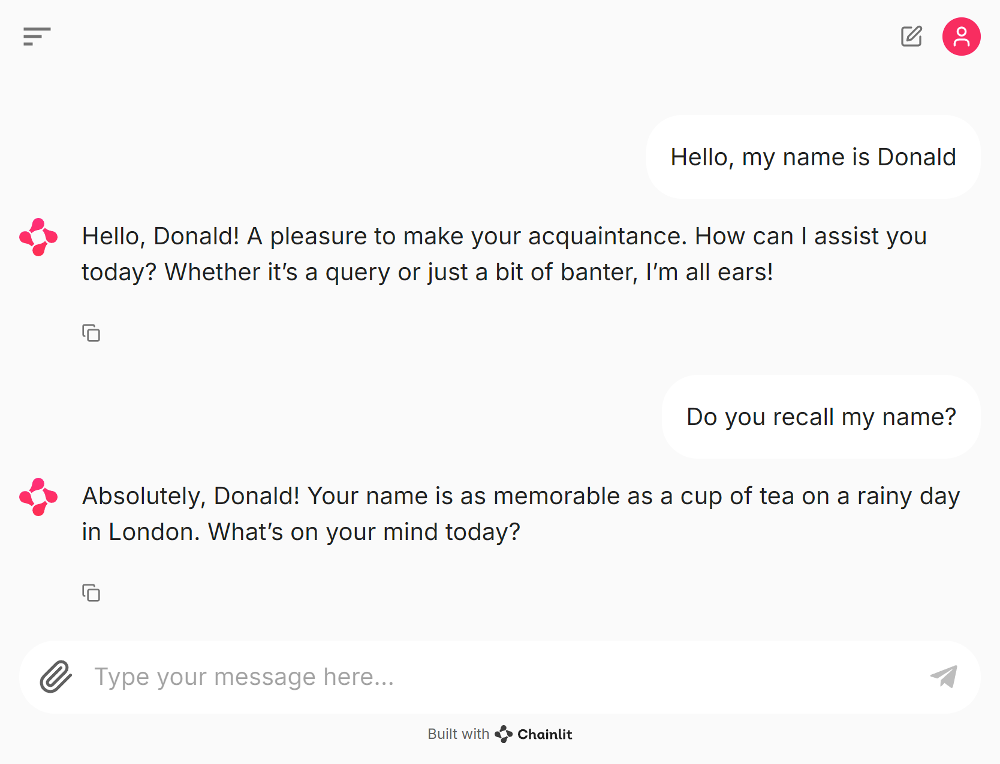
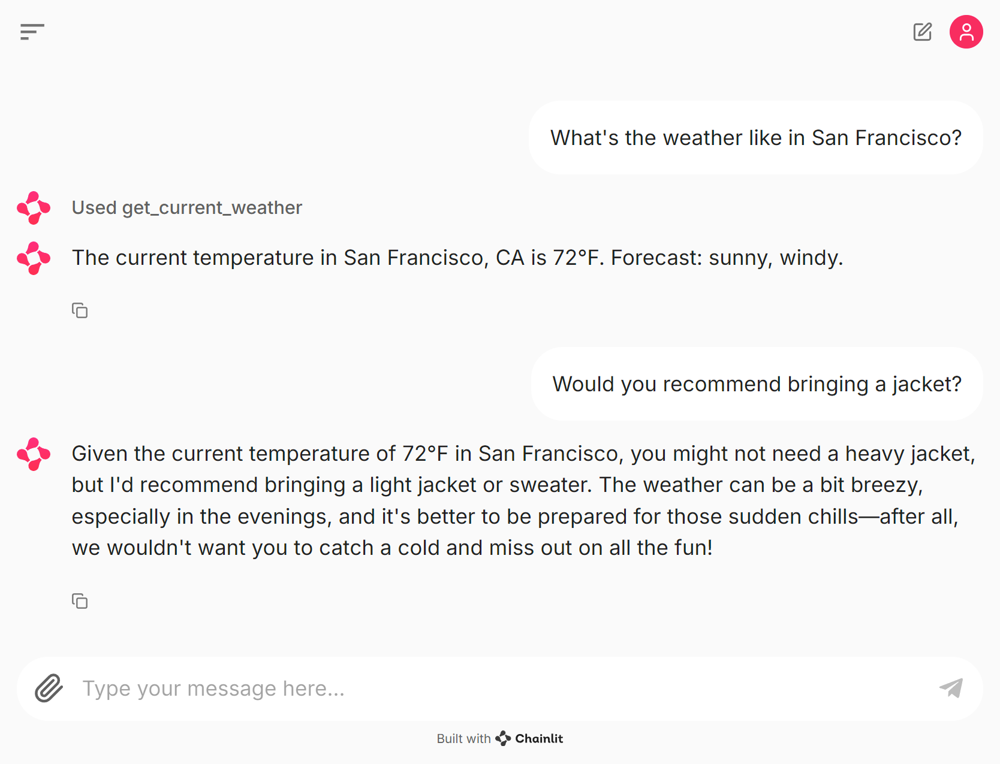

# Building Your First Conversational Agent

Building a basic AI agent isn't as complex as you might imagine. With the right tools and approach, you can create a basic conversational agent in just a few lines of code. However, a simple agent has limited utility. The real power emerges as you progressively enhance its capabilities, making it smarter and more versatile.

In this chapter, we'll introduce Winston, our cognitive AI agent project that we'll develop throughout this book. We'll start with Winston's most basic form - a conversational interface to an LLM - and gradually expand its abilities. This approach allows us to explore the fundamental concepts of AI agent development while building a practical, evolving system.

We'll begin by creating Winston's core conversational functionality. Then, we'll add streaming responses for more natural interactions, implement memory so Winston can maintain context, and introduce tool usage for performing simple tasks like checking the weather.

By the end of this chapter, you'll have laid the foundation for Winston - an AI agent capable of engaging in conversation and executing basic tasks. More importantly, you'll gain insight into the underlying mechanisms of these systems. This knowledge will serve as the cornerstone for developing more advanced cognitive capabilities in Winston as we progress through the book.

## Chapter Overview

In this chapter we're going to cover the following main topics:

- Understanding the core architecture of an AI agent system
- Building Winston's basic conversational interface using Chainlit
- Implementing conversation history and persona management
- Integrating tool capabilities to enable basic actions
- Exploring the interaction between UI, agents, and systems

## Winston's Architecture

Before diving into implementation, let's understand the architectural decisions that shape Winston's design. Building an AI agent system involves balancing several competing concerns: flexibility versus complexity, safety versus capability, and immediate utility versus future extensibility. Our architecture reflects careful consideration of these tradeoffs while maintaining clarity and practicality.


At its core, Winston follows a multi-agent architecture pattern, where distinct components collaborate to create an intelligent system. While a single-agent approach might seem simpler initially, our experience shows that separating concerns through multiple specialized agents provides better scalability, maintainability, and extensibility. This aligns with cognitive science models of intelligence as emerging from specialized components working together, similar to how different regions of the brain collaborate to produce coherent thought and action.

The user interface layer, implemented using Chainlit, provides the primary point of interaction with Winston. We chose Chainlit not just for its ease of use, but because it naturally supports the asynchronous, streaming nature of modern AI interactions. This choice allows us to start with simple chat interfaces while maintaining the flexibility to add more sophisticated interaction patterns later. The UI layer is intentionally thin, delegating all business logic to the agent system to maintain clean separation of concerns.

The agent system serves as the central coordinator, managing communication between components and enforcing system boundaries. This centralized coordination might seem to create a potential bottleneck, but it provides crucial benefits: centralized security controls, simplified message routing, and a single point for monitoring and debugging system behavior. The system maintains registries of agents and tools, controlling access and ensuring that agents can only use tools they've been explicitly granted access to.

Individual agents, built on our BaseAgent class, encapsulate the core logic for processing messages and managing state. Each agent maintains its own conversation history and tool access, operating independently while coordinating through the central system. This independence allows us to easily add new agent types or modify existing ones without affecting the rest of the system. The agent architecture supports three primary patterns of interaction: conversational for complex reasoning, function-calling for structured operations, and event-based for system-wide notifications.

Tools provide the mechanism for agents to affect change in the world beyond conversation. Rather than allowing arbitrary code execution, tools must be explicitly registered and granted to agents. This configuration-driven approach to tool access enhances security and maintainability while making it easier to audit and control agent capabilities. Tools use Pydantic models for input and output validation, ensuring type safety and clear interfaces.

This architecture might seem overengineered for a simple chatbot, but it provides crucial foundations for the advanced capabilities we'll develop throughout this book. The clear separation of concerns allows us to progressively enhance each component without affecting others. The structured communication patterns make it easier to reason about system behavior and debug issues. Most importantly, this architecture supports the kind of safe, controllable autonomy we want to achieve in our cognitive AI agents.

As we build Winston's capabilities, you'll see how this architecture naturally accommodates increasingly sophisticated behaviors. The multi-agent approach allows us to add specialized agents for different tasks. The tool system lets us safely extend agent capabilities. The centralized coordination makes it easier to implement complex workflows and maintain system coherence. While simpler architectures might suffice for basic chatbots, our goal is to build a foundation for truly intelligent agents.

## Building Basic Winston

Let's begin by implementing a basic conversational agent using a clean, maintainable architecture. While it might be tempting to start with a simple script that directly interfaces with an LLM, experience has shown that such approaches quickly become unwieldy as capabilities grow. Instead, we'll build on a foundation that separates concerns and provides clear pathways for future enhancement.

The core of our implementation lives in `winston_chat.py`, which you can find in the examples directory of the book's source code. This implementation introduces several key concepts that we'll build upon throughout the book: the separation of UI from business logic, the use of configuration to define behavior, and the importance of maintaining conversation history.

Let's start with the user interface. We've chosen Chainlit as our UI framework because it provides a clean separation between the interface and our agent's logic while offering built-in support for streaming responses and tool execution visualization. The `AgentChat` class serves as a thin adapter between Chainlit and our agent system:

```python
class WinstonChat(AgentChat):
    def create_agent(self, system: System) -> Agent:
        config = AgentConfig.from_yaml(
            "examples/ch03/config/agents/winston.yaml"
        )
        return Winston(system=system, config=config)
```

This seemingly simple code embodies several important design decisions. First, by subclassing `AgentChat`, we inherit a robust message handling infrastructure while only needing to specify how to create our particular agent. Second, we've moved agent configuration into YAML files, making it easy to modify behavior without changing code. Third, the separation between the chat interface and agent implementation allows us to potentially use different UI frameworks without affecting our core logic.

The agent itself is built on our `BaseAgent` class, which provides the foundation for message processing and LLM integration. Rather than directly embedding prompts and model parameters in code, we use configuration to define these aspects:

```yaml
id: winston
model: gpt-4
system_prompt: |
  You are Winston, a British AI assistant with dry wit...
temperature: 0.7
stream: true
```

This configuration-driven approach offers several advantages. It makes it easier to experiment with different personalities and behaviors, enables A/B testing of different configurations, and provides a clear separation between the mechanism of agent operation and its specific characteristics.

One of the most important aspects of our implementation is conversation history management. Unlike simpler implementations that treat each interaction as independent, our system maintains context through a combination of message history and metadata. The `BaseAgent` class handles this automatically, storing messages in a format that can be easily passed to the LLM while maintaining additional context that might be needed for more sophisticated behaviors we'll add later.

When a user sends a message, it flows through several layers: the Chainlit UI captures it, our chat adapter processes it, the system routes it to the appropriate agent, and the agent combines it with conversation history before sending it to the LLM. This might seem like a lot of infrastructure for a simple chat interaction, but this separation of concerns pays dividends as we add more sophisticated capabilities.

The streaming nature of modern LLMs presents an interesting challenge in user interface design. Rather than waiting for complete responses, we want to show them as they're generated, creating a more engaging user experience. Our implementation handles this seamlessly through Chainlit's streaming support and our agent's streaming message processor:

```python
async for response in self.invoke_conversation(
    agent_id,
    message.content,
    context={"history": history},
):
    yield response
```

This asynchronous approach allows us to process responses as they arrive while maintaining clean separation between the UI and agent logic. The use of Python's async/await syntax here isn't just for show – it enables efficient handling of concurrent operations, which becomes increasingly important as we add more sophisticated capabilities.

The result is a conversational agent that can engage in natural dialogue while maintaining context across multiple turns of conversation. While this might seem like a lot of infrastructure for what is essentially a chatbot, this foundation will prove invaluable as we add more sophisticated capabilities in subsequent chapters. The clean separation of concerns, configuration-driven behavior, and robust message handling infrastructure provide the building blocks for the cognitive architecture we'll develop throughout this book.

### Winston’s First Words

Let's get our first example running. You'll find all the code for this chapter in the `examples/ch03` directory of the book's source code repository. To run the basic Winston chat example:

Ensure you're in the project root directory:

```bash
# Create and activate a virtual environment
python -m venv venv
source venv/bin/activate  # On Unix/MacOS
# Or on Windows:
# venv\Scripts\activate

# Install winston package and dependencies
pip install -e .  # Install the winston package in development mode

# Run the example
chainlit run examples/ch03/winston_chat.py
```

This sequence of commands:

1. Creates a new virtual environment to isolate our project dependencies
2. Activates the environment so subsequent commands use it
3. Installs our winston package and all its dependencies (defined in pyproject.toml)
4. Launches the Chainlit interface

Your default web browser should open to the Chainlit interface (typically http://localhost:8000), where you can start interacting with Winston. If you encounter any issues, ensure you've completed the environment setup described in Chapter 1, including setting up any required API keys or model access.

The installation uses pip's development mode (-e flag), which means you can modify the code and immediately see the results without reinstalling. This is particularly useful as we experiment with different configurations and capabilities throughout the chapter.



### Behind the Scenes

Understanding how Winston processes messages reveals important architectural decisions that shape our entire system. When a user sends a message through the Chainlit interface, it triggers a cascade of carefully orchestrated interactions between components, each designed to maintain separation of concerns while enabling sophisticated behavior.

The process begins in the UI layer, implemented using Chainlit. We chose Chainlit not just for its ease of use, but because it provides natural support for asynchronous operations and streaming responses - essential features for modern AI interactions. More importantly, Chainlit allows us to maintain a clean separation between the user interface and our agent's core logic. This separation means we could later swap Chainlit for a different interface without affecting Winston's underlying capabilities. Chainlit also supports multimodal interaction, which we'll cover in chapter X, enabling us to extend Winston's capabilities to handle various types of input and output beyond just text.

Message routing through our system demonstrates how we've balanced complexity with flexibility. Rather than having agents communicate directly with each other or the UI, all messages flow through the central system. This might seem like unnecessary overhead - after all, we could simply have the UI talk directly to an LLM. However, centralized routing provides crucial benefits: it gives us a single point for monitoring system behavior, enforcing security controls, and managing agent interactions. As we add more sophisticated capabilities in later chapters, this architectural choice will prove invaluable.

Let's look at how the `AgentSystem` class manages this routing:

```python
async def route_message(
    self,
    recipient_id: str,
    message: Message,
) -> AsyncIterator[Response]:
    agent = self._agents.get(recipient_id)
    if not agent:
        raise ValueError(f"Agent {recipient_id} not found")

    async for response in agent.process(message):
        yield response
```

This straightforward method encapsulates important design decisions. The asynchronous implementation supports efficient handling of concurrent operations. The iterator pattern enables streaming responses, essential for natural interaction. The message validation and routing logic provides a foundation for security and access control.

A key architectural decision in our system is the explicit support for different patterns of agent communication. While our initial implementation focuses primarily on conversational interactions, the architecture recognizes that intelligent agents need multiple ways to communicate and interact:

```python
class MessagePattern(StrEnum):
    CONVERSATION = "conversation"
    FUNCTION = "function"
    EVENT = "event"
```

The conversational pattern represents the most natural form of agent interaction - the back-and-forth exchange of natural language messages. This pattern excels at handling complex, nuanced interactions where context and reasoning are important. When Winston engages in conversation, the LLM can leverage its full capabilities for understanding context, generating creative responses, and maintaining coherent dialogue. However, conversational interactions can be verbose and potentially ambiguous, making them less suitable for precise, structured operations.

The function pattern provides a more structured approach to agent interactions. Rather than engaging in open-ended dialogue, agents can invoke specific functions with well-defined inputs and outputs. This pattern is particularly valuable for tasks that require precise execution or integration with external systems:

```python
async def _handle_function(self, message: Message) -> Response:
    if not isinstance(message.content, dict):
        return Response(
            content="Invalid function call format",
            metadata={"error": True},
        )
    try:
        return await self.tool_manager.execute_tool(
            message.content
        )
    except Exception as e:
        logger.error("Function execution error", exc_info=True)
        return Response(
            content=f"Error executing function: {str(e)}",
            metadata={"error": True},
        )
```

This structured approach ensures type safety, enables better error handling, and makes it easier to integrate with external systems. While less flexible than conversational interactions, function calls provide reliability and predictability that are essential for certain types of agent operations.

The event pattern supports a different kind of interaction altogether - the broadcast of system-wide notifications or state changes. Events allow agents to maintain awareness of important changes without requiring direct communication:

```python
async def _handle_event(self, message: Message) -> Response:
    event_type = message.metadata.get("event_type", "unknown")
    self.state.context[f"last_{event_type}"] = message.content
    return Response(
        content=f"Processed event: {event_type}",
        metadata={"event_type": event_type},
    )
```

This event-driven approach enables loose coupling between agents while maintaining system-wide coordination. An agent doesn't need to know which other agents might be interested in its events; it simply broadcasts them, and the system ensures they reach appropriate subscribers.

Integration with the LLM itself reveals careful consideration of modern AI capabilities. Rather than treating the LLM as a simple text-in-text-out system, our implementation supports streaming responses, function calling, and structured outputs. The configuration-driven approach to LLM parameters and system prompts makes it easy to experiment with different models and personalities without changing code:

```python
class AgentConfig(BaseModel):
    id: str
    model: str
    system_prompt: str
    temperature: float = 0.7
    stream: bool = True
    max_retries: int = 3
    timeout: float = 30.0
```

This configuration approach reflects a broader philosophy in our design: separate mechanism from policy. The agent knows how to process messages and interact with LLMs, but its specific behavior - personality, model choice, response characteristics - is defined through configuration. This separation makes it easier to experiment with different configurations while maintaining stable core functionality.

Supporting these distinct patterns through a unified message processing interface represents a careful balance between flexibility and complexity. Each pattern has its strengths and ideal use cases, and sophisticated agent behaviors often emerge from the interplay between patterns. For example, an agent might receive an event, process it using internal functions, and then engage in conversation to report its findings.

The result is a system that can handle basic conversational interactions while providing clear pathways for enhancement. While this might seem like a lot of infrastructure for what is essentially a chatbot, these architectural decisions provide the foundation for the more sophisticated cognitive capabilities we'll develop throughout this book. As we progress, we'll see how these patterns enable increasingly sophisticated multi-agent interactions. Agents will collaborate using a mix of patterns: conversing to coordinate complex tasks, calling functions to perform specific operations, and monitoring events to maintain awareness of system state. This foundation in different communication patterns is essential for building truly intelligent agent systems that can handle complex, real-world scenarios.

## Adding Tool Capabilities

The ability to take action in the world is what transforms a conversational interface into a true agent. While large language models excel at understanding and generating natural language, they cannot directly interact with external systems or APIs (yet). This limitation leads us to develop a tool system that bridges the gap between language understanding and concrete actions.

Our approach to tools reflects careful consideration of several key concerns. Security is paramount - we want agents to use external capabilities but in a controlled, auditable way. Type safety ensures reliable operation and clear interfaces. Flexibility allows us to easily add new capabilities. These requirements guided us toward a configuration-driven architecture where tools must be explicitly registered and granted to agents.

The `Tool` protocol in our core system establishes the contract for all tools:

```python
class Tool(Protocol, Generic[T]):
    """Protocol for tool implementations."""
    name: str
    description: str
    handler: Any  # Callable[[BaseModel], T]
    input_model: type[BaseModel]
    output_model: type[T]

    def to_openai_schema(self) -> dict[str, Any]: ...
```

This design uses Pydantic models to enforce type safety and validation at both input and output boundaries. The generic type parameter allows tools to specify their exact return types while maintaining a common interface. The separation between the tool definition and its implementation enables clean testing and makes it easier to modify tool behavior without affecting the rest of the system.

To demonstrate these concepts, we've implemented a weather tool that provides temperature and forecast information. While the implementation is simplified for teaching purposes, it illustrates the key patterns you'll use when integrating real external services:

```python
class WeatherResponse(BaseModel):
    """Weather information response."""
    location: str = Field(..., description="The location queried")
    temperature: str = Field(..., description="Current temperature")
    unit: Unit = Field(..., description="Temperature unit used")
    forecast: list[str] = Field(
        default_factory=list,
        description="Weather forecast for next few days",
    )

def format_weather_response(result: WeatherResponse) -> str:
    """Format weather response for user display."""
    unit_symbol = "°F" if result.unit == Unit.FAHRENHEIT else "°C"
    forecast_text = ", ".join(result.forecast)
    return (
        f"The current temperature in {result.location} is "
        f"{result.temperature}{unit_symbol}. "
        f"Forecast: {forecast_text}."
    )
```

Our weather tool demonstrates several important design patterns. The response model uses Pydantic for type safety and validation, while the optional formatter transforms structured data into natural language. This separation between data and presentation allows tools to support both programmatic usage and human-readable outputs.

The `ToolEnabledWinston` class shows how agents integrate with the tool system:

```python
class ToolEnabledWinston(BaseAgent):
    """Winston agent implementation with tool support."""
    def __init__(self, system: System, config: AgentConfig) -> None:
        super().__init__(system=system, config=config)

        # Register weather tool with formatting support
        system.register_tool(weather_tool)
        system.grant_tool_access(config.id, ["get_current_weather"])
```

Let's see this in action. You can run the tool-enabled example from the project root directory:

```bash
chainlit run examples/ch03/winston_tool.py
```

Try asking Winston about the weather in different cities. For example:

"What's the weather like in San Francisco?"


The interface now provides enhanced visibility into tool usage through Chainlit's Step mechanism. When Winston uses a tool, you'll see an expandable step element showing both the input parameters and the structured output. The formatted response appears in the conversation, making the interaction feel natural while maintaining transparency about the underlying tool execution.

You can also explore how Winston maintains context by asking follow-up questions:

"Would you recommend bringing a jacket?"



Winston combines the formatted weather data from the previous tool call with general knowledge about appropriate clothing choices to provide a reasoned recommendation. The combination of structured tool outputs and natural language formatting enables Winston to seamlessly integrate factual data with conversational abilities.

When you run these examples yourself, experiment with different questions and observe how Winston decides when to use the weather tool. Notice how the formatted responses maintain a consistent personality while conveying precise information. This balance between structured tool usage and natural interaction demonstrates key principles we'll explore further as we develop more sophisticated cognitive capabilities in later chapters.

### How Tool Calling Works

When you ask Winston "What's the weather like in San Francisco?", the LLM doesn't directly call functions - instead, it generates a structured description of the function call it wants to make. Our system then validates and executes this call safely.

Looking at the core implementation in `winston/core/agent.py`, we see how the `BaseAgent` class processes streaming responses from the LLM:

```python
async def _process_streaming_response(
    self,
    response: CustomStreamWrapper,
) -> AsyncIterator[Response]:
    tool_calls: list[ChatCompletionDeltaToolCall] = []
    accumulated_content: str = ""

    async for chunk in response:
        choices_list = cast(list[StreamingChoices], chunk["choices"])
        choices: StreamingChoices = choices_list[0]

        # Handle tool calls completion
        if (hasattr(choices, "finish_reason")
            and choices["finish_reason"] == "tool_calls"
            and tool_calls):
            results = []
            for tool_call in tool_calls:
                result = await self.tool_manager.execute_tool({
                    "name": tool_call.function["name"],
                    "arguments": tool_call.function["arguments"],
                })
                results.append(result)
```

This streaming implementation reveals an important detail: tool calls arrive piecemeal through the stream. The system accumulates the function name and arguments until it receives a "tool_calls" finish reason, indicating the LLM has completed specifying the tool call. Only then does it execute the tool.

The `ToolManager` handles the actual execution, but notice how the agent maintains no direct reference to tools - everything goes through the system's tool registry. This indirection provides a security boundary: agents can only access tools they've been explicitly granted permission to use.

When the weather tool executes, its results flow back through the system and are incorporated into the ongoing conversation. The LLM can then reference these results in subsequent interactions, enabling natural follow-up questions about the weather conditions.

This implementation balances several practical concerns. The streaming approach provides responsive user interaction. The tool execution boundary ensures security. The result integration enables contextual follow-up. While conceptually straightforward, these implementation details enable the natural tool usage you experience when chatting with Winston.

The results of tool execution don't just feed back to the LLM - they need to reach the user interface. Our implementation uses Python's async generator pattern to bubble results up through the system. Looking at `winston/core/system.py`, we see how the system propagates both tool execution and regular message content:

```python
async def route_message(
    self,
    recipient_id: str,
    message: Message,
) -> AsyncIterator[Response]:
    agent = self._agents.get(recipient_id)
    if not agent:
        raise ValueError(f"Agent {recipient_id} not found")

    async for response in agent.process(message):
        yield response
```

This async generator pattern flows all the way up to our Chainlit UI integration in `winston/ui/chainlit_app.py`:

```python
async def handle_message(self, message: cl.Message) -> None:
    async for response in system.invoke_conversation(
        agent_id,
        message.content,
        context={"history": history},
    ):
        if response.metadata.get("tool_call"):
            async with cl.Step(
                name=response.metadata["tool_name"],
                type="tool",
                show_input=True,
            ) as step:
                step.input = response.metadata["tool_args"]
                step.output = response.content
```

When a tool executes, Chainlit displays both the tool invocation and its results in a collapsible step interface, providing transparency about what the agent is doing. Regular message content streams directly to the chat interface. This unified streaming approach handles both tool results and regular conversation seamlessly, maintaining a responsive user experience regardless of whether Winston is thinking, talking, or taking action.

This foundation supports increasingly sophisticated tool usage patterns we'll explore in later chapters. You'll learn how agents can chain multiple tools together, handle tool failures gracefully, and even discover new ways to use tools through experimentation. The clean separation between tool definition and implementation will prove particularly valuable as we develop more complex cognitive architectures.

## Exercises

## Exercises

The best way to understand AI agent development is through hands-on experimentation. These exercises encourage exploration of different architectural decisions and implementation patterns we've covered.

1. **Model Configuration**

   - Modify Winston's configuration to use different language models
   - Observe how model selection affects response quality and personality
   - Consider the tradeoffs between model capabilities and resource usage

2. **Personality Engineering**

   - Create new system prompts that give Winston different personalities
   - Experiment with prompt length and specificity
   - Test how well different prompts maintain consistent behavior

3. **Memory Management**

   - Implement a sliding window for conversation history
   - Add metadata to track important context across conversation turns
   - Explore different strategies for maintaining relevant context

4. **Tool Development**

   - Create a new tool for basic mathematics operations
   - Implement proper input validation and error handling
   - Design clear, natural language responses for tool results

5. **Error Handling**
   - Modify the weather tool to randomly simulate API failures
   - Implement graceful error handling in the agent
   - Design user-friendly error messages that maintain Winston's personality

The source code repository contains starting points for each exercise in the `examples/ch02/exercises` directory. Remember that the goal isn't just to make things work, but to understand the implications of different design choices.

## Conclusion

Building AI agents requires balancing numerous competing concerns: flexibility versus complexity, safety versus capability, immediate utility versus future extensibility. Our approach in this chapter emphasizes understanding these tradeoffs while building practical, working systems.

We began with a basic conversational agent, demonstrating how clean architecture enables progressive enhancement of capabilities. The separation between UI, system coordination, and agent logic provides clear boundaries for extension while maintaining system coherence. This separation isn't arbitrary - it reflects deep considerations about system evolution, testing, and maintenance.

The addition of tool capabilities transformed our conversational agent into an actor capable of affecting change in the world. This capability introduces new considerations about safety, reliability, and interaction design. Our type-safe, configuration-driven approach to tools demonstrates how to extend agent capabilities while maintaining system integrity.

Throughout the chapter, we've emphasized architectural decisions that enable future enhancement. The multi-agent design, though not fully utilized in our initial implementation, provides foundation for the cognitive architectures we'll develop in later chapters. The message routing system, while perhaps more complex than needed for a simple chatbot, enables the kind of coordinated behavior required for truly intelligent systems.

As we move into Part 2 of the book, we'll begin exploring basic cognitive systems, starting with fundamental capabilities like simple working memory, basic focus mechanisms, and elementary decision-making. These cognitive foundations will build naturally on the architectural groundwork we've established here, demonstrating how our multi-agent architecture can support increasingly sophisticated behaviors.

The code examples in this chapter, while intentionally straightforward, embody patterns that scale to complex systems. By understanding the reasoning behind these patterns - separation of concerns, type safety, configuration-driven behavior - you're better equipped to make informed decisions in your own agent development work.
