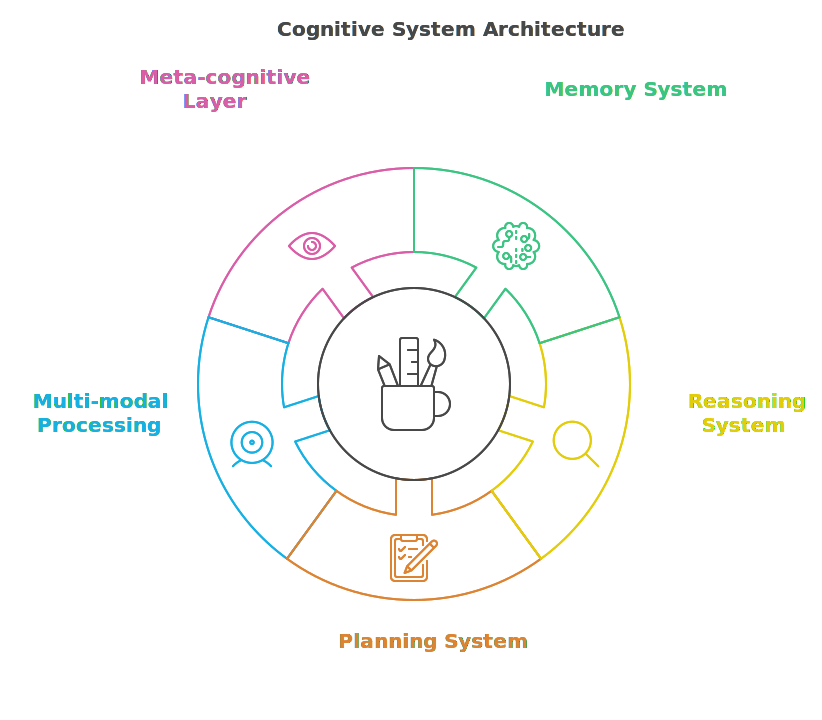
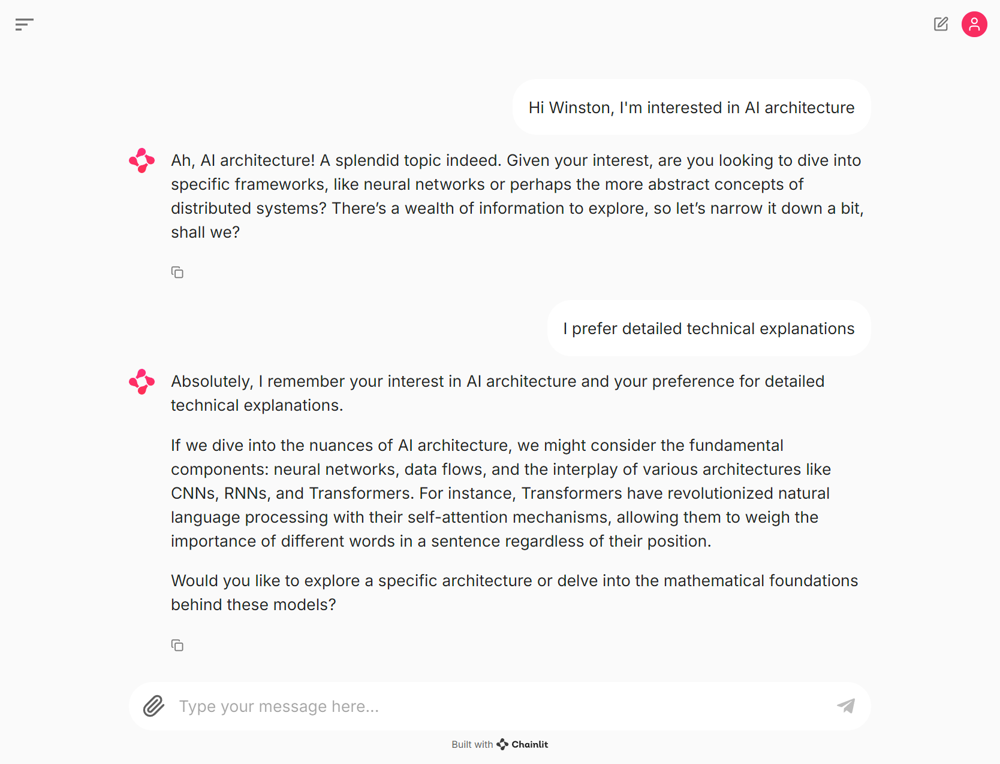
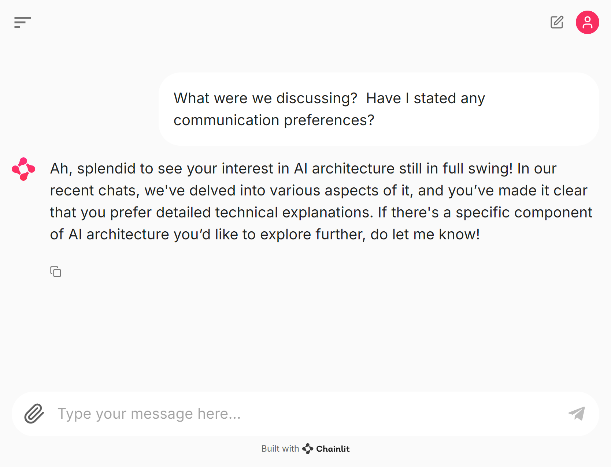
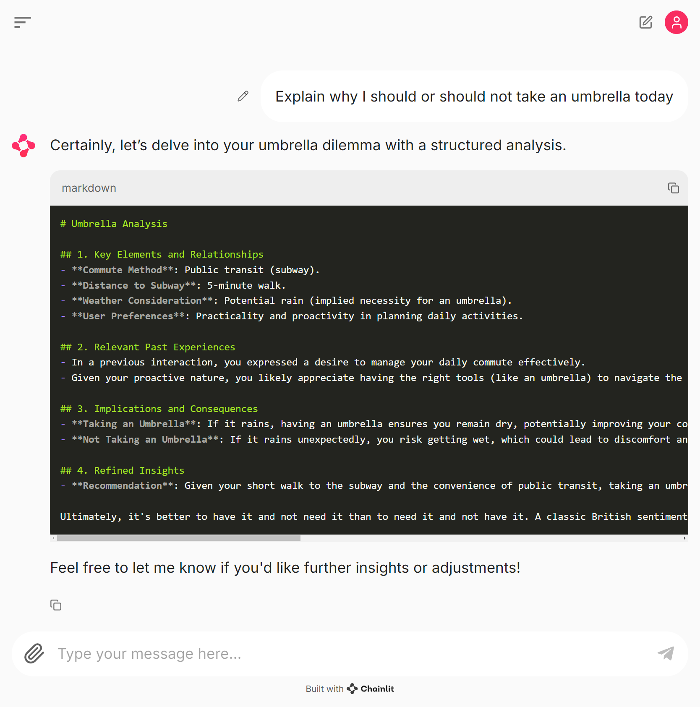
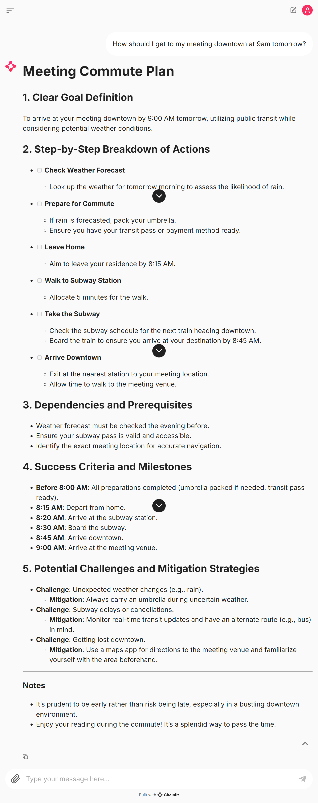
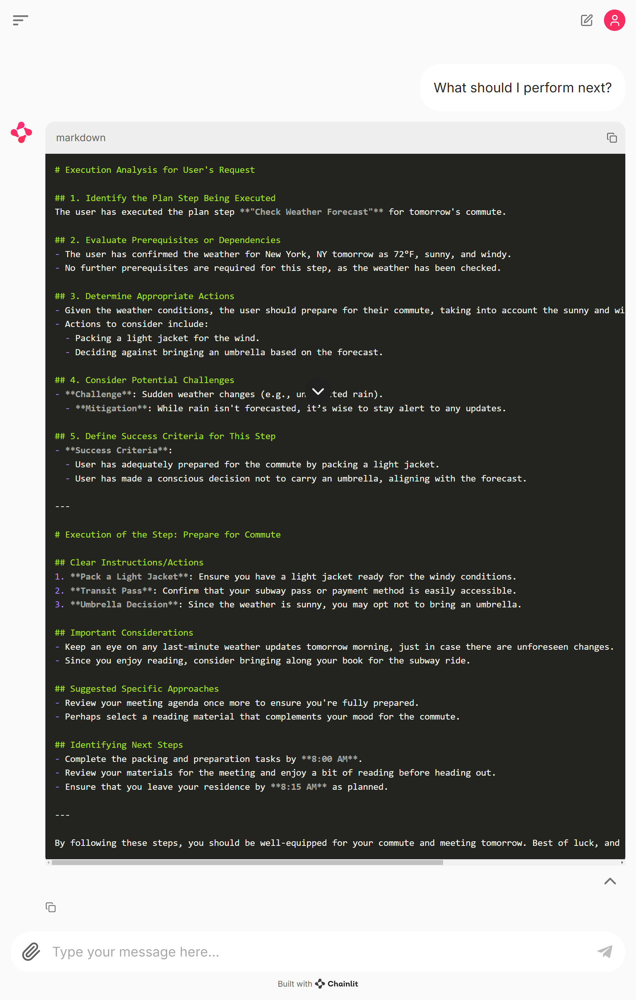
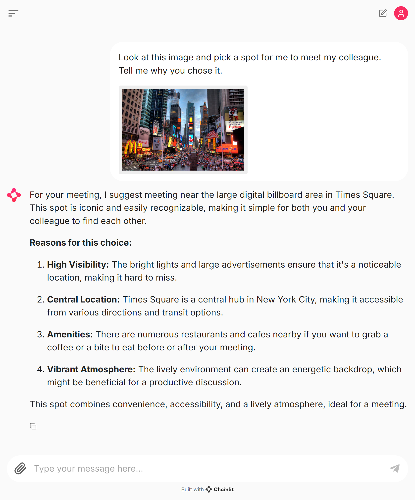

# Chapter 3: Cognitive Foundations

Creating an AI agent with genuine cognitive capabilities requires more than just adding features to a basic conversational system. We need to develop fundamental mechanisms for memory, reasoning, planning, and self-awareness that work together cohesively. While this might sound daunting, our cognitive workspace approach makes it surprisingly approachable.

In this chapter, we'll transform Winston from a simple conversational agent into a cognitive system with real understanding and learning abilities. We'll build on the foundation established in Chapter 2, introducing a unified architecture that enables sophisticated cognitive capabilities while maintaining implementation clarity and debuggability.

We'll begin by exploring Winston's cognitive architecture and its central workspace concept. Then we'll progressively add core cognitive capabilities: memory for maintaining context, reasoning for analyzing situations, planning for organizing actions, and meta-cognition for self-improvement. Throughout this process, we'll maintain architectural consistency while enabling increasingly sophisticated behaviors.

By the end of this chapter, you'll have evolved Winston into an agent with genuine cognitive capabilities - able to remember, reason, plan, and learn from experience. More importantly, you'll understand how these capabilities emerge naturally from our unified workspace approach. This understanding will prove invaluable as we develop even more advanced cognitive abilities in subsequent chapters.

In this chapter we're going to cover the following main topics:

- Implementing Winston's cognitive architecture and workspace system
- Building memory and attention through cognitive workspaces
- Developing reasoning capabilities through cognitive reflection
- Creating planning abilities through workspace orchestration
- Enabling multi-modal processing through unified representation
- Implementing meta-cognition through workspace monitoring

## Winston's cognitive architecture

The cognitive architecture developed in this chapter centers on a fundamental insight: modern language models excel at working with natural language descriptions and markdown-formatted text. Rather than imposing rigid structures or formal representations, we leverage these strengths through a unified cognitive workspace that serves as the foundation for memory, reasoning, planning, and meta-cognitive capabilities.



At the core of Winston's architecture lies the cognitive workspace - a markdown document that maintains the agent's mental state. This workspace provides sections for different aspects of cognition: user preferences, recent interactions, current context, and working memory. The WorkspaceManager handles persistence and updates of this workspace, allowing Winston to maintain context across sessions while keeping the implementation clean and debuggable.

Memory in this architecture emerges naturally from the workspace structure. Rather than building complex knowledge graphs or traditional databases, Winston maintains memories as markdown-formatted text that can be easily updated and referenced. This approach allows for flexible organization while working with rather than against the language model's natural capabilities for understanding and manipulating text.

Reasoning capabilities build upon this foundation through cognitive reflection. When Winston needs to analyze a situation, it creates explicit reasoning chains within the workspace, developing and refining thoughts through iteration. This process mirrors how humans often write out their thoughts to develop understanding, allowing Winston to break down complex problems and build sophisticated analyses while maintaining architectural simplicity.

Planning extends these capabilities into the future through workspace orchestration. Plans exist as structured markdown sections that track goals, steps, dependencies, and progress. This representation allows Winston to naturally modify plans as circumstances change, maintaining both the original intent and execution history. The integration with memory and reasoning enables plans to adapt based on past experiences and ongoing analysis.

Multi-modal processing maintains consistency with this approach by transforming different input types into descriptive representations within the workspace. Visual information, for example, becomes detailed textual descriptions that integrate naturally with other cognitive processes. This unified representation enables Winston to reason about and connect information from different modes without maintaining separate processing pipelines.

Meta-cognitive capabilities emerge through workspace monitoring. Winston maintains observations about its own performance and effectiveness as part of the workspace, allowing it to analyze and improve its behavior over time. This self-reflection creates a feedback loop where meta-cognitive insights influence future actions, enabling progressive refinement of cognitive strategies.

The power of this architecture lies in its unified nature. Different cognitive capabilities interact naturally through the shared workspace, creating emergent sophisticated behaviors while maintaining implementation clarity. The markdown format ensures human readability and easy debugging, while the consistent representation simplifies the addition of new capabilities.

This architecture might appear simple compared to traditional AI systems with their complex knowledge representations and formal reasoning engines. However, its strength comes from working with language model capabilities rather than forcing them into rigid structures. The cognitive workspace provides a foundation that supports both current functionality and future enhancement while remaining comprehensible and maintainable.

As we build more advanced capabilities in subsequent chapters, this architecture will prove its value. The workspace format accommodates increasingly sophisticated representations while maintaining backward compatibility. New cognitive capabilities integrate naturally through the shared workspace. The meta-cognitive layer enables continuous improvement through experience. These characteristics create a robust foundation for developing truly intelligent agent behaviors.

## Basic memory & attention through cognitive workspaces

The transition from a simple conversational agent to one with genuine cognitive capabilities requires careful consideration of how to represent and manage mental state. While traditional approaches often rely on structured databases or complex knowledge graphs, we've found that working with large language models demands a different paradigm. These models excel at understanding and manipulating natural language, suggesting an alternative approach that leverages their inherent capabilities rather than forcing them into rigid structures.

Our solution emerges from two key insights about modern language models. First, they demonstrate remarkable ability to work with markdown-formatted text, parsing and understanding both structure and content with high fidelity. Second, they excel at maintaining and updating context when that context is presented as a coherent document rather than fragmented data points. These observations led us to develop cognitive workspaces - markdown documents that serve as dynamic scratchpads for agent memory and attention.

Consider how human experts often work: they maintain notes, organize thoughts in documents, and use whiteboards to track context and develop ideas. Our cognitive workspace approach mirrors this natural process, providing agents with similar tools for managing their mental state. This approach offers several advantages over more traditional structured storage. It maintains flexibility while providing light organization through markdown's natural hierarchy. It remains human-readable and easily debuggable. Perhaps most importantly, it works with rather than against the language model's natural capabilities.

The core system provides workspace management capabilities through the WorkspaceManager class, which handles the persistence and manipulation of cognitive workspaces. This separation of concerns allows agents to focus on cognitive processing while the system manages the underlying workspace mechanics. The implementation in `src/winston/core/workspace.py` demonstrates this approach.

Let's take a look at the initialization of the workspace:

```python:src/winston/core/workspace.py
def initialize_workspace(self) -> None:
  if not self.workspace_path.exists():
    self.workspace_path.write_text(
      dedent(
        """
        # Cognitive Workspace

        ## User Preferences

        ## Recent Interactions

        ## Current Context

        ## Working Memory
        """
      ).strip()
    )
```

This initialization creates a clean, structured document that serves as the agent's cognitive foundation. We chose these specific sections based on cognitive science research about human memory organization, while keeping the structure flexible enough to evolve with the agent's needs. The markdown format provides natural hierarchy without imposing rigid constraints, allowing the workspace to grow organically as the agent learns and develops.

The `update_workspace` method handles the core logic for updating the workspace based on new information. This method takes a user message and an agent instance, then uses the agent's language model capabilities to update the workspace based on the new information.

The workhorse of the update operation is the prompt:

````markdown
Update the `Current Workspace` to incorporate the new information effectively.

# Steps

1. **Integrate Key Insights**: Extract critical insights and relationships from `Update Content` and integrate them into the existing workspace.
2. **Specific Updates**:
   - If `Message Type` is "Interaction": Update the relevant workspace sections, such as context and preferences.
   - For other types, create or append sections as necessary to reflect the new content appropriately (i.e., if it is new, retain all details as provided)
3. **Preserve Structure**: Maintain existing sections, formatting, and overall organization to ensure clarity and conciseness.

# Output Format

Provide the updated workspace in a clear and structured markdown format, maintaining existing layout and introducing necessary modifications or additions to incorporate new content.

# Examples

**Example 1**

- **Input**:

  - `msg_type`: "Interaction"
  - `content_format`: "User interacted with new features."
  - `workspace`: "## Existing Context..."

- **Output**:
  - `workspace`: "## Existing Context... \n\n### Updated Features...\n- User interacted with new features...\n"

(Note: realistic examples should include detailed content and integration reflecting the actual updates for clarity and completeness.)

Message Type: {msg_type}
Update Content:

```markdown
{content_format}
```

Current Workspace:

```markdown
{workspace}
```
````

This prompt will incorporate updates into the workspace based on the message type and content. If the message type is "Interaction", it will update the relevant sections, such as context and preferences. For other types, it will create or append sections as necessary to reflect the new content appropriately. We'll see how this works in practice in the next section.

Next, let's take a look at the MemoryWinston implementation in `examples/ch03/winston_memory.py` which demonstrates how to extend the BaseAgent with workspace capabilities.

The initialization method receives a system instance and the paths for the agent, which it passes to the base class, then creates a workspace manager instance:

```python:examples/ch03/winston_memory.py
class MemoryWinston(BaseAgent):
    """Winston with basic cognitive capabilities."""

    def __init__(
        self,
        system: System,
        config: AgentConfig,
        paths: AgentPaths,
    ) -> None:
        super().__init__(system, config, paths)

        # Get workspace manager from system
        self.workspace_manager = system.get_workspace_manager(
            agent_id=self.id,
        )
```

The `process` method updates the workspace based on the user's message, then generates a response using the updated workspace context:

```python:examples/ch03/winston_memory.py
async def process(
  self, message: Message
) -> AsyncIterator[Response]:
  # Update workspace using the workspace manager
  updated_workspace = await self.workspace_manager.update_workspace(
    message,
    self,
  )

  # Generate response using workspace context
  response_prompt = f"""
    Given this user message:
    {message.content}

    And your cognitive workspace:
    {updated_workspace}

    Provide a response that:
    1. Demonstrates awareness of previous interactions
    2. Shows understanding of user preferences
    3. Maintains conversation context
    4. Is helpful and engaging
    """

  async for response in super().process(
    Message(
      content=response_prompt,
      context={"workspace": updated_workspace},
    )
  ):
    yield response
```

The workspace management system is integrated into the core System interface through the AgentSystem implementation in `src/winston/core/system.py`:

```python:src/winston/core/system.py
def get_workspace_manager(
    self,
    agent_id: str,
) -> WorkspaceManager:
    """Get workspace manager for an agent."""
    if agent_id not in self._workspaces:
        agent = self._agents.get(agent_id)
        if not agent:
            raise ValueError(f"Agent {agent_id} not found")

        workspace_path = (
            agent.paths.workspaces / f"{agent_id}.md"
        )
        workspace_path.parent.mkdir(
            parents=True, exist_ok=True
        )
        self._workspaces[agent_id] = WorkspaceManager(
            workspace_path
        )
    return self._workspaces[agent_id]
```

The cognitive workspace approach transforms Winston from a stateless chatbot into an agent with genuine memory and learning capabilities. Let's examine how this plays out in practice through an interaction:


_Figure 3.2: Winston learns about the user's interests and preferences_

In this initial interaction, Winston learns about the user's commuting habits. The WorkspaceManager maintains this information in the cognitive workspace:

```markdown
# Cognitive Workspace

## User Preferences

- User prefers public transit for commuting to work.
- User enjoys reading.

## Recent Interactions

- User mentioned their commuting habits, specifically using public transit.
- User lives about a 5-minute walk from the subway station.

## Current Context

- User utilizes public transit as their primary mode of transportation to work.
- User's proximity to the subway station suggests convenience in their daily commute.

## Working Memory

- User's commuting method is noted for future reference.
- User's interest in reading is acknowledged for potential future discussions.
```

(Your version of the workspace will look different, but it will have the same structure.)

Even after completely closing and restarting the application, Winston maintains awareness of these preferences and past interactions. The WorkspaceManager handles the persistence of this information, allowing the agent to build genuine long-term understanding of each user rather than starting fresh each session.


_Figure 3.3: Winston maintains context even after a complete restart_

The WorkspaceManager's design offers practical advantages beyond just maintaining context. The markdown format makes it easy to inspect and modify the cognitive workspace directly, enabling manual corrections or updates when needed. The human-readable nature of the storage also makes it straightforward to debug issues or understand how Winston's understanding evolves over time.

By incorporating workspace management into the core system, we establish a foundation that future cognitive capabilities can build upon. The WorkspaceManager provides a consistent interface for workspace operations while maintaining the flexibility that makes our approach effective. This architectural decision separates the mechanics of workspace management from the cognitive processing that agents perform, creating a cleaner and more maintainable system.

This implementation represents our first step toward true cognitive capabilities. While simple in concept, it provides a foundation for more sophisticated memory and attention mechanisms we'll develop in later chapters. The cognitive workspace approach will prove particularly valuable as we add reasoning capabilities, as it provides a natural medium for tracking chains of thought and maintaining context across multiple reasoning steps.

## Basic reasoning through cognitive reflection

The addition of memory through cognitive workspaces enables Winston to maintain context, but memory alone does not create understanding. True cognitive capabilities require the ability to analyze, interpret, and draw conclusions from stored information. Reasoning in AI systems serves the purpose of deriving conclusions from available information, understanding relationships, and making informed decisions based on those insights. It allows AI to navigate uncertainty, draw inferences, and adapt to new situations, which is distinct from planning. Planning typically involves formulating a sequence of actions to achieve a specific goal, often relying on predefined rules or algorithms. While traditional approaches to AI reasoning often involve rule engines or formal logic systems, our experience with large language models suggests an alternative approach that builds on their natural ability to develop and articulate chains of thought.

When humans engage in complex reasoning, we often write out our thoughts, review them, refine them, and build upon previous insights. This process of cognitive reflection allows us to break down complex problems, examine our assumptions, and develop sophisticated understanding through iteration. Modern language models demonstrate similar capabilities when given space to "think through" problems step by step, suggesting an approach to reasoning that extends our cognitive workspace concept.

A fundamental question in implementing reasoning capabilities is determining when to engage in deeper analysis. For this initial implementation, we've chosen a straightforward trigger-based approach, looking for specific linguistic patterns that suggest analytical needs. The ReasoningWinston implementation (`examples/ch03/winston_reasoning.py`) demonstrates this through explicit detection:

```python:examples/ch03/winston_reasoning.py
needs_analysis = any(
    trigger in message.content.lower()
    for trigger in [
        "analyze",
        "understand",
        "explain why",
        "what's causing",
        "help me understand",
        "struggling with",
        "having trouble",
    ]
)
```

This simple pattern matching represents a deliberate architectural choice. While more sophisticated intent classification systems exist, starting with explicit triggers allows us to establish and validate our basic reasoning architecture before adding complexity. Future chapters will explore more nuanced approaches to detecting analytical needs, including contextual analysis and learned patterns, but this foundation lets us focus on the core reasoning mechanisms.

When analysis is needed, Winston engages its analytical capabilities through a structured process:

```python:examples/ch03/winston_reasoning.py
async def analyze_situation(
    self,
    message: Message,
) -> AsyncIterator[Response]:
    workspace = await self.workspace_manager.update_workspace(
        message,
        self,
    )

    analysis_prompt = f"""
        Analyze this situation:
        {message.content}

        Using the context from your workspace:
        {workspace}

        Develop a detailed analysis through these steps:
        1. Identify key elements and relationships
        2. Connect with relevant past experiences
        3. Consider implications and consequences
        4. Refine initial insights

        Structure your analysis clearly in markdown format.
        """

    # Stream the analysis response
    accumulated_analysis = ""
    async for response in self.generate_streaming_response(
        Message(
            content=analysis_prompt,
            metadata={"type": "Analysis Request"},
        ),
    ):
        accumulated_analysis += response.content
        yield response

    # Update workspace with the complete analysis
    _ = await self.workspace_manager.update_workspace(
        Message(
            content=accumulated_analysis,
            metadata={"type": "Analysis Result"},
        ),
        self,
    )
```

The analysis process integrates with the cognitive workspace, allowing Winston to reference past experiences and context while developing new insights. This integration proves particularly valuable when analyzing complex situations that connect to previous interactions or require understanding of user preferences and patterns.

Consider how this plays out in practice. When a user seeks to understand any complex situation - whether it's analyzing market trends, debugging code, planning a vacation, or even deciding what to cook for dinner - Winston first determines if analysis is needed through its trigger detection. Upon recognizing an analytical need, it engages its reasoning capabilities, drawing on workspace context to develop a structured understanding. The resulting analysis becomes part of the workspace, available for future reference and refinement.

This approach to reasoning differs significantly from traditional expert systems or rule-based approaches. Rather than attempting to encode all possible analytical patterns, we leverage the language model's inherent ability to develop coherent analytical narratives. The structured prompting guides this process while maintaining flexibility to handle diverse situations.

The integration of reasoning with memory creates particularly powerful combinations. When analyzing situations, Winston can draw on both general knowledge and specific memories of past interactions. This context enriches the reasoning process, enabling more personalized and practical insights. Similarly, the conclusions from reasoning processes become part of the workspace's memory, available for future reference and refinement.

Let's see how this reasoning process works through a concrete example:


_Figure 3.4: Winston analyzes a user'schallenges_

In this interaction, the user is asking for advice on whether to take an umbrella today. (I seeded the `winston_reason.md` workspace with the `winston_memory.md` workspace to start.) The resulting workspace captures not just conclusions but the analytical process itself, incorporating user preferences and past experiences:

```markdown
# Cognitive Workspace

## User Preferences

- User prefers public transit for commuting to work.
- User enjoys reading.
- User values practicality and proactivity in planning daily activities.

## Recent Interactions

- User mentioned their commuting habits, specifically using public transit.
- User lives about a 5-minute walk from the subway station.
- User inquired about their typical commute to work.
- User asked for advice on whether to take an umbrella today.
- User requested an explanation regarding the necessity of an umbrella.
- User expressed a desire to manage their daily commute effectively.

## Current Context

- User utilizes public transit as their primary mode of transportation to work.
- User's proximity to the subway station suggests convenience in their daily commute.
- User's commute is likely consistent, given their established routine.
- User is considering weather conditions and their impact on daily activities.
- User is actively seeking practical advice related to weather, indicating a proactive approach to planning.
- User's potential need for an umbrella reflects their awareness of the unpredictable British weather.

## Working Memory

- User's commuting method is noted for future reference.
- User's interest in reading is acknowledged for potential future discussions.
- User's inquiry about their commute indicates a reflective consideration of their daily habits.
- User's question about the umbrella suggests a practical concern for daily weather conditions.
- User's latest interaction reflects an interest in understanding the implications of weather on their day.
- User's proactive nature indicates a preference for being prepared for unexpected situations.

## Umbrella Analysis

- **Commute Method**: Public transit (subway).
- **Distance to Subway**: 5-minute walk.
- **Weather Consideration**: Potential rain (implied necessity for an umbrella).
- **Recommendation**: Given the short walk to the subway and the convenience of public transit, taking an umbrella is advisable if rain is in the forecast. This will help maintain comfort while reading during the commute and avoid the discomfort of getting wet.

Ultimately, it's better to have it and not need it than to need it and not have it. A classic British sentiment, wouldn't you agree?
```

While this example demonstrates basic reasoning capabilities, it lays the groundwork for more sophisticated features. In future iterations, Winston will evolve beyond analysis to take concrete actions based on its reasoning - for instance, checking real-time weather data to provide more actionable umbrella advice. This implementation marks an important transition from an agent that simply recalls information to one that can analyze and understand complex situations. Though our current trigger-based approach to initiating analysis is straightforward, it provides a foundation for more sophisticated detection mechanisms we'll explore in later chapters. The success of this approach reinforces our fundamental design philosophy: working with language model strengths rather than imposing artificial constraints.

## Basic planning through workspace orchestration

Planning represents a natural evolution of reasoning capabilities. While reasoning allows Winston to analyze and understand situations, planning extends this ability into the future, organizing potential actions and tracking their execution. Our approach to planning maintains consistency with our cognitive workspace philosophy, treating plans not as rigid data structures but as living documents that evolve through interaction and reflection.

The traditional approach to AI planning often involves formal representations like PDDL (Planning Domain Definition Language) or complex hierarchical task networks. These approaches excel in domains with clear, well-defined actions and goals but prove brittle when dealing with the ambiguous, open-ended requests that characterize human interaction. Our experience with language models suggests an alternative approach: representing plans as structured narrative within the cognitive workspace.

This narrative approach to planning aligns with how humans naturally create and modify plans. Consider how we might plan a project on paper - we write out goals, break them into steps, note dependencies, and adjust our plans as circumstances change. The cognitive workspace enables Winston to work similarly, maintaining plans as markdown sections that can be readily updated and refined.

The implementation in `examples/ch03/winston_plan.py` demonstrates this through explicit detection of planning needs:

```python
needs_planning = any(
    trigger in message.content.lower()
    for trigger in [
        "plan",
        "organize",
        "schedule",
        "steps to",
        "how should i",
        "what's the best way to",
        "help me figure out how to",
    ]
)
```

When planning is needed, Winston engages its planning capabilities through a structured process:

```python
async def create_plan(
    self,
    message: Message,
) -> AsyncIterator[Response]:
    workspace = await self.workspace_manager.update_workspace(
        message,
        self,
    )

    planning_prompt = f"""
        Create a detailed plan for this request:
        {message.content}

        Using the context from your workspace:
        {workspace}

        Develop a comprehensive plan that includes:
        1. Clear goal definition
        2. Step-by-step breakdown of actions
        3. Dependencies and prerequisites
        4. Success criteria and milestones
        5. Potential challenges and mitigation strategies

        Structure the plan clearly in markdown format.
        """

    # Stream the planning response and update workspace
    accumulated_plan = ""
    async for response in self.generate_streaming_response(
        Message(
            content=planning_prompt,
            metadata={"type": "Planning Request"},
        ),
    ):
        accumulated_plan += response.content
        yield response

    # Update workspace with the complete plan
    _ = await self.workspace_manager.update_workspace(
      Message(
        content=accumulated_plan,
        metadata={"type": "New Plan"},
      ),
      self,
    )
```

The plan becomes part of the cognitive workspace, allowing Winston to track and update progress. Consider this example interaction:


_Figure 3.5: Winston creates a plan_

In this interaction, the user asks: "How should I get to my meeting downtown at 9am tomorrow?"

The resulting workspace captures both the plan and its context:

```markdown
# Cognitive Workspace

## User Preferences

- User prefers public transit for commuting to work.
- User enjoys reading.
- User values practicality and proactivity in planning daily activities.

## Recent Interactions

- User mentioned their commuting habits, specifically using public transit.
- User lives about a 5-minute walk from the subway station.
- User inquired about their typical commute to work.
- User asked for advice on whether to take an umbrella today.
- User requested an explanation regarding the necessity of an umbrella.
- User expressed a desire to manage their daily commute effectively.
- User inquired about getting to a meeting downtown at 9am tomorrow.
- User has outlined a detailed meeting commute plan.

## Current Context

- User utilizes public transit as their primary mode of transportation to work.
- User's proximity to the subway station suggests convenience in their daily commute.
- User's commute is likely consistent, given their established routine.
- User is considering weather conditions and their impact on daily activities.
- User is actively seeking practical advice related to weather, indicating a proactive approach to planning.
- User's potential need for an umbrella reflects their awareness of the unpredictable British weather.
- User has a meeting downtown at 9am tomorrow, suggesting an immediate need for effective route planning.
- User has a clear plan for their commute, detailing steps to ensure timely arrival.

## Working Memory

- User's commuting method is noted for future reference.
- User's interest in reading is acknowledged for potential future discussions.
- User's inquiry about their commute indicates a reflective consideration of their daily habits.
- User's question about the umbrella suggests a practical concern for daily weather conditions.
- User's latest interaction reflects an interest in understanding the implications of weather on their day.
- User's proactive nature indicates a preference for being prepared for unexpected situations.
- User's upcoming meeting adds urgency to their need for planning their route.
- User's request for directions to their meeting downtown further emphasizes their need for practical guidance.

## Meeting Commute Plan

### 1. Clear Goal Definition

To arrive at your meeting downtown by 9:00 AM tomorrow, utilizing public transit while considering potential weather conditions.

### 2. Step-by-Step Breakdown of Actions

- [ ] **Check Weather Forecast**

  - Look up the weather for tomorrow morning to assess the likelihood of rain.

- [ ] **Prepare for Commute**

  - If rain is forecasted, pack your umbrella.
  - Ensure you have your transit pass or payment method ready.

- [ ] **Leave Home**

  - Aim to leave your residence by 8:15 AM.

- [ ] **Walk to Subway Station**

  - Allocate 5 minutes for the walk.

- [ ] **Take the Subway**

  - Check the subway schedule for the next train heading downtown.
  - Board the train to ensure you arrive at your destination by 8:45 AM.

- [ ] **Arrive Downtown**
  - Exit at the nearest station to your meeting location.
  - Allow time to walk to the meeting venue.

### 3. Dependencies and Prerequisites

- Weather forecast must be checked the evening before.
- Ensure your subway pass is valid and accessible.
- Identify the exact meeting location for accurate navigation.

### 4. Success Criteria and Milestones

- **Before 8:00 AM**: All preparations completed (umbrella packed if needed, transit pass ready).
- **8:15 AM**: Depart from home.
- **8:20 AM**: Arrive at the subway station.
- **8:30 AM**: Board the subway.
- **8:45 AM**: Arrive downtown.
- **9:00 AM**: Arrive at the meeting venue.

### 5. Potential Challenges and Mitigation Strategies

- **Challenge**: Unexpected weather changes (e.g., rain).

  - **Mitigation**: Always carry an umbrella during uncertain weather.

- **Challenge**: Subway delays or cancellations.

  - **Mitigation**: Monitor real-time transit updates and have an alternate route (e.g., bus) in mind.

- **Challenge**: Getting lost downtown.
  - **Mitigation**: Use a maps app for directions to the meeting venue and familiarize yourself with the area beforehand.

---

### Notes

- It’s prudent to be early rather than risk being late, especially in a bustling downtown environment.
- Enjoy your reading during the commute! It’s a splendid way to pass the time.

## Umbrella Analysis

- **Commute Method**: Public transit (subway).
- **Distance to Subway**: 5-minute walk.
- **Weather Consideration**: Potential rain (implied necessity for an umbrella).
- **Recommendation**: Given the short walk to the subway and the convenience of public transit, taking an umbrella is advisable if rain is in the forecast. This will help maintain comfort while reading during the commute and avoid the discomfort of getting wet.

Ultimately, it's better to have it and not need it than to need it and not have it. A classic British sentiment, wouldn't you agree?
```

Plan execution is handled through explicit detection and structured processing:

```python
is_execution = any(
    trigger in message.content.lower()
    for trigger in [
        "execute",
        "start",
        "begin",
        "do",
        "implement",
        "carry out",
        "perform",
        "complete step",
    ]
)

async def execute_plan_step(
  self,
  message: Message,
) -> AsyncIterator[Response]:
  """Execute a step in the current plan."""
  # Get current workspace state
  workspace = (
    await self.workspace_manager.update_workspace(
      message,
      self,
    )
  )

  # Generate execution analysis and updates
  execution_prompt = dedent(
    f"""
          Regarding this execution request:
          {message.content}

          And the current workspace state:
          {workspace}

          Analyze the execution request and:
          1. Identify which plan step is being executed
          2. Evaluate any prerequisites or dependencies
          3. Determine appropriate actions
          4. Consider potential challenges
          5. Define success criteria for this step

          Then execute the step by:
          1. Providing clear instructions or actions
          2. Noting any important considerations
          3. Suggesting specific approaches
          4. Identifying next steps

          Structure your response in markdown format.
          """
  ).strip()

  # Stream the execution response
  accumulated_execution = ""
  async for (
    response
  ) in self.generate_streaming_response(
    Message(
      content=execution_prompt,
      metadata={"type": "Plan Execution Request"},
    ),
  ):
    accumulated_execution += response.content
    yield response

  # Update workspace with execution results
  _ = await self.workspace_manager.update_workspace(
    Message(
      content=accumulated_execution,
      metadata={"type": "Plan Step Executed"},
    ),
    self,
  )
```

In our commuting scenario, the user checks and reports the weather forecast (in the future, Winston will use his tools to check the weather automatically) and then asks what to do next:


_Figure 3.6: Winston executes a plan step_

The updated workspace now includes the execution of the plan step:

```markdown
# Cognitive Workspace

...

### 2. Step-by-Step Breakdown of Actions

- [x] **Check Weather Forecast**

  - Confirmed that the weather is sunny and windy for tomorrow.

- [x] **Prepare for Commute**

  - Pack a light jacket for the wind.
  - Ensure you have your transit pass or payment method ready.
  - Given the forecast, you may opt not to bring an umbrella.

- [ ] **Leave Home**

  - Aim to leave your residence by 8:15 AM.
    ...
```

The implementation of planning capabilities transforms Winston from an agent that analyzes current situations into one that organizes and tracks future actions. The integration with the cognitive workspace ensures plans remain accessible and updatable, while structured prompting guides the creation of clear, actionable steps. This approach proves particularly valuable when handling uncertainty or partial success - rather than treating plan steps as binary outcomes, Winston maintains nuanced understanding of progress and adapts accordingly.

The combination of planning with memory and reasoning enables sophisticated behaviors. When creating or modifying plans, Winston draws on remembered preferences, past experiences, and previous analytical insights. This context enriches the planning process, leading to more personalized and practical plans. The reasoning system can examine plan progress and suggest adaptations, creating a natural flow between understanding situations and organizing responses.

Our approach to planning through workspace orchestration demonstrates the value of working with language model capabilities. By representing plans as structured narrative rather than formal constructs, we enable Winston to handle the ambiguity inherent in real-world planning while maintaining systematic organization. This foundation supports both current functionality and future enhancement while remaining comprehensible and maintainable.

## Basic multi-modal processing through unified representation

The addition of multi-modal capabilities presents unique challenges for cognitive architectures. Traditional approaches often treat different input modes as separate streams, maintaining distinct processing pipelines and data structures for each mode. This separation, while conceptually clean, creates artificial boundaries that can impede the natural integration of information from different sources. Our experience with large language models suggests an alternative approach: representing all modes of input within the unified framework of our cognitive workspace.

Modern language models demonstrate remarkable ability to understand and reason about different types of information when that information is presented in natural language form. This observation leads us to extend our cognitive workspace approach to handle multi-modal input through descriptive representation. Rather than maintaining separate structures for different modes, we represent all inputs as markdown content, using rich descriptions to capture the essential characteristics of non-textual inputs.

At the core, `src/core/vision.py` provides utilities for handling image data, including conversion of images to base64 format (`image_to_base64`) and creation of vision-model-compatible message formats (`create_vision_messages`). This encapsulation keeps the image handling logic centralized and separates the concerns of image processing from the cognitive processing.

The `Agent` protocol and `BaseAgent` implementation extend this foundation by defining and implementing vision-specific methods. These include both streaming and non-streaming variants for vision processing, allowing agents to generate either complete descriptions (`generate_vision_response`) or progressive observations of visual input directly to the user (`generate_streaming_vision_response`). These methods mirror the existing `generate_streaming_response` and `generate_response` methods, but tailored to the vision model.

Chainlit's interface supports uploading images, which it represents as `cl.Image` elements. The `AgentChat` class detects these elements and enriches the message metadata with the image path, which is then used in the `process` method (below) to update the workspace with the image description:

```python
# In AgentChat.handle_message
metadata = {"history": history}
if message.elements and len(message.elements) > 0:
    image = message.elements[0]
    if isinstance(image, cl.Image):
        metadata["image_path"] = image.path
```

When an image is uploaded, it is processed and its description is integrated into the workspace alongside other cognitive content. This allows Winston to maintain rich connections between visual and textual information. For example, if a user uploads an image of their workspace and asks about organization suggestions, the workspace might contain:

The implementation in `examples/ch03/winston_multimodal.py` demonstrates how this approach all comes together. When Winston receives an image, it first generates a detailed description of that image and integrates this description into its workspace:

```python
async def process(
  self,
  message: Message,
) -> AsyncIterator[Response]:
  """Process an incoming message."""
  # First update workspace with new information
  updated_workspace = await self.workspace_manager.update_workspace(
    message,
    self,
  )

  # Handle image analysis if present
  if "image_path" in message.metadata:
    # Accumulate the complete vision response
    accumulated_content = []
    async for response in self.generate_streaming_vision_response(
      message.content,
      message.metadata["image_path"],
    ):
      accumulated_content.append(response.content)
      yield response

    # Update workspace with complete vision observation
    if accumulated_content:
      await self.workspace_manager.update_workspace(
        Message(
          content="".join(accumulated_content),
          metadata={"type": "Visual Observation"},
        ),
        self,
      )
    return
```

Continuing from our previous transportation example, let's see how this appears in practice:


_Figure 3.7: Winston processes visual input_

Here, we are asking Winston to examine a photo of Times Square and pick a spot to meet our colleague, asking him to also provide a rationale for his choice. The results have been integrated into the workspace:

```markdown
...

## Current Context

- Discussion around commuting habits and reading preferences.
- Consideration of suitable meeting locations based on user’s commuting preferences, particularly noting the advantages of Times Square.

### Updated Insight

- The user is actively seeking recommendations for meeting spots and values the reasoning behind such choices.
- Suggested meeting location: the large digital billboard area in Times Square.
  - **Reasons for this choice**:
    1. **High Visibility:** Bright lights and large ads make it a noticeable location.
    2. **Central Location:** Accessible from various directions and transit options.
    3. **Amenities:** Numerous nearby restaurants and cafes for a coffee or bite to eat.
    4. **Vibrant Atmosphere:** Energetic backdrop conducive to productive discussions.

## Working Memory

- The image shows a text-based conversation from a chat interface, discussing commuting with a friendly and inquisitive tone. It invites the user to share more about their reading habits or commute experiences.
- User is seeking advice on meeting locations, indicating a blend of professional and social considerations in their interactions.
- **Updated Insight**: Times Square is recognized as a dynamic and convenient spot for meetings, offering a vibrant atmosphere, accessibility, and networking opportunities, aligning with the user’s preferences for lively and convenient meeting settings.
- User has requested specific reasoning for meeting location choices, indicating a desire for thoughtful and contextual recommendations.
```

The power of this unified representation becomes apparent when Winston needs to reason about complex situations involving multiple modes of input. Rather than maintaining separate reasoning processes for different input types like images, audio, or sensor data, the cognitive workspace enables natural integration of all information through descriptive text representations. This approach mirrors how humans naturally combine different types of information in their thinking processes, while maintaining architectural simplicity. Visual information persists alongside other memories in the workspace, enabling Winston to reference and compare observations over time while incorporating them into its analytical processes. This success in handling multi-modal input reinforces our fundamental design philosophy: working with the language model's natural capabilities rather than imposing artificial structures.

## Basic meta-cognition through workspace monitoring

The development of memory, reasoning, planning, and multi-modal capabilities provides Winston with sophisticated cognitive tools, but true intelligence requires more than just using these capabilities - it requires understanding and improving their use. This self-awareness and self-improvement capacity, known as meta-cognition, represents a fundamental aspect of intelligent behavior. Our approach to implementing meta-cognitive capabilities builds naturally on our cognitive workspace architecture, treating Winston's own performance and behavior as subjects for analysis and optimization.

Traditional approaches to meta-cognition in AI systems often rely on explicit performance metrics and optimization algorithms. While these approaches can be effective in narrow domains, they struggle with the complexity and ambiguity of open-ended interactions. Our experience with language models suggests an alternative: using the cognitive workspace itself as a medium for self-reflection and improvement. This approach leverages the model's natural ability to analyze and reason about described behaviors and outcomes.

The implementation in `examples/ch03/winston_metacog.py` demonstrates this approach by adding a meta-cognitive layer to Winston's workspace. This layer maintains observations about Winston's own performance, effectiveness, and areas for improvement:

```markdown
## Meta-Cognitive Analysis

Performance Observations:
User engagement decreased during technical explanations.
Response time increased when accessing older memories.
Planning effectiveness improved with explicit step tracking.

Strategy Adjustments:

- Simplified technical language based on user reactions
- Implemented progressive memory loading for faster access
- Added completion indicators to plan steps

Learning Patterns:
Recent interactions show improved context maintenance.
Multi-modal integration becoming more natural.
Plan adaptation speed increasing.
```

This self-awareness emerges through active monitoring of Winston's interactions and their outcomes. Rather than relying on external metrics, Winston maintains its own observations about its performance and effectiveness:

```python
async def monitor_interaction(self, interaction: dict) -> None:
    workspace = self.load_workspace()

    reflection_prompt = f"""
    Analyze this interaction:
    {interaction}

    Consider:
    - User engagement and satisfaction
    - Response relevance and clarity
    - Memory and context utilization
    - Reasoning and planning effectiveness

    Update the Meta-Cognitive Analysis section, maintaining existing insights
    while adding new observations and adjusting strategies as needed.
    """

    reflection = await self.generate_response(reflection_prompt)
    workspace.update_section("Meta-Cognitive Analysis", reflection.content)
    self.save_workspace(workspace)
```

The power of this approach lies in its integration with the existing cognitive architecture. Meta-cognitive observations become part of the same workspace that stores memories and plans, allowing Winston to reference and consider these insights during regular operations. This creates a feedback loop where meta-cognitive awareness influences behavior, and behavioral outcomes inform meta-cognitive understanding.

The meta-cognitive layer proves particularly valuable when Winston encounters challenges or suboptimal outcomes. Rather than simply noting failures, Winston can analyze the underlying causes and develop strategies for improvement:

```python
async def analyze_difficulty(self, context: str) -> None:
    workspace = self.load_workspace()

    analysis_prompt = f"""
    Regarding this challenging situation:
    {context}

    Review relevant workspace sections, including Meta-Cognitive Analysis.
    Identify patterns or similar past challenges.
    Consider current strategies and their effectiveness.
    Propose potential adjustments or new approaches.

    Update the workspace to reflect this analysis and any strategy changes.
    """
```

This self-reflective process enables Winston to evolve its behavior based on experience. When certain approaches prove ineffective, Winston can identify patterns and adjust its strategies accordingly. The workspace format allows these adjustments to persist across sessions, enabling long-term learning and improvement.

The integration of meta-cognition with other cognitive capabilities creates particularly powerful synergies. Meta-cognitive insights inform memory organization, guiding decisions about what information to prioritize and how to structure it for optimal access. They influence reasoning processes by highlighting successful analytical patterns and identifying areas where additional consideration might be needed. Planning benefits from meta-cognitive awareness of past plan successes and failures, enabling more effective strategy selection.

Our approach to meta-cognition through workspace monitoring demonstrates the extensibility of our cognitive workspace architecture. By representing meta-cognitive insights in the same markdown format as other cognitive processes, we maintain architectural simplicity while enabling sophisticated self-awareness and improvement capabilities. This foundation will prove valuable as we develop more advanced meta-cognitive capabilities in later chapters, including learning optimization and strategy innovation.

The success of this approach reinforces our fundamental design philosophy of working with language model strengths. By representing meta-cognitive processes as natural language analysis within the workspace, we enable Winston to develop genuine self-awareness and improvement capabilities while maintaining the benefits of our unified architectural approach.

[A diagram showing the meta-cognitive feedback loop would be valuable here. The diagram should illustrate how workspace monitoring leads to strategy adjustments, which influence behavior, which generates new observations for monitoring. The circular nature of this process, all mediated through the workspace, would help readers understand the integrated nature of the meta-cognitive system.]

This implementation of meta-cognition completes our basic cognitive architecture while setting the stage for more sophisticated capabilities. The ability to monitor and improve its own performance transforms Winston from a system that simply uses cognitive capabilities into one that actively develops and refines them through experience.

## Bringing it all together: A unified cognitive architecture

The individual cognitive capabilities we've explored - memory, reasoning, planning, multi-modal processing, and meta-cognition - each provide valuable functionality. However, the true power of our approach emerges when these capabilities work together through the unified cognitive workspace. This integration creates an architecture that exceeds the sum of its parts, enabling sophisticated behaviors while maintaining architectural simplicity.

Consider how these capabilities interact in practice. When Winston receives a request to "help organize my home office for better productivity," multiple cognitive processes engage naturally through the workspace. Memory provides context about previous workspace discussions and known preferences. The multi-modal system processes uploaded photos of the current space, integrating visual information with remembered context. Reasoning analyzes the situation, considering ergonomics, workflow, and stated goals. Planning develops a structured approach to improvements. Throughout this process, meta-cognitive monitoring observes the effectiveness of different strategies, enabling progressive refinement of Winston's approach.

The implementation in `examples/ch03/winston_cognitive.py` demonstrates this integration. Rather than explicitly orchestrating different cognitive processes, Winston allows them to interact naturally through the workspace:

```python
class MemoryWinston(BaseAgent):
    async def process(self, message: Message) -> AsyncIterator[Response]:
        with self.metacog.monitor_session():
            # Load and update workspace with new interaction
            workspace = await self.update_workspace(message)

            # Generate response considering full cognitive context
            async for response in self.generate_cognitive_response(
                message, workspace
            ):
                yield response
```

This deceptively simple interface masks sophisticated cognitive processing. The workspace serves as a shared medium through which different capabilities interact. When generating a response, Winston considers the full cognitive context:

```python
async def generate_cognitive_response(
    self, message: Message, workspace: CognitiveWorkspace
) -> AsyncIterator[Response]:
    prompt = f"""
    Considering the full cognitive context in this workspace:
    {workspace.content}

    Respond to: {message.content}

    Integrate all relevant:
    - Memories and past interactions
    - Current reasoning and analysis
    - Active plans and their status
    - Visual and multi-modal observations
    - Meta-cognitive insights
    """
```

The cognitive workspace evolves during this process, reflecting the interplay of different capabilities. A memory might trigger relevant reasoning chains. Visual observations might influence plan adjustments. Meta-cognitive insights might guide the balance between different cognitive processes. This dynamic interaction creates rich, contextually aware responses while maintaining architectural clarity.

The success of this integrated approach validates our fundamental design decisions. The choice of markdown as a unified representation format enables natural interaction between cognitive processes without requiring complex integration code. The decision to work with rather than against language model capabilities allows sophisticated behaviors to emerge from relatively simple architectural foundations. The focus on human-readable representations maintains transparency and debuggability even as system complexity grows.

Our implementation demonstrates that effective cognitive architectures need not rely on complex formal systems or rigid processing pipelines. By providing a shared workspace through which different cognitive capabilities can interact, we enable emergent sophisticated behaviors while maintaining architectural simplicity. This foundation proves particularly valuable as we develop more advanced capabilities in subsequent chapters.

The cognitive workspace approach also offers practical advantages for system development and maintenance. The human-readable nature of the workspace makes it easy to understand system state and debug issues. The markdown format enables version control and diff tracking of cognitive state evolution. The unified representation simplifies the addition of new capabilities - they naturally integrate with existing processes through the shared workspace.

Looking ahead, this architecture provides clear paths for enhancement. The workspace format can accommodate increasingly sophisticated representations while maintaining backward compatibility. New cognitive capabilities can be added without disrupting existing ones. The meta-cognitive layer enables progressive system improvement through experience. These characteristics create a robust foundation for the advanced cognitive capabilities we'll explore in subsequent chapters.

[Figure 3.4: Cognitive Integration Through Workspace]
The diagram illustrates how different cognitive capabilities interact through the workspace, showing the flow of information and the emergence of sophisticated behaviors from these interactions. Key elements include:

- Workspace as central integration point
- Bidirectional information flow between capabilities
- Meta-cognitive monitoring layer
- Progressive refinement through experience

This unified cognitive architecture demonstrates that sophisticated AI systems need not sacrifice clarity for capability. By building on natural language model strengths and maintaining consistent architectural principles, we've created a foundation that supports both current functionality and future enhancement while remaining comprehensible and maintainable.
