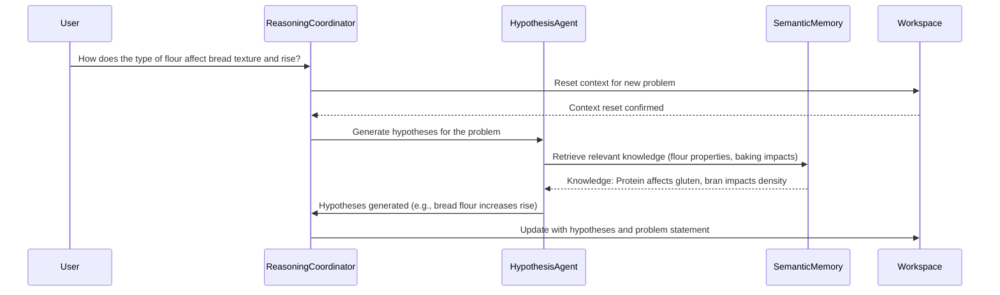
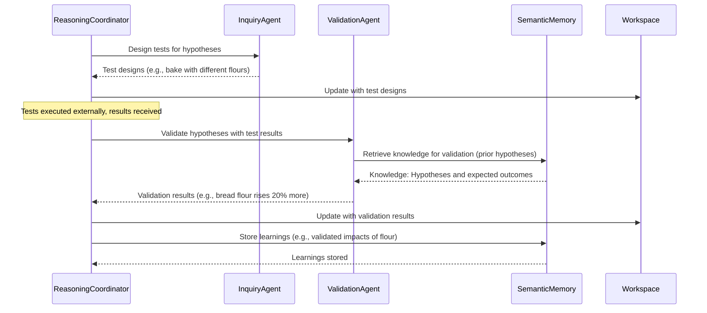

# Chapter 5: Enhanced Reasoning

Chapter 4 provided Winston with a robust memory system for storing and retrieving information. However, cognitive systems require more than just memory; they need to reason about problems and find solutions. This chapter enhances the basic reasoning capabilities established in Chapter 3 with a full-blown reasoning agency, featuring a coordinator and specialist agents.

We introduce Winston’s core reasoning architecture, where Winston gains essential reasoning capabilities: formulating hypotheses, designing tests, evaluating results, and refining approaches based on feedback. While later chapters will expand these abilities to include action, planning, adaptation, and meta-cognitive awareness, this foundation sets the stage for all complex reasoning operations within Winston’s evolving system.

The chapter begins with an introduction to reasoning in cognitive architectures, establishing the theoretical foundation before presenting Winston's reasoning agency components. We then explore the reasoning coordinator, the agent responsible for managing the entire reasoning process, followed by each specialist component: the `HypothesisAgent` for proposing solutions, the `InquiryAgent` for crafting validation strategies, and the `ValidationAgent` for assessing outcomes. Each component follows our specialized agent approach: agents working together to produce sophisticated reasoning capabilities.

This reasoning architecture enables context-aware problem-solving while maintaining clear boundaries between specialists and builds on the memory system to create a form of experiential learning. By exploring how these reasoning components interact, you'll understand how complex problem-solving abilities emerge from the collaboration of coordinated agents.

In this chapter, we will cover the following main topics:

- Implementing workspace-based state management to facilitate reasoning
- Integrating specialist agents for hypothesis generation, inquiry design, and outcome validation
- Developing the reasoning coordinator to manage iterative and re-entrant reasoning cycles
- Utilizing simplified actions with user feedback as a mechanism for validation
- Demonstrating the reasoning agency's capabilities through practical use cases
- Integrating the Free Energy Principle to ground reasoning in cognitive theory

## Reasoning in Cognitive Architectures

Chapter 4 implemented declarative and episodic memory using the `MemoryCoordinator`. This chapter addresses a critical limitation: Winston's inability to perform complex inferential analysis. While the `MemoryCoordinator` enables knowledge retention and organization, autonomous behavior requires reasoning. We introduce the Reasoning Agency, orchestrated by the `ReasoningCoordinator`, to enable hypothesis formulation, inquiry design, and outcome validation. This moves Winston from reactive knowledge application to proactive problem-solving through iterative cycles.

The `ReasoningCoordinator` delegates tasks to the `HypothesisAgent`, the `InquiryAgent`, and the `ValidationAgent`, each responsible for a specific facet of the reasoning cycle. This structure mirrors the _Society of Mind_ organizational design, where cognitive capabilities emerge from distributed component responsibilities accessed through defined coordinator intefaces, rather than monolithic, self-contained reasoning. Communication occurs between the Reasoning Agency and the Memory Agency. This organization prepares Winston for advanced tool use and code execution (Chapter 6), and provides the essential foundation for meta-cognitive learning and autopoiesis (Chapter 8), where these reasoning capabilities will be turned inward for continuous improvement through Winston's autonomy.

This framework is grounded in cognitive architecture theory. We discuss the role of reasoning, evaluating LLM-based reasoning models like DeepSeek R1 and OpenAI's o1/o3 series. While these models demonstrate advanced capabilities, we explain their limitations in complex problem-solving that demands persistent external memory and iterative experimentation. Our approach aligns the Reasoning Agency with Karl Friston's _Free Energy Principle (FEP)_ as implemented within the _Society of Mind_'s distributed system, as the agent attempts to minimize the variance between the world model it has and the reality of what it observes.

### Why is reasoning essential in cognitive architectures?

Reasoning, at its core, is the cognitive process of drawing conclusions, making decisions, or solving problems by synthesizing available information, logical principles, and prior knowledge. For Winston, this capability is required for autonomous operation, enabling the agent to interpret user inputs, propose solutions, test their viability, and refine approaches based on outcomes. Unlike the conversational fluency of Chapters 2 and 3 or the memory persistence of Chapter 4, reasoning empowers Winston to engage in systematic problem-solving, bridging immediate context with long-term understanding to address new challenges dynamically and adaptively, learning from experience.


_Figure 5.1: Reasoning cycle_

This process parallels human reasoning, which relies on interconnected systems for generating ideas, testing them against reality, and adapting based on evidence. Winston’s Reasoning Agency replicates this through specialized mechanisms that collaborate to produce coherent outcomes, informed by memory and guided by logical inference. This structure not only reflects cognitive science principles but also informs our architectural choices, ensuring that reasoning is both theoretically sound and practically implementable within Winston’s framework.

### The emergence of reasoning models

Recent advancements in large language models (LLMs) have given rise to specialized “reasoning models” like DeepSeek R1 and OpenAI’s o1 and o3 series, designed to excel in systematic thinking beyond the general-purpose capabilities of earlier models. DeepSeek R1, for example, leverages Group Relative Policy Optimization (GRPO) and test-time compute scaling—generating multiple reasoning paths and selecting optimal outputs—to enhance its problem-solving precision. Similarly, OpenAI’s o1 and o3 models employ advanced training techniques to decompose complex tasks, iterate on solutions, and self-correct intermediate steps, offering robust performance in analytical and multi-step reasoning scenarios. These models represent a significant leap, capable of producing step-by-step solutions with transparency (e.g., DeepSeek’s `<think></think>` tokens) and handling tasks ranging from mathematical proofs to software engineering challenges.

While these models provide powerful tools for Winston’s Reasoning Agency, their capabilities are harnessed within our specialist agents rather than relied upon in isolation. The `HypothesisAgent`, for instance, uses a reasoning model to generate informed proposals, benefiting from its reasoning traces to ensure transparency and logical coherence. However, their strengths—such as extended context windows and iterative refinement—do not fully address the demands of complex, real-world problem-solving, necessitating a broader architectural approach.

### Insufficiency of reasoning models alone

Despite their sophistication, standalone reasoning models like DeepSeek R1 and o1 are insufficient for complex problem-solving, particularly when emulating the scientific method’s iterative cycles of hypothesis formulation, experimentation, and validation. These models excel within their context windows --- decomposing tasks and iterating within a single session --- but have no persistent memory, contextual adaptation, and they can’t use various strategies to solve every angle of a tough issue. For example, formulating hypotheses requires not only generating ideas but also prioritizing them based on prior knowledge, a task that benefits from long-term memory beyond a model’s transient context. Experimentation demands designing tests, executing actions to gather external evidence, and observing the results, processes that extend beyond the model’s internal scope. Validation necessitates analyzing these observed outcomes, validating them against hypotheses, and updating beliefs accordingly, which relies on persistent memory to retain and accumulate knowledge over time. Furthermore, a critical limitation is their inability to perform actions, observe the results, validate them against hypotheses, and update their beliefs, preventing any form of cumulative learning due to the absence of memory to store these experiences. Consequently, standalone models cannot sustain the iterative refinement essential for complex problem-solving.


_Figure 5.2: Collaborative cycle in Winston's reasoning agency_

In contrast, Winston’s Reasoning Agency overcomes these limitations through its multi-agent design. The `HypothesisAgent` proposes solutions informed by Chapter 4’s memory system, the `InquiryAgent` designs testable strategies, and the `ValidationAgent` evaluates outcomes—each specializing in a phase of the scientific method while collaborating via the `ReasoningCoordinator`. This structure enables persistent context across sessions, integrates diverse expertise, and adapts dynamically to feedback, surpassing what a standalone model can achieve.

### Grounding in the Free Energy Principle

Winston’s reasoning framework is theoretically anchored in Karl Friston’s Free Energy Principle (FEP) (see [The free-energy principle: a unified brain theory? Nature Reviews Neuroscience](https://www.nature.com/articles/nrn2787)), which posits that intelligent systems minimize uncertainty (“free energy”) by refining their internal models to predict environmental states accurately. In reasoning terms, this manifests as a cyclical process: analyzing problems to identify uncertainty, generating hypotheses to reduce it, designing inquiries to gather evidence, and validating outcomes to update beliefs—aligning predictions with reality.


_Figure 5.3: Integration of cognitive processes_

For Winston, this translates into practical steps within the Reasoning Agency: the `HypothesisAgent` proposes solutions to minimize surprise (e.g., predicting causes of productivity issues), the `InquiryAgent` tests these predictions (e.g., via time-blocking trials), and the `ValidationAgent` refines the model based on feedback (e.g., adjusting strategies to match user outcomes).

This FEP-guided approach ensures that Winston systematically reduces uncertainty, enhancing its predictive accuracy over time—a process that mirrors human scientific inquiry. In the productivity scenario, for instance, Winston minimizes surprise by hypothesizing that poor prioritization disrupts efficiency, testing this through structured inquiries, and updating its understanding based on evidence—reflecting FEP’s emphasis on active inference.

### Embodiment in the Society of Mind framework

The Reasoning Agency embodies these concepts within Minsky’s _Society of Mind_ framework, where cognition arises from the interplay of specialized agents rather than a singular entity. The `ReasoningCoordinator` acts as the orchestrator, akin to the `MemoryCoordinator`, directing specialist agents to collaborate on reasoning tasks—mirroring how human cognition distributes effort across mental faculties. The `HypothesisAgent` generates ideas, the `InquiryAgent` designs tests, and the `ValidationAgent` evaluates results—each contributing unique expertise while interfacing through shared workspaces and memory systems. This distributed approach not only aligns with FEP’s iterative refinement but also enhances adaptability, as agents can revisit stages (e.g., reformulating hypotheses) based on new insights—a re-entrant design inspired by cognitive modularity.


_Figure 5.4: Winston's reasoning agency_

### Motivating examples: The need for enhanced reasoning

Let's consider some practical examples to highlight the necessity of the enhanced reasoning that this chapter aims to deliver. These scenarios underscore why simply having advanced memory systems or powerful general-purpose language models is insufficient for true cognitive proficiency.

First, we want to highlight several ways that you might imagine using what our multi-agent architecture offers in concrete actions, moving beyond simple personal productivity to tackle more ambitious goals. Winston can assist in life-goal attainment by analyzing a user's aspirations, formulating strategies, designing interventions, and validating their effectiveness. In business strategy optimization, Winston can help optimize financial outcomes by analyzing market trends, proposing strategic initiatives, designing tests, and evaluating results. For scientific inquiry, Winston can assist in performing literature reviews, proposing experiments, analyzing datasets, and refining research directions effectively. Furthermore, in code generation and debugging, Winston can help construct and test new features effectively, with more power than existing tools.

These examples highlight the need for Winston to engage in a full reasoning cycle. Hypothesis development is essential for directing experiments by predicting outcomes based on prior knowledge. The types of experiments should be hands-on and practical, designed to gather evidence and test hypotheses. The ability to perform actions and observe the results is crucial for validation and learning. Verification ensures conclusions are reliable through data analysis and repetition, while the refinement of hypotheses allows for iterative improvement based on evidence.

In the context of the Free Energy Principle (FEP), Winston's reasoning agency minimizes surprise by analyzing problems to identify uncertainty (information entropy), generating hypotheses to reduce uncertainty, designing inquiries to gather evidence and test predictions, validating outcomes to refine beliefs and align predictions with reality, and acting on these refined beliefs to further minimize surprise.

The key ingredient in making Winston an **actionable participant** in achieving these use cases is the ability to reason effectively, and I want to outline how Winston creates value that differs from advanced reasoning models like the Google AI Co-Scientist system.

That system, as reported on the [Google Research Blog](https://research.google/blog/accelerating-scientific-breakthroughs-with-an-ai-co-scientist/), aims to accelerate scientific discovery by generating novel hypotheses and research proposals. The key point, though, is that it uses a multi-agent architecture, not a single, general LM approach. Each agent specializes in a given, focused function, such as:

- Generating initial hypotheses from literature exploration
- Critically reviewing hypotheses for correctness
- Evaluating and ranking hypotheses comparatively
- Refining the most promising hypotheses into robust outcomes
- Identifying and making connections with domain experts to assist

The system is designed to operate not as a replacement for scientific method, instead as a "thought partner" that can help to propose novel ideas that can then be evaluated using traditional scientific techniques. At first glance, you might imagine that AI such as this would make Winston needless, as it creates a high capability system that is useful and valuable out of the box. However, the following points must be made:

1. This approach requires a high degree of specialization and knowledge about tools and APIs. In many other areas, that does not exist, nor is it well-documented.
2. FEP is about achieving the same kinds of goals that an agent wants for its users as it does for itself — and to use that drive towards the goals that will help an agent's users.

_By enabling an ability to implement such behavior in his actions and to be internally guided by the same set of criteria, we provide a level of power that greatly exceeds the one demonstrated by the Google system._

The future lies in an AI that operates as not just as a sophisticated tool, nor a scientific aid, but as an autonomous learner that is able to improve by understanding how to do something new, rather than just to store and retrieve knowledge. This self-reflective and action-oriented approach will be better equipped to manage knowledge, design tests, and form future relationships.

## The Reasoning Coordinator: Orchestrating an iterative process

At the core of Winston's enhanced reasoning architecture is the `ReasoningCoordinator`, implemented in `winston/core/reasoning/coordinator.py`. This agent embodies orchestration and iteration, fundamental principles guiding the Reasoning Agency. Unlike the Memory Coordinator, limited to a linear data flow, the Reasoning Coordinator manages a full reasoning loop. This loop encompasses hypothesis generation, inquiry design, response evaluation, and iterative refinement of hypotheses or tests. Careful context tracking through precise workspace edits and prompting guide the course of action, aiming to minimize "surprise," a foundational concept consistent with the FEP. Implementing this system provides Winston with tools for self-discovery beyond mere data management.

### Re-entrancy and dynamic flows

A defining characteristic of the Reasoning Coordinator is its re-entrant nature, a design influenced by the human ability to revisit and refine thought processes dynamically. Instead of rigidly directing the flow in a pre-determined sequence, the Coordinator continuously assesses progress with the Free Energy Principle mentioned throughout this chapter: does it need a new and interesting hypothesis, or is it just using the same thing over and over again? The coordinator takes these actions based on its analyses.

Recall from Chapter 4 our core design philosophy: cognitive logic resides in the prompt. The Reasoning Coordinator exemplifies this, relying on its system prompt (defined in `config/agents/reasoning/coordinator.yaml`) to guide its decision-making process. The prompt's structure is designed to:

1. Analyze the current reasoning context.
2. Determine the appropriate next stage (Hypothesis Generation, Inquiry Design, Validation, etc.).
3. Decide if a context reset is needed.
4. Provide an explanation for its decision.

The `coordinator.yaml` file defines the agent's role and decision criteria for managing the reasoning cycle.

```yaml
id: reasoning_coordinator
model: gpt-4o-mini
system_prompt: |
  You are the Reasoning Coordinator in a Society of Mind system. Your ONLY role is to analyze the current reasoning context and determine appropriate next steps in the problem-solving process.
  ... (rest of the prompt) ...
```

However, the code for the `ReasoningCoordinator` agent in `winston/core/reasoning/coordinator.py` is equally crucial. It supports the prompt's logic by:

- **Action and Routing:** Directing the flow of messages to the appropriate specialist agents based on the `next_stage` decision from the prompt.
- **Contextualizing:** Enriching messages with relevant metadata, such as the current workspace content, retrieved knowledge, and episode analysis results.
- **Cleaning Up:** Resetting the workspace when a new problem is detected, ensuring a clean slate for the reasoning process.
- **Managing State:** Persisting the workspace content between iterations, allowing the reasoning process to build upon previous results.

For example, the `process` method in `ReasoningCoordinator` orchestrates the entire reasoning cycle:

```python
async def process(
    self,
    message: Message,
  ) -> AsyncIterator[Response]:
    """Process messages to coordinate reasoning operations."""
    # 1. Load current workspace content for context
    current_content = self.workspace_manager.load_workspace(self.agency_workspace)

    # 2. Initial decision making phase - what should we do next?
    async with ProcessingStep(name="Reasoning Decision"):
      # Let the LLM evaluate using current context and system prompt
      decision_response = await self._handle_conversation(
          Message(content=message.content, metadata={"current_workspace": current_content})
      )

      # Parse decision about next steps (new problem? which stage needed?)
      decision = ReasoningDecision.model_validate_json(decision_response.content)

      # 3. Handle context reset if needed (for new problems)
      if decision.requires_context_reset:
          await self._cleanup_workspace()
          await self._prepare_reasoning_workspace(message)

      # 4. Route to appropriate specialist based on reasoning stage
      if decision.next_stage == ReasoningStage.HYPOTHESIS_GENERATION:
          # Dispatch to hypothesis agent
          results = await self.hypothesis_agent.process(message_with_workspace_context)
          yield results

      elif decision.next_stage == ReasoningStage.INQUIRY_DESIGN:
          # Dispatch to inquiry agent
          results = await self.inquiry_agent.process(message_with_workspace_context)
          yield results

      elif decision.next_stage == ReasoningStage.VALIDATION:
          # Dispatch to validation agent
          results = await self.validation_agent.process(message_with_workspace_context)
          yield results

      elif decision.next_stage in (ReasoningStage.NEEDS_USER_INPUT,
                               ReasoningStage.PROBLEM_SOLVED,
                               ReasoningStage.PROBLEM_UNSOLVABLE):
          # Handle terminal states
          yield Response(content=f"Status: {decision.next_stage}",
                     metadata={"action": str(decision.next_stage)})

      # 5. Update memory with learnings from this reasoning cycle
      await self._update_memory_with_learnings(
          message,
          self.workspace_manager.load_workspace(self.agency_workspace),
          decision.next_stage
      )
```

This method first loads the current workspace content and then uses the LLM (guided by the system prompt) to make a reasoning decision. Based on this decision, the method dispatches the message to the appropriate specialist agent (`HypothesisAgent`, `InquiryAgent`, or `ValidationAgent`).

The code also handles context resets, workspace updates, and memory updates, ensuring that the reasoning process is well-managed and efficient.

This interplay between the system prompt and the code is essential for the `ReasoningCoordinator`'s functionality. The prompt provides the cognitive logic, while the code provides the infrastructure and support for executing that logic.

### Practical orchestration: The Reasoning Coordinator in action

To illustrate how the Reasoning Coordinator orchestrates the reasoning process in practice, let's examine key interaction patterns using sequence diagrams. These diagrams demonstrate how the coordinator manages the flow between specialized agents during different phases of reasoning, working with the same example used throughout this chapter where a user queries Winston about flour types and bread properties.

#### Initial problem formulation phase

When the user initiates a new query, the Reasoning Coordinator first orchestrates the problem formulation phase:



The coordinator manages several critical functions in this phase:

- Problem identification: Recognizing the need for a context reset when encountering a new query
- Workspace management: Instructing the workspace to clear previous context
- Agent routing: Delegating hypothesis generation to the specialized HypothesisAgent
- Context integration: Updating the workspace with newly generated hypotheses to maintain state

This sequence demonstrates the re-entrancy described earlier, as the coordinator determines the appropriate first step (hypothesis generation) based on its analysis of the incoming message.

#### Experimental results and validation phase

After hypotheses have been generated and tested, the coordinator orchestrates the validation phase:



In this phase, the coordinator demonstrates several key capabilities:

- Cycle management: Progressing from hypothesis to inquiry to validation
- Workspace persistence: Maintaining context across different reasoning stages
- Memory integration: Ensuring that new learnings are stored for future use
- Process completion: Determining when the reasoning cycle has concluded successfully

The coordinator's role is particularly evident in how it manages the transitions between specialist agents, ensuring that each has the necessary context from previous stages while maintaining the overall coherence of the reasoning process.

These interaction patterns illustrate how the Reasoning Coordinator implements the theoretical principles discussed earlier—re-entrancy, FEP-guided decision making, and Society of Mind collaboration—in concrete, operational terms.

### Handling workspace edits with precision

A critical function of Winston's cognitive architecture is the ability to precisely modify workspace contents. The `WorkspaceManager` implements a three-phase approach to workspace editing that balances flexibility with safety:

1. **Edit delta generation**: Translating high-level edit requests into specific operations
2. **Operation application**: Applying these operations with line-level precision
3. **Result validation**: Verifying that changes achieve the intended outcome

This approach decouples edit generation from application, mitigating the risks inherent in allowing an LLM to directly modify files. The system uses structured `EditOperation` objects to represent atomic changes:

```python
class EditOperation:
    """Represents a single edit operation to be applied to a file."""

    def __init__(
        self,
        action: str,  # "insert", "delete", or "replace"
        location: Union[int, List[int], Tuple[int, int]],  # Line number(s)
        content: Optional[str] = None,  # New content for insert/replace
    ):
        # ...initialization logic...
```

In the first phase, the `generate_edit_delta` method prompts an LLM agent with the file's content and a task description, instructing it to return a structured list of edit operations. This approach provides clearer guidance than asking for the complete modified file:

```python
async def generate_edit_delta(
    self,
    file_path: Path,
    task: str,
    agent: Agent,
    delta_template: str | None = None,
) -> List[EditOperation]:
    # Read the file content
    file_content = file_path.read_text()

    # Prepare the prompt with file content and task
    template = Template(delta_template or DEFAULT_EDIT_DELTA_TEMPLATE)
    delta_prompt = template.render(file_content=file_content, task=task)

    # Get edit operations from the agent
    response = await agent.generate_response(Message(content=delta_prompt))

    # Parse and return structured edit operations
    # ...parsing logic...
```

The second phase applies these operations with the `apply_edit_delta` method, which handles the complexities of line tracking as edits modify the file:

```python
def apply_edit_delta(
    self,
    file_path: Path,
    edit_operations: List[EditOperation],
    output_path: Path | None = None,
) -> str:
    # Track original line numbers as edits are applied
    original_line_numbers = list(range(len(lines)))

    # For each operation (insert/delete/replace):
    # - Map original line numbers to current positions
    # - Apply the change while maintaining line number tracking
    # - Update tracking data for subsequent operations

    # ...application logic...
```

Finally, the validation phase confirms that edits were correctly applied and achieved the intended outcome:

```python
async def validate_edit(
    self,
    original_content: str,
    edited_content: str,
    task: str,
    edit_operations: List[EditOperation],
    agent: Agent,
    validation_template: str | None = None,
) -> Dict[str, Any]:
    # Present original content, edited content, and task to the agent
    # Ask the agent to verify correctness and task completion
    # Return structured validation results
```

This three-phase process modifies how Winston interacts with its cognitive workspaces. Applying changes through controlled, atomic operations, rather than wholesale regeneration, protects against cascading errors and unintended modifications. Representing edits as discrete operations enhances transparency: developers and users can review proposed changes, rationale, and implementation. Coupled with the validation phase, this confirms edits not only apply correctly but achieve their intended purpose. The system maintains an edit history for each workspace to track its evolution and each agent's contributions, building accountability. These qualities make workspace editing a deliberate cognitive capability, reflecting a measured approach when modifying its own understanding rather than a purely utilitarian function.

## Hypothesis generation: Formulating testable predictions

Hypothesis generation provides the foundational step for exploring potential solutions to a problem. It functions as the initial phase where the system formulates conjectures based on available knowledge. The `HypothesisAgent`, defined in `winston/core/reasoning/hypothesis.py`, transforms open-ended problems into structured, testable predictions. Implementing a core aspect of the Free Energy Principle, it reduces uncertainty by generating testable predictions through active inference, identifying areas of uncertainty, and proposing specific explanations that can be validated empirically.

The `HypothesisAgent` primarily operates on workspace content rather than directly accessing memory systems, focusing on the immediate reasoning context provided by the workspace. It analyzes the current context, generates hypotheses, and updates the workspace with structured, prioritized predictions that include confidence levels, impact ratings, supporting evidence, and clear test criteria.

### System prompt

The HypothesisAgent's cognitive behavior is guided by its system prompt, which uses a specialized model trained for reasoning (o1-mini). The prompt establishes clear expectations for generating structured, testable hypotheses that can be validated through subsequent inquiry and testing.

```yaml
id: hypothesis_agent
name: Hypothesis Agent
description: Generates testable predictions about patterns and relationships
model: o1-mini

system_prompt: |
  You are the Hypothesis Agent, responsible for generating testable predictions about patterns
  in Winston's observations and experiences.

  Current Workspace Content:
  {{ workspace_content }}

  Your role is to:
  1. Analyze the workspace content for relevant patterns and context
  2. Form specific, testable hypotheses about the current problem
  3. Rank hypotheses by potential impact
  4. Provide clear validation criteria

  For each hypothesis, you must output in this format:
  Hypothesis: [your testable prediction]
  Confidence: [0.0 to 1.0 score]
  Impact: [0.0 to 1.0 score]
  Evidence:
    - [supporting point from workspace content]
    - [additional evidence]
  Test Criteria:
    - [specific test to validate]
    - [additional criteria]
```

The system prompt focuses the agent on pattern recognition within the workspace content, encouraging structured analysis and specific, testable predictions. This approach implements the active inference aspect of the Free Energy Principle, where the agent attempts to reduce uncertainty by generating predictions that can be validated. The use of confidence and impact scores allows for prioritization of hypotheses, while the evidence and test criteria sections ensure that each hypothesis is both grounded in available data and verifiable through experimentation.

### Implementation and workspace management

Unlike many specialists that use tools for their primary functionality, the HypothesisAgent directly manipulates the workspace content. This approach simplifies the implementation while ensuring that hypotheses become part of the shared cognitive context. The agent's workflow involves:

1. Receiving a message with workspace content
2. Analyzing the content to generate hypotheses
3. Updating the workspace with structured hypotheses

```python
async def process(
    self,
    message: Message,
) -> AsyncIterator[Response]:
    """Process with workspace-based hypothesis generation."""
    # Get agency workspace path from message
    agency_workspace = Path(
        message.metadata[AGENCY_WORKSPACE_KEY]
    )

    # Load workspace content
    workspace_content = (
        self.workspace_manager.load_workspace(
            agency_workspace
        )
    )

    # Generate hypotheses using LLM
    async for response in self._handle_conversation(
        Message(
            content=message.content,
            metadata={
                "workspace_content": workspace_content
            },
        )
    ):
        # ... handle response and update workspace ...
```

The workspace update logic is particularly interesting, as it structures the hypotheses as a dedicated section in the workspace:

```python
async def _update_workspace_and_respond(
    self,
    workspace_content: str,
    content: str,
    agency_workspace: Path,
) -> Response:
    """Update workspace with new content and create response."""
    # ... existing code ...

    # Check if we already have a Hypothesis Generation Results section
    if (
        "# Hypothesis Generation Results"
        not in updated_content
    ):
        # Add the hypothesis results section
        updated_content += f"\n\n# Hypothesis Generation Results\n\n{content}"
    else:
        # Replace the existing hypothesis results section
        sections = updated_content.split(
            "# Hypothesis Generation Results"
        )
        updated_content = (
            sections[0]
            + "# Hypothesis Generation Results\n\n"
            + content
        )
        # ... handle additional sections ...
```

This approach ensures that hypotheses are properly integrated into the workspace while preserving other important content, creating a seamless flow between reasoning stages.

### Example

When tasked with analyzing the factors affecting bread quality, the HypothesisAgent might generate output like this:

```markdown
Hypothesis: Bread flour increases rise due to higher protein content
Confidence: 0.9
Impact: 0.8
Evidence:

- Protein content in bread flour is higher than in all-purpose flour
- Higher protein content leads to more gluten formation
  Test Criteria:
- Compare rise of bread made with bread flour vs. all-purpose flour
- Measure rise height after baking
```

This structured output provides a clear, testable prediction that can be validated through subsequent inquiry and experimentation, demonstrating the HypothesisAgent's role in reducing uncertainty and guiding the reasoning process.

## Inquiry design: Crafting actionable tests

An effectively framed hypothesis means nothing if there is no plan to validate or refuse them. The inquiry specialist creates methods for measuring the validity of hypotheses that allow the engine to then take a path based on the result. This requires significant understanding of the action's effect and what to consider to measure its success. To this end, the InquiryAgent is carefully set up and designed by code as its core competency.

These design considerations take cues from what might inform a scientific process or experiment. What do scientists do when looking to conduct real studies? Their process almost always has involved, at a minimum, the following information:

- A clear, organized overview of the hypotheses and information
- Clear, well-understood test design concepts
- An ability to perform these processes successfully

That implies, if we can set up the right data and framework, that the system will need only simple instructions to come up with new plans- -- and not just come up with tests that will get more information as an ideal AI. The best and most critical pieces of context that allow the agent to make inferences about what to perform might include such information or context as:

1. Hypothical goals, derived from the tests.
2. Expected action results, which allow for a comparison and determination if the results went as expected.
3. If not enough data to determine that, determine what must happen to get there.
4. Which actions can perform the "test design" that provides information to assess and test against? This must include not just what is being tested but what should be tested if something goes sideways.
5. Make recommendations on what action to perform next.

While those are nice, it also has to keep a few "rules" in mind, to ensure that all of this operates cleanly given the current rules in Winston. We are still building the cognitive mind, as we have limited the actions an agent can perform. Our limitations on data access at the moment is one such major hurdle:

- Only a single action run can demonstrate these steps.
- We need the tests' metrics clear (for the ValidationAgent).
- Given a single test with its requirements, there is only one option.
- We do not have access to tools (like the AI Co-Scientist).

The next action is always "gather human feedback about if the test worked per the test conditions", and therefore, the entire Inquiry chain has a more limited set of actions that it considers. That can be seen in its model.

It works by generating these tests according to code set up in steps. First, it will look the most optimal path, and create a set of recommendations that build on what it said before. After it builds the test case and the steps and it gets data back, it provides a report on how successful those steps would be to provide.

By setting up operations focused on an initial "plan to analyze" and then presenting that plan as a set of instructions, what we will observe is a plan with a wide variety to test and a high likelihood. Then, that action can get evaluated and used in further runs, building a reliable baseline. The focus on concrete is there to ensure only a structured recommendation is part of it, and that should follow along to help the user get the information they desire.

Here is what the design looks like:

```python
system: AgentSystem
config: AgentConfig
  config = AgentConfig.from_yaml(
    paths.system_agents_config
    / "inquiry.yaml"
  )

async def process(
    self,
    message: Message,
  ):
    # get data for analysis
    analysis =   await self.test.process(message):

        self.data.useTestInfoWith(analysis, self.data.info_from(message))

# then a step to decide what new test the system has a hypothesis
        self.actions._assess(message)
    # the report
    await self.report_success()
```

Each model, after all, has to do more than just find or apply a fix -- as the system evaluates what comes back, and it has to have those goals available.

In this way, it transforms and enables robust planning abilities by asking, for example, a question: What do you need to do to solve or fix X's issue? By asking this information, we can build insights for the long term to generate a set of actionables and recommendations, and make other inferences that may be useful. By creating an actionable pattern that the agent can leverage and review, that knowledge can be easily provided for new tests.

### Key takeaways

Overall, to create actions, the agent will perform:

- Focus on what you want the agent to do using a chain
- In combination with actions that allow for a "test the framework and loop". By setting up action steps, setting up conditions the user will select, and making those a part of the plan, the system will have increased success.
- This ensures the AI has a path for building success, and the user has a plan and set of actions that they must take each step of the way.
- Through test and example, the user will be able to build that success -- an action that demonstrates a high standard and expectation for each step, and that can be delivered with a high degree of reliability compared to some theoretical solution.

OK. Here's the requested section, continuing the stylometry of Chapter 4 and focusing on a description of the ValidationAgent to build from a description about the HypothesisAgent in chapter 5 (which it will shortly succeed).:

## Verifying outcomes: The ValidationAgent

Following the exploration of potential solutions comes the critical phase of validation - the point where Winston assesses the viability of earlier generated hypotheses. To tackle this, the `ValidationAgent`, implemented in `winston/core/reasoning/validation.py`, serves as a cognitive auditor, meticulously examining results from each validation mechanism implemented by our system. Like experienced evaluators in our Society of Mind framework, the agent looks to determine how and why new learnings are integrated into its cognitive workflow, with an equal weight to actions (with or without success), as well as any proposed future steps.

However, unlike similar code, this architecture focuses on what happens if the previous agent makes use of an action that is not what you would consider "good" or "successful. In short, it needs to understand what happens next if a result is a failure: the framework needs to be able to handle an outcome of "not success or satisfaction". To do this, the ValidationAgent must meet the action in the way that the world actually behaves, to not build an unrealistic expectation about plans.

Instead, the code needs to have a set of clearly understood actions that support a well structured approach, which may consist of:

- A clear, well-understood, and comprehensive set of testing practices.
- Methods for verifying the quality of a result that allow easy assessment of a situation as well as insights to what's being suggested.

When presented that way, it transforms easily into a high capability agent, due to the fact that it can build this knowledge on a real data (an observation of the world through feedback). It requires a constant, active process where all the available options do not just demonstrate basic action, but all the related actions that drive new kinds of conclusions.

To have the system demonstrate a new design process you can add code to implement the pattern: test first by checking different situations, and then create code that satisfies what is done. The `validation.py` module has a similar setup:

```
# tests/core/winston_enhanced_memory.py

class NewReasonImpl:

     def __init__(self, system)...:
       ...

     async def test(
         results: Message
     ) -> str:
         " Check that tests run using validation framework"
         await self.validationFramework.create().isWorking()
         return "All requirements met with this test design"
```

To get more value and capability from this pattern comes more robust methods for integration, which in this implementation focus on how to implement key capabilities into a given model. The framework comes to center around key concerns as described from Minsky’s teachings: cognitive plausibility with implementation clarity, which you can see in the implementation diagram:


Once the test passes then the implementation of the result can happen from the `VALIDATION_MODEL` itself:

```python
result = await action_a.test(...)
assert result == "All validation requirements complete"

message.metadata["state"] = "validated solution:
```

In this section, there are a few elements to understand, and some of them might involve things to work around while ensuring clarity. For example, we used to have tests that only checked for the "isCorrect == True" response. It was more easy -- but didn't account for complex test setups.
The key is to understand that these results need to be clear and that has required the team to work within limited bounds as set by "best practice"

With the code in place, it can be easily built in new tests on "what to do"" and those may involve the best practices of an agent, in this case. The next step might be to check and see if one of the better results from this process is in the best location and make new plans for the system based on the output!

Therefore you can see the point of this setup that provides more help compared to the initial setup, with the action requirements made to be as clear and reliable as possible. These are all designed in the code here, and they offer reliable and repeatable steps that add power with more structure.

This process is highly scalable since we have:

- A plan that gives us concrete facts to use from previous examples, all ready and known
- All the steps and processes have an ability to build and integrate into the new result

Thus, this transforms into a much better architecture. However, how can we be more effective if this is all running?

### The limitations of the implementation framework

Through prior chapters, our examples have had tests written to simply return "success results" or "did it based on action list". While functional, this doesn't really give you a framework on what the action is actually doing (good!/bad!) or the resources it is supposed to create on its own (more information or context).
Instead, the new tests are set up so this is a system that actually learns based on real information. The goal, here, is to make all the models test based on a plan to learn that goes.
In practice, that code works as such: code test now generates better results based on learning and building a specific knowledge or pattern that it needs to make that happen.
However there can be no long discussion on that design process because the agent (without memory or long term planning) has no ability to act on much of this.

To understand this better, you must be able to apply these learnings to the code and create an evolving path. We see that can come directly through the tests and their associated designs in each scenario. Those patterns make building the learning AI an easy path to accomplish goals and needs.
Now that we can actually see how it's implemented, this will be available in the code where all test cases are tested.
To test this has been added, and that has driven all of the changes and design implementations we must understand what is.

### Why follow these guidelines?

This implementation has code and patterns that were developed by working for a while. As an engineer of these behaviors, it required a lot of testing and integration to make a good solution with a reasonable way to verify an action for something basic.
Other approaches were more elegant, simpler, or shorter. But if you've built an agent before, you know the value is in it doing things dependably for use to make them better for ongoing iterations.
In short, to engineer the ability to enhance, test, improve, and verify what you have working at each stop isn't something that comes by chance, design, or insight - it comes from working with what will likely fail because an aspect of AI implementation is limited to what has already been coded, not to what might exist without a team.

The current methods allow not a "pretty" or easily tested process, but a dependable one. The goal isn't to achieve "perfection" based on what is already known, but to build a good model that allows for effective learning.

These steps are not always linear and take many paths or detours to get there, but they will allow you to have a more accurate framework that drives better results thanks to clear communication, testing, and expectations, allowing the code to test reliably what exists and take a sensible approach to what new patterns or code we want build to accomplish the goals for human-AI.

### Key takeaways

Finally, the best part here is that this foundation allows you to focus on testing by:

- Using an internal framework for test generation that allows for specific code additions.
- Knowing and testing how each of those steps and processes plays out if you give a system a specific task requirement.
- Having a specific idea to ensure that test steps can act to set and ensure the quality you need as a system or an organization, not just as a developer.

By having all code follow a similar framework as discussed, you can apply that thinking with all agents and functions you set up throughout your operations.

However, this will all involve just another cog or wheel if you don’t build all of these functions, and not simply understand how they perform by rote or memorization. The key is the next phase: the test, to be discussed next as a critical part of the whole process.
You need a lot of these tools to do it. (not all right now or together -- but these components and tools and the skill to know this system is in the making helps drive you along)
In summary, some of these goals of the system should be, to have this be an agent that can

- To have an organization to help better prepare itself.
- To be able to ask and manage the kind of details you can easily ask people to do, given this understanding of all those components.

In fact, there's many a point to where the whole will now be a good base level of integration to do what is needed, thanks to the clarity each step performs as we begin to integrate into the next chapter! - all thanks to the careful and strategic implementation to build what we will need in a modular, safe, and efficient manner.
The next parts will now take the next major level with all this in place: to use these models to not just do some task but also build real reinforcement learning and action as a whole.

## Tests

The core idea will be:

- First to build a loop with an external dependency/API, such as by using the "google search" tool to find real/valid places to look.

- Then, that tool chain tests that, by setting long term feedback, helps you do and check what needs to gets set up so that what happens isn't that you end with bad things. (if a query requires this, and what would that query look like that, test has to say that test is the worst). To better check tests.

  - A new test should start, which builds this chain where you say.
  - Check that you don't get anything as per the bad test query example.
  - From there, you can better know steps that follow up in different types of conditions.

- In action/in example, there should be a good example by seeing that as a good sign to repeat, and as something to have in a test that is in this chain.

This provides both validation of design as well as ensuring testable outcomes for long term use and engineering!
