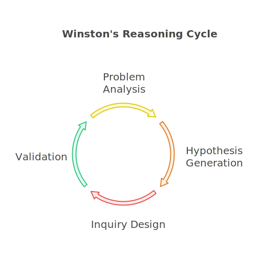
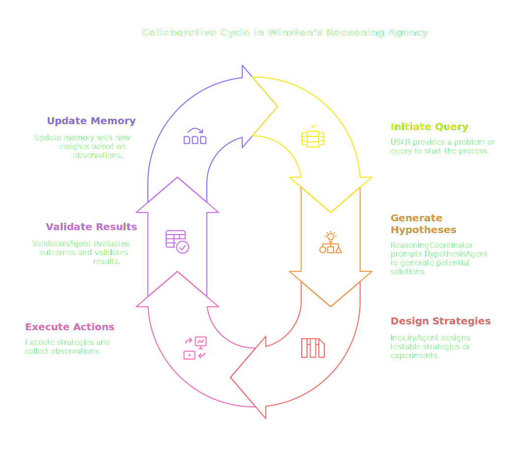
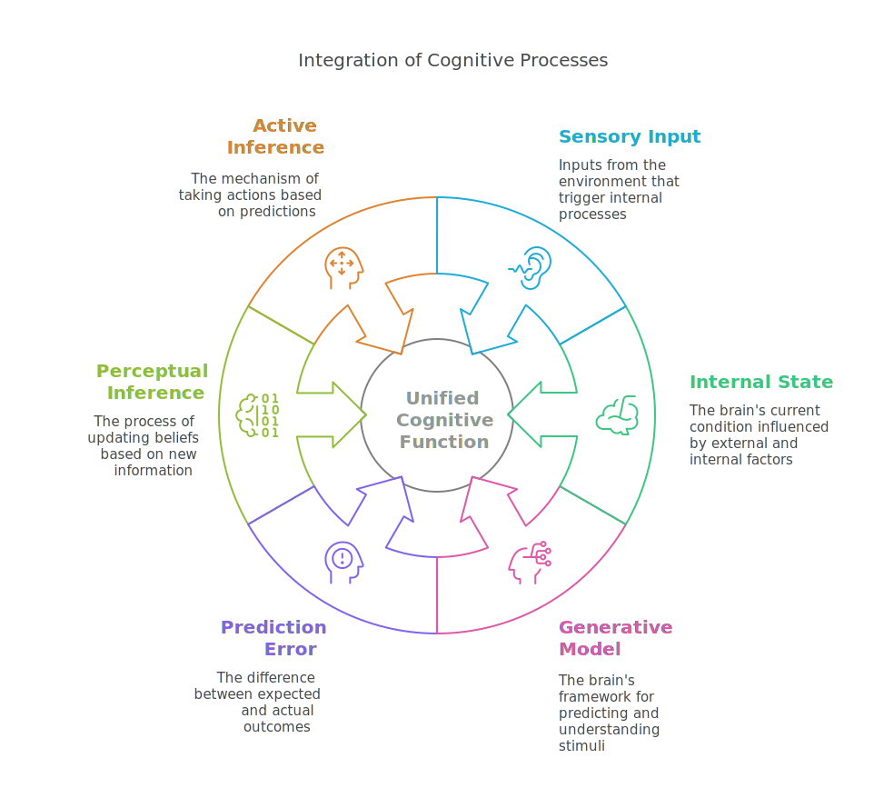
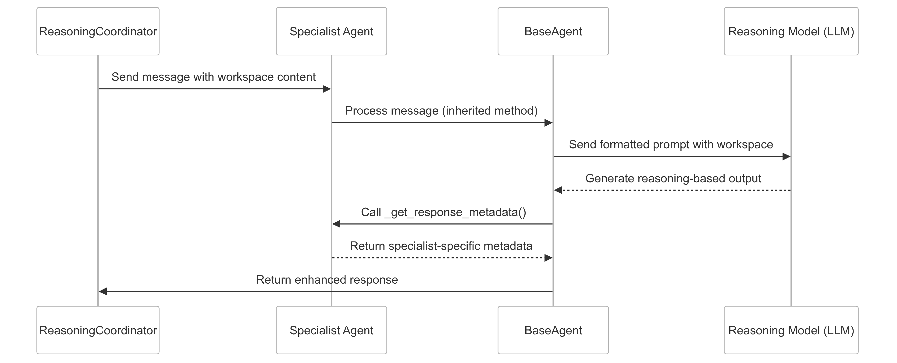
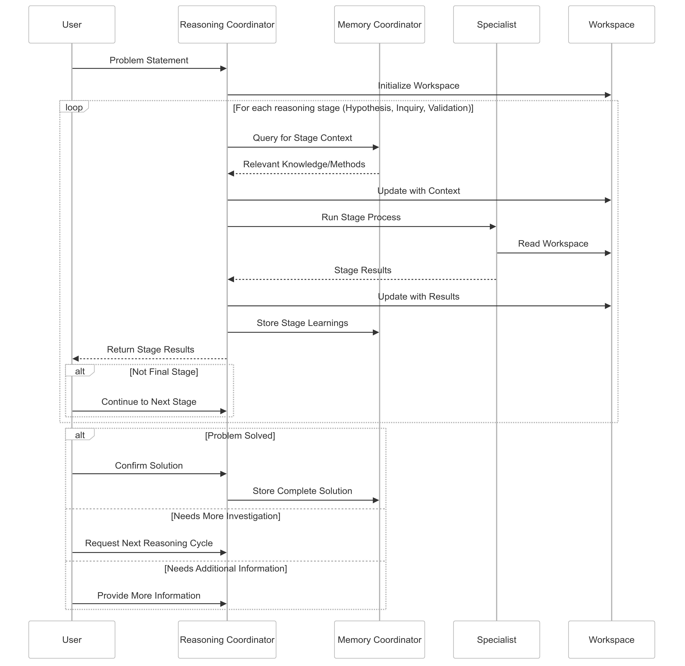

# Chapter 5: Enhanced Reasoning

Chapter 4 provided Winston with a robust memory system for storing and retrieving information. However, cognitive systems require more than just memory; they need to reason about problems and find solutions. This chapter enhances the basic reasoning capabilities established in Chapter 3 with a full-blown reasoning agency, featuring a coordinator and specialist agents.

We introduce Winston’s core reasoning architecture, where Winston gains essential reasoning capabilities: formulating hypotheses, designing tests, evaluating results, and refining approaches based on feedback. While later chapters will expand these abilities to include action, planning, adaptation, and meta-cognitive awareness, this foundation sets the stage for all complex reasoning operations within Winston’s evolving system.

The chapter begins with an introduction to reasoning in cognitive architectures, establishing the theoretical foundation before presenting Winston's reasoning agency components. We then explore the reasoning coordinator, the agent responsible for managing the entire reasoning process, followed by each specialist component: the `HypothesisAgent` for proposing solutions, the `InquiryAgent` for crafting validation strategies, and the `ValidationAgent` for assessing outcomes. Each component follows our specialized agent approach: agents working together to produce sophisticated reasoning capabilities.

This reasoning architecture enables context-aware problem-solving while maintaining clear boundaries between specialists and builds on the memory system to create a form of experiential learning. By exploring how these reasoning components interact, you'll understand how complex problem-solving abilities emerge from the collaboration of coordinated agents.

In this chapter, we will cover the following main topics:

- Implementing workspace-based state management to facilitate reasoning
- Integrating specialist agents for hypothesis generation, inquiry design, and outcome validation
- Developing the reasoning coordinator to manage iterative and re-entrant reasoning cycles
- Utilizing simplified actions with user feedback as a mechanism for validation
- Demonstrating the reasoning agency's capabilities through practical use cases
- Integrating the Free Energy Principle to ground reasoning in cognitive theory

## Reasoning in Cognitive Architectures

Chapter 4 implemented declarative and episodic memory using the `MemoryCoordinator`. This chapter addresses a critical limitation: Winston's inability to perform complex inferential analysis. While the `MemoryCoordinator` enables knowledge retention and organization, autonomous behavior requires reasoning. We introduce the Reasoning Agency, orchestrated by the `ReasoningCoordinator`, to enable hypothesis formulation, inquiry design, and outcome validation. This moves Winston from reactive knowledge application to proactive problem-solving through iterative cycles.

The `ReasoningCoordinator` delegates tasks to the `HypothesisAgent`, the `InquiryAgent`, and the `ValidationAgent`, each responsible for a specific facet of the reasoning cycle. This structure mirrors the _Society of Mind_ organizational design, where cognitive capabilities emerge from distributed component responsibilities accessed through defined coordinator intefaces, rather than monolithic, self-contained reasoning. Communication occurs between the Reasoning Agency and the Memory Agency. This organization prepares Winston for advanced tool use and code execution (Chapter 6), and provides the essential foundation for meta-cognitive learning and autopoiesis (Chapter 8), where these reasoning capabilities will be turned inward for continuous improvement through Winston's autonomy.

This framework is grounded in cognitive architecture theory. We discuss the role of reasoning, evaluating LLM-based reasoning models like DeepSeek R1 and OpenAI's o1/o3 series. While these models demonstrate advanced capabilities, we explain their limitations in complex problem-solving that demands persistent external memory and iterative experimentation. Our approach aligns the Reasoning Agency with Karl Friston's _Free Energy Principle (FEP)_ as implemented within the _Society of Mind_'s distributed system, as the agent attempts to minimize the variance between the world model it has and the reality of what it observes.

### Why is reasoning essential in cognitive architectures?

Reasoning, at its core, is the cognitive process of drawing conclusions, making decisions, or solving problems by synthesizing available information, logical principles, and prior knowledge. For Winston, this capability is required for autonomous operation, enabling the agent to interpret user inputs, propose solutions, test their viability, and refine approaches based on outcomes. Unlike the conversational fluency of Chapters 2 and 3 or the memory persistence of Chapter 4, reasoning empowers Winston to engage in systematic problem-solving, bridging immediate context with long-term understanding to address new challenges dynamically and adaptively, learning from experience.


_Figure 5.1: Reasoning cycle_

This process parallels human reasoning, which relies on interconnected systems for generating ideas, testing them against reality, and adapting based on evidence. Winston’s Reasoning Agency replicates this through specialized mechanisms that collaborate to produce coherent outcomes, informed by memory and guided by logical inference. This structure not only reflects cognitive science principles but also informs our architectural choices, ensuring that reasoning is both theoretically sound and practically implementable within Winston’s framework.

### The emergence of reasoning models

Recent advancements in large language models (LLMs) have given rise to specialized “reasoning models” like DeepSeek R1 and OpenAI’s o1 and o3 series, designed to excel in systematic thinking beyond the general-purpose capabilities of earlier models. DeepSeek R1, for example, leverages Group Relative Policy Optimization (GRPO) and test-time compute scaling—generating multiple reasoning paths and selecting optimal outputs—to enhance its problem-solving precision. Similarly, OpenAI’s o1 and o3 models employ advanced training techniques to decompose complex tasks, iterate on solutions, and self-correct intermediate steps, offering robust performance in analytical and multi-step reasoning scenarios. These models represent a significant leap, capable of producing step-by-step solutions with transparency (e.g., DeepSeek’s `<think></think>` tokens) and handling tasks ranging from mathematical proofs to software engineering challenges.

While these models provide powerful tools for Winston’s Reasoning Agency, their capabilities are harnessed within our specialist agents rather than relied upon in isolation. The `HypothesisAgent`, for instance, uses a reasoning model to generate informed proposals, benefiting from its reasoning traces to ensure transparency and logical coherence. However, their strengths—such as extended context windows and iterative refinement—do not fully address the demands of complex, real-world problem-solving, necessitating a broader architectural approach.

### Insufficiency of reasoning models alone

Despite their sophistication, standalone reasoning models like DeepSeek R1 and o1 are insufficient for complex problem-solving, particularly when emulating the scientific method’s iterative cycles of hypothesis formulation, experimentation, and validation. These models excel within their context windows --- decomposing tasks and iterating within a single session --- but have no persistent memory, contextual adaptation, and they can’t use various strategies to solve every angle of a tough issue. For example, formulating hypotheses requires not only generating ideas but also prioritizing them based on prior knowledge, a task that benefits from long-term memory beyond a model’s transient context. Experimentation demands designing tests, executing actions to gather external evidence, and observing the results, processes that extend beyond the model’s internal scope. Validation necessitates analyzing these observed outcomes, validating them against hypotheses, and updating beliefs accordingly, which relies on persistent memory to retain and accumulate knowledge over time. Furthermore, a critical limitation is their inability to perform actions, observe the results, validate them against hypotheses, and update their beliefs, preventing any form of cumulative learning due to the absence of memory to store these experiences. Consequently, standalone models cannot sustain the iterative refinement essential for complex problem-solving.


_Figure 5.2: Collaborative cycle in Winston's reasoning agency_

In contrast, Winston’s Reasoning Agency overcomes these limitations through its multi-agent design. The `HypothesisAgent` proposes solutions informed by Chapter 4’s memory system, the `InquiryAgent` designs testable strategies, and the `ValidationAgent` evaluates outcomes—each specializing in a phase of the scientific method while collaborating via the `ReasoningCoordinator`. This structure enables persistent context across sessions, integrates diverse expertise, and adapts dynamically to feedback, surpassing what a standalone model can achieve.

### Grounding in the Free Energy Principle

Winston’s reasoning framework is theoretically anchored in Karl Friston’s Free Energy Principle (FEP) (see [The free-energy principle: a unified brain theory? Nature Reviews Neuroscience](https://www.nature.com/articles/nrn2787)), which posits that intelligent systems minimize uncertainty (“free energy”) by refining their internal models to predict environmental states accurately. In reasoning terms, this manifests as a cyclical process: analyzing problems to identify uncertainty, generating hypotheses to reduce it, designing inquiries to gather evidence, and validating outcomes to update beliefs—aligning predictions with reality.


_Figure 5.3: Integration of cognitive processes_

For Winston, this translates into practical steps within the Reasoning Agency: the `HypothesisAgent` proposes solutions to minimize surprise (e.g., predicting causes of productivity issues), the `InquiryAgent` tests these predictions (e.g., via time-blocking trials), and the `ValidationAgent` refines the model based on feedback (e.g., adjusting strategies to match user outcomes).

This FEP-guided approach ensures that Winston systematically reduces uncertainty, enhancing its predictive accuracy over time—a process that mirrors human scientific inquiry. In the productivity scenario, for instance, Winston minimizes surprise by hypothesizing that poor prioritization disrupts efficiency, testing this through structured inquiries, and updating its understanding based on evidence—reflecting FEP’s emphasis on active inference.

### Embodiment in the Society of Mind framework

The Reasoning Agency embodies these concepts within Minsky’s _Society of Mind_ framework, where cognition arises from the interplay of specialized agents rather than a singular entity. The `ReasoningCoordinator` acts as the orchestrator, akin to the `MemoryCoordinator`, directing specialist agents to collaborate on reasoning tasks—mirroring how human cognition distributes effort across mental faculties. The `HypothesisAgent` generates ideas, the `InquiryAgent` designs tests, and the `ValidationAgent` evaluates results—each contributing unique expertise while interfacing through shared workspaces and memory systems. This distributed approach not only aligns with FEP’s iterative refinement but also enhances adaptability, as agents can revisit stages (e.g., reformulating hypotheses) based on new insights—a re-entrant design inspired by cognitive modularity.


_Figure 5.4: Winston's reasoning agency_

### Motivating examples: The need for enhanced reasoning

Let's consider some practical examples to highlight the necessity of the enhanced reasoning that this chapter aims to deliver. These scenarios underscore why simply having advanced memory systems or powerful general-purpose language models is insufficient for true cognitive proficiency.

First, we want to highlight several ways that you might imagine using what our multi-agent architecture offers in concrete actions, moving beyond simple personal productivity to tackle more ambitious goals. Winston can assist in life-goal attainment by analyzing a user's aspirations, formulating strategies, designing interventions, and validating their effectiveness. In business strategy optimization, Winston can help optimize financial outcomes by analyzing market trends, proposing strategic initiatives, designing tests, and evaluating results. For scientific inquiry, Winston can assist in performing literature reviews, proposing experiments, analyzing datasets, and refining research directions effectively. Furthermore, in code generation and debugging, Winston can help construct and test new features effectively, with more power than existing tools.

These examples highlight the need for Winston to engage in a full reasoning cycle. Hypothesis development is essential for directing experiments by predicting outcomes based on prior knowledge. The types of experiments should be hands-on and practical, designed to gather evidence and test hypotheses. The ability to perform actions and observe the results is crucial for validation and learning. Verification ensures conclusions are reliable through data analysis and repetition, while the refinement of hypotheses allows for iterative improvement based on evidence.

In the context of the Free Energy Principle (FEP), Winston's reasoning agency minimizes surprise by analyzing problems to identify uncertainty (information entropy), generating hypotheses to reduce uncertainty, designing inquiries to gather evidence and test predictions, validating outcomes to refine beliefs and align predictions with reality, and acting on these refined beliefs to further minimize surprise.

The key ingredient in making Winston an **actionable participant** in achieving these use cases is the ability to reason effectively, and I want to outline how Winston creates value that differs from advanced reasoning models like the Google AI Co-Scientist system.

That system, as reported on the [Google Research Blog](https://research.google/blog/accelerating-scientific-breakthroughs-with-an-ai-co-scientist/), aims to accelerate scientific discovery by generating novel hypotheses and research proposals. The key point, though, is that it uses a multi-agent architecture, not a single, general LM approach. Each agent specializes in a given, focused function, such as:

- Generating initial hypotheses from literature exploration
- Critically reviewing hypotheses for correctness
- Evaluating and ranking hypotheses comparatively
- Refining the most promising hypotheses into robust outcomes
- Identifying and making connections with domain experts to assist

The system is designed to operate not as a replacement for scientific method, instead as a "thought partner" that can help to propose novel ideas that can then be evaluated using traditional scientific techniques. At first glance, you might imagine that AI such as this would make Winston needless, as it creates a high capability system that is useful and valuable out of the box. However, the following points must be made:

1. This approach requires a high degree of specialization and knowledge about tools and APIs. In many other areas, that does not exist, nor is it well-documented.
2. FEP is about achieving the same kinds of goals that an agent wants for its users as it does for itself — and to use that drive towards the goals that will help an agent's users.

_By enabling an ability to implement such behavior in his actions and to be internally guided by the same set of criteria, we provide a level of power that greatly exceeds the one demonstrated by the Google system._

The future lies in an AI that operates as not just as a sophisticated tool, nor a scientific aid, but as an autonomous learner that is able to improve by understanding how to do something new, rather than just to store and retrieve knowledge. This self-reflective and action-oriented approach will be better equipped to manage knowledge, design tests, and form future relationships.

## The Reasoning Coordinator: Orchestrating an iterative process

At the core of Winston's enhanced reasoning architecture is the `ReasoningCoordinator`, implemented in `winston/core/reasoning/coordinator.py`. This agent embodies the principles of orchestration and iteration that guide the Reasoning Agency. Unlike the Memory Coordinator from Chapter 4, which manages a primarily linear data flow, the Reasoning Coordinator handles a complete reasoning loop that encompasses hypothesis generation, inquiry design, response evaluation, and iterative refinement. This cyclical approach allows Winston to revisit and refine its understanding as new information becomes available.

The Reasoning Coordinator plays an expanded role in Winston's cognitive architecture. While the specialist agents (Hypothesis, Inquiry, and Validation) focus on specific cognitive tasks, the Coordinator manages the overall flow, workspace state, memory integration, and decision-making about which stage to execute next. This design creates a clear separation of concerns: specialists handle focused cognitive operations while the Coordinator maintains the coherence of the entire reasoning process.

### Re-entrancy and dynamic flows

A defining characteristic of the Reasoning Coordinator is its re-entrant nature, a design influenced by the human ability to revisit and refine thought processes dynamically. Instead of rigidly directing the flow in a pre-determined sequence, the Coordinator continuously assesses progress through the lens of the Free Energy Principle: does it need a new hypothesis to reduce uncertainty, or should it proceed to testing or validation? The coordinator makes these decisions based on its analysis of the current workspace state.

Recall from Chapter 4 our core design philosophy: cognitive logic resides in the prompt. The Reasoning Coordinator exemplifies this, relying on its system prompt to guide its decision-making process. The prompt's structure directs the coordinator to analyze the current reasoning context, determine the appropriate next stage, decide if a context reset is needed for a new problem, and provide an explanation for its decision.

The system prompt establishes the coordinator's role as the central decision-maker in the reasoning process. It provides the current workspace content as context and guides analysis through structured criteria: context continuity (determining if a problem is new or continuing), stage progression (identifying the current reasoning stage and transition conditions), and stage requirements (detailed criteria for each reasoning stage). For each reasoning stage, the prompt defines specific conditions that indicate when that stage is appropriate:

- Hypothesis generation is needed for new problems, when current hypotheses need revision, or when new evidence challenges existing hypotheses
- Inquiry design is appropriate when hypotheses exist and need testing, current tests need refinement, or new hypotheses require validation
- Validation is required when test results are available for analysis, hypotheses need evaluation, or learning capture is needed
- Additional states handle situations requiring user input, problem resolution, or determination that a problem is unsolvable

The implementation supports this prompt-driven decision-making through several key mechanisms. The Coordinator uses a specialized required tool (`handle_reasoning_decision`) for every message, forcing structured decisions about the next reasoning stage. This tool-based approach ensures consistent decision-making and provides clear explanations for stage transitions.

### Memory integration and workspace management

The Reasoning Coordinator implements sophisticated memory integration tailored to each reasoning stage. Before hypothesis generation, it queries memory for similar problems and domain knowledge. Before inquiry design, it retrieves test design patterns and validation approaches. Before validation, it searches for interpretation frameworks and previous conclusions. After each stage completes, the coordinator stores stage-specific learnings with appropriate semantic metadata, building a growing knowledge base that enhances future reasoning.

This memory integration is implemented through a query mechanism that formulates stage-specific memory requests. For example, before hypothesis generation, the coordinator might query:

```
Please retrieve any relevant information from memory related to:
Problem: How does the type of flour affect bread texture and rise?

This information will be used for hypothesis generation. Focus on similar problems,
relevant domain knowledge, and previous hypotheses that might be applicable.
```

The retrieved knowledge is then integrated into the workspace, providing context for the specialist agents. This ensures that each reasoning stage benefits from relevant past experiences and domain knowledge.

Workspace management is equally critical to the coordinator's function. The coordinator uses a predefined workspace template with sections for the problem statement, reasoning stage, background knowledge, learning capture, and specialist results. It maintains this structure throughout the reasoning process using sophisticated editing techniques to update specific sections while preserving overall context.

When a new problem is encountered, the coordinator initializes a fresh workspace using this template. As the reasoning process progresses, it carefully updates the workspace to reflect the current state, ensuring that each specialist agent has access to the complete context from previous stages. This structured approach to state management is essential for the re-entrant nature of the reasoning process, allowing the coordinator to revisit earlier stages when necessary while maintaining cognitive continuity.

### Specialist orchestration and reasoning flow

The Reasoning Coordinator's primary function is orchestrating the flow between specialist agents. This orchestration follows a pattern of progressive context building:

1. The coordinator analyzes the current workspace state and determines the appropriate next stage
2. It queries memory for relevant context based on the current stage and problem
3. It updates the workspace with this memory-informed context
4. It dispatches to the appropriate specialist agent with this enriched context
5. It processes the specialist's response and updates the workspace
6. It stores learnings from the current stage in memory
7. It repeats this process until the problem is solved or determined to be unsolvable

This orchestration creates a coherent reasoning flow that builds understanding progressively. Each specialist contributes its specific cognitive function, while the coordinator ensures that these contributions integrate into a unified reasoning process.

For example, when a user asks about the effect of flour types on bread texture, the coordinator first recognizes this as a new problem and initializes a fresh workspace. It queries memory for relevant knowledge about flour properties and baking science, then dispatches to the Hypothesis Agent with this context. The Hypothesis Agent generates predictions (e.g., "bread flour increases rise due to higher protein content"), which the coordinator integrates into the workspace. The coordinator then stores these hypotheses in memory and determines that the next appropriate stage is inquiry design.

As the reasoning process continues, the coordinator maintains this coherent flow, ensuring that each stage builds on the previous ones while preserving the overall context. This orchestration enables Winston to tackle complex problems through systematic, memory-informed reasoning.

### Practical example: Bread flour investigation

To illustrate how the Reasoning Coordinator orchestrates the reasoning process in practice, let's follow a complete reasoning cycle for our bread flour example:

1. **Initial query**: The user asks "How does the type of flour affect bread texture and rise?"

2. **Problem identification**: The coordinator recognizes this as a new query and initializes a fresh workspace with the problem statement.

3. **Memory integration**: The coordinator queries memory for relevant knowledge about flour properties and baking science, updating the workspace with this context.

4. **Hypothesis generation**: The coordinator dispatches to the Hypothesis Agent, which generates predictions like "bread flour increases rise due to higher protein content" with confidence and impact ratings.

5. **Workspace update**: The coordinator integrates these hypotheses into the workspace and stores them in memory.

6. **Inquiry design**: The coordinator determines that inquiry design is the next appropriate stage and dispatches to the Inquiry Agent, which designs tests like "comparative bread rise experiment with different flour types."

7. **User feedback**: The coordinator presents these test designs to the user, who conducts the experiments and reports results.

8. **Validation**: The coordinator dispatches to the Validation Agent, which analyzes the results and validates the hypotheses, updating confidence levels based on evidence.

9. **Problem resolution**: The coordinator determines that sufficient evidence exists to consider the problem solved and presents the findings to the user.

Throughout this process, the coordinator maintains cognitive continuity by carefully managing the workspace state and memory integration. Each specialist contributes its specific expertise, while the coordinator ensures that these contributions form a coherent reasoning process. This orchestration enables Winston to tackle complex problems through systematic, memory-informed reasoning.

## Specialist Agents: The Building Blocks of Reasoning

While the Reasoning Coordinator orchestrates the overall reasoning process, the specialist agents—`HypothesisAgent`, `InquiryAgent`, and `ValidationAgent`—perform the core cognitive tasks within their respective domains. These specialists are intentionally designed to be relatively shallow at this stage of Winston's development, consisting primarily of reasoning prompts that generate structured outputs. This design choice allows for a clear separation of concerns, with the specialists focusing on their specific cognitive tasks while the Coordinator manages the overall flow, workspace state, memory integration, and decision-making.

The specialist agents share a common implementation pattern:

1. They receive workspace content from the Coordinator
2. They analyze this content using their specialized reasoning prompts
3. They generate structured outputs in a consistent format
4. They return these outputs to the Coordinator, which integrates them into the workspace

This pattern ensures that each specialist can focus on its specific cognitive task without needing to understand the broader reasoning process or manage workspace state directly. The Coordinator handles all the complexity of orchestration, allowing the specialists to remain focused and efficient.

## Hypothesis generation: Formulating testable predictions

Hypothesis generation provides the foundational step for exploring potential solutions to a problem. It functions as the initial phase where the system formulates conjectures based on available knowledge. The `HypothesisAgent`, defined in `winston/core/reasoning/hypothesis.py`, is a remarkably simple implementation that transforms open-ended problems into structured, testable predictions.

Unlike more complex agents, the `HypothesisAgent` is essentially a thin wrapper around a specialized prompt and the response metadata hook mechanism. The actual cognitive work is performed by the language model guided by the prompt, while the agent itself primarily handles message routing and metadata management. This design exemplifies our core philosophy: cognitive logic resides in the prompt, while the agent provides the structural framework.

The `HypothesisAgent` primarily operates on workspace content rather than directly accessing memory systems, focusing on the immediate reasoning context provided by the workspace. It analyzes the current context, generates hypotheses, and returns structured, prioritized predictions that include confidence levels, impact ratings, supporting evidence, and clear test criteria.

### System prompt

The HypothesisAgent's cognitive behavior is guided by its system prompt, which uses a specialized model trained for reasoning (o3-mini). The prompt establishes clear expectations for generating structured, testable hypotheses that can be validated through subsequent inquiry and testing. This prompt is where the actual "intelligence" of the agent resides.

```yaml
id: hypothesis_agent
name: Hypothesis Agent
description: Generates testable predictions about patterns and relationships
model: o3-mini

system_prompt: |
  You are the Hypothesis Agent, responsible for generating testable predictions about patterns
  in Winston's observations and experiences.

  Current Workspace Content:
  {{ workspace_content }}

  Your role is to:
  1. Analyze the workspace content for relevant patterns and context
  2. Form specific, testable hypotheses about the current problem
  3. Rank hypotheses by potential impact
  4. Provide clear validation criteria

  For each hypothesis, you must output in this format:
  Hypothesis: [your testable prediction]
  Confidence: [0.0 to 1.0 score]
  Impact: [0.0 to 1.0 score]
  Evidence:
    - [supporting point from workspace content]
    - [additional evidence]
  Test Criteria:
    - [specific test to validate]
    - [additional criteria]
```

The system prompt focuses the agent on pattern recognition within the workspace content, encouraging structured analysis and specific, testable predictions. This approach implements the active inference aspect of the Free Energy Principle, where the agent attempts to reduce uncertainty by generating predictions that can be validated. The use of confidence and impact scores allows for prioritization of hypotheses, while the evidence and test criteria sections ensure that each hypothesis is both grounded in available data and verifiable through experimentation.

### Implementation

The HypothesisAgent's implementation is intentionally minimal, focusing on processing the workspace content and generating structured hypotheses:

```python
class HypothesisAgent(BaseAgent):
  """Generates testable predictions about patterns in observations and experiences.

  Analyzes workspace content to form specific hypotheses with confidence ratings,
  impact assessments, supporting evidence, and validation criteria.
  """

  def __init__(
    self,
    system: System,
    config: AgentConfig,
    paths: AgentPaths,
  ) -> None:
    super().__init__(system, config, paths)

  def _get_response_metadata(self) -> dict[str, Any]:
    """Get metadata for hypothesis responses.

    Returns
    -------
    dict[str, Any]
        Metadata for hypothesis responses
    """
    return {
      "is_reasoning_stage": True,
      "specialist_type": "hypothesis",
    }
```

This implementation is remarkably simple. The agent inherits the `process` method from `BaseAgent` without modification, relying entirely on the base implementation to handle the conversation with the language model. The only specialized functionality is the `_get_response_metadata` method, which adds specific metadata to the responses.

This is our first encounter with the response metadata hook in the `BaseAgent` class. This hook is a key mechanism that allows specialized agents to communicate their role and purpose to the coordinator without requiring complex custom processing logic. The `BaseAgent.process` method handles the conversation with the language model and then calls `_get_response_metadata` to add specialized metadata to the responses before returning them.

Here's how the response metadata hook works in the `BaseAgent` class:

```python
async def process(
    self,
    message: Message,
) -> AsyncIterator[Response]:
    """Process messages through LLM conversation."""
    # Track accumulated content from streaming responses
    accumulated_content: list[str] = []

    # Let the LLM evaluate the message using system prompt and tools
    async for response in self._handle_conversation(message):
        if response.metadata.get("streaming"):
            accumulated_content.append(response.content)
            yield response
            continue

        # For non-streaming responses, add specialized metadata
        metadata = response.metadata.copy()
        metadata.update(self._get_response_metadata())

        yield Response(
            content=response.content,
            metadata=metadata,
        )
        return

    # If we only got streaming responses, send a final non-streaming response
    if accumulated_content:
        final_content = "".join(accumulated_content)
        yield Response(
            content=final_content,
            metadata=self._get_response_metadata(),
        )
```

This design pattern allows specialized agents to focus solely on their unique contributions (in this case, adding hypothesis-specific metadata) while inheriting all the common functionality from the base class. The actual integration of the hypotheses into the workspace is handled by the Reasoning Coordinator, not the HypothesisAgent itself.

### Example output

When tasked with analyzing the factors affecting bread quality, the HypothesisAgent might generate output like this:

```markdown
Hypothesis: Bread flour increases rise due to higher protein content
Confidence: 0.9
Impact: 0.8
Evidence:

- Protein content in bread flour is higher than in all-purpose flour
- Higher protein content leads to more gluten formation
  Test Criteria:
- Compare rise of bread made with bread flour vs. all-purpose flour
- Measure rise height after baking
```

This structured output provides a clear, testable prediction that can be validated through subsequent inquiry and experimentation, demonstrating the HypothesisAgent's role in reducing uncertainty and guiding the reasoning process.

## Inquiry design: Crafting actionable tests

Once hypotheses have been generated, the next step is to design tests that can validate or refute them. The `InquiryAgent`, defined in `winston/core/reasoning/inquiry.py`, transforms abstract hypotheses into concrete, actionable test plans. Like the HypothesisAgent, it implements a core aspect of the Free Energy Principle by designing empirical tests to reduce uncertainty through active inference.

The InquiryAgent operates on the workspace content provided by the Coordinator, which includes the hypotheses generated in the previous stage. It analyzes these hypotheses and their test criteria, then designs specific, practical validation tests with clear success metrics and execution guidelines.

### System prompt

The InquiryAgent's cognitive behavior is guided by its system prompt, which uses the same specialized reasoning model (o3-mini) as the HypothesisAgent. The prompt establishes clear expectations for designing structured, practical tests that can validate the hypotheses:

```yaml
id: inquiry_agent
name: Inquiry Agent
description: Designs and plans validation tests for hypotheses
model: o3-mini

system_prompt: |
  You are the Inquiry Agent, responsible for designing practical tests to validate
  hypotheses in Winston's enhanced reasoning system.

  Current Workspace Content:
  {{ workspace_content }}

  Your role is to:
  1. Analyze the hypotheses and their test criteria
  2. Design specific, practical validation tests
  3. Define clear success metrics
  4. Provide execution guidelines

  For each test design, you must output in this format:
  Test Design: [specific validation approach]
  Priority: [0.0 to 1.0 score]
  Complexity: [0.0 to 1.0 score]
  Requirements:
    - [resources/tools needed]
    - [additional requirements]
  Success Metrics:
    - [specific measurable criteria]
    - [additional metrics]
  Execution Steps:
    1. [detailed step]
    2. [additional steps]
```

This prompt focuses the agent on designing practical, executable tests with clear success metrics. The structured format ensures that each test design includes all the necessary information for implementation and evaluation, including priority and complexity scores for resource allocation, specific requirements, measurable success criteria, and detailed execution steps.

### Implementation

Like the HypothesisAgent, the InquiryAgent's implementation is intentionally minimal:

```python
class InquiryAgent(BaseAgent):
  """Designs validation tests informed by workspace state."""

  def __init__(
    self,
    system: System,
    config: AgentConfig,
    paths: AgentPaths,
  ) -> None:
    super().__init__(system, config, paths)

  def _get_response_metadata(self) -> dict[str, Any]:
    """Get metadata for inquiry responses.

    Returns
    -------
    dict[str, Any]
        Metadata for inquiry responses
    """
    return {
      "is_reasoning_stage": True,
      "specialist_type": "inquiry",
    }
```

This implementation follows the same pattern as the HypothesisAgent, demonstrating the consistency of our design approach. The agent inherits the `process` method from `BaseAgent` without modification, relying entirely on the base implementation to handle the conversation with the language model. The only specialized functionality is the `_get_response_metadata` method, which adds specific metadata to the responses.

This design pattern continues to leverage the response metadata hook in the `BaseAgent` class, allowing the InquiryAgent to focus solely on its unique contribution (adding inquiry-specific metadata) while inheriting all the common functionality from the base class. The actual integration of the test designs into the workspace is handled by the Reasoning Coordinator, not the InquiryAgent itself.

The simplicity of this implementation reinforces our core philosophy: cognitive logic resides in the prompt, while the agent provides the structural framework. The specialized prompt guides the language model to generate structured test designs, while the agent itself primarily handles message routing and metadata management.

### Example output

For the bread flour hypothesis, the InquiryAgent might generate a test design like this:

```markdown
Test Design: Comparative bread rise experiment with different flour types
Priority: 0.85
Complexity: 0.4
Requirements:

- Bread flour (12-14% protein)
- All-purpose flour (9-11% protein)
- Identical bread recipe for both tests
- Measuring tools (ruler, scale)
- Controlled environment (temperature, humidity)
  Success Metrics:
- Measure final rise height in centimeters
- Compare crumb structure density
- Evaluate gluten network development
  Execution Steps:

1. Prepare two identical dough batches, one with bread flour and one with all-purpose
2. Control all variables (water temperature, proofing time, etc.)
3. Bake both loaves under identical conditions
4. Measure rise height from base to highest point
5. Cut cross-sections and photograph crumb structure
6. Record and compare results
```

This structured output provides a clear, actionable test plan that can be executed to validate the hypothesis about bread flour's impact on rise. The test design includes all the necessary information for implementation and evaluation, ensuring that the results will be meaningful and comparable.

## Validation: Evaluating outcomes and updating beliefs

The final stage in the reasoning cycle is validation, where test results are evaluated against hypotheses to update beliefs and capture learnings. The `ValidationAgent`, defined in `winston/core/reasoning/validation.py`, serves as a cognitive auditor, meticulously examining test results and validating hypotheses. Like the other specialist agents, it implements a core aspect of the Free Energy Principle by evaluating empirical evidence to update beliefs through active inference.

The ValidationAgent operates on the workspace content provided by the Coordinator, which includes the hypotheses from the first stage and the test designs and results from the second stage. It analyzes this information to evaluate the evidence, update confidence levels, identify needed refinements, and capture key learnings.

### System prompt

The ValidationAgent's cognitive behavior is guided by its system prompt, which uses the same specialized reasoning model (o3-mini) as the other specialist agents. The prompt establishes clear expectations for evaluating test results and validating hypotheses:

```yaml
id: validation_agent
name: Validation Agent
description: Evaluates test results and validates hypotheses
model: o3-mini

system_prompt: |
  You are the Validation Agent, responsible for evaluating test results and validating
  hypotheses in Winston's enhanced reasoning system.

  Current Workspace Content:
  {{ workspace_content }}

  Your role is to:
  1. Parse the workspace content to identify:
     - Original hypotheses and their confidence levels
     - Test designs and success criteria
     - Test results and evidence
  2. For each hypothesis:
     - Analyze test results against predictions
     - Evaluate evidence quality
     - Update confidence levels
     - Identify needed refinements

  For each validation analysis, you must output in this format:
  Hypothesis: [original hypothesis being validated]
  Evidence Quality: [0.0 to 1.0 score]
  Results Analysis:
    - [key finding from test results]
    - [additional findings]
  Confidence Update:
    - Original: [previous confidence score]
    - New: [updated confidence score]
    - Change: [+/- amount]
  Refinements Needed:
    - [specific improvement]
    - [additional refinements]
  Learning Capture:
    - [key insight gained]
    - [additional learnings]
```

This prompt focuses the agent on evaluating test results against hypotheses and updating beliefs based on evidence. The structured format ensures that each validation analysis includes all the necessary information for learning and refinement, including evidence quality assessment, results analysis, confidence updates, needed refinements, and key learnings.

### Implementation

The ValidationAgent completes the reasoning cycle with an implementation that follows the same minimal pattern as the other specialist agents:

```python
class ValidationAgent(BaseAgent):
  """Evaluates test results and validates hypotheses."""

  def __init__(
    self,
    system: System,
    config: AgentConfig,
    paths: AgentPaths,
  ) -> None:
    super().__init__(system, config, paths)

  def _get_response_metadata(self) -> dict[str, Any]:
    """Get metadata for validation responses.

    Returns
    -------
    dict[str, Any]
        Metadata for validation responses
    """
    return {
      "is_reasoning_stage": True,
      "specialist_type": "validation",
    }
```

This implementation completes the reasoning cycle by providing the critical validation component. The ValidationAgent serves as the cognitive auditor of the reasoning process, examining test results against hypotheses to update beliefs and capture learnings. It represents the culmination of the scientific method within Winston's reasoning architecture, where empirical evidence is used to refine understanding.

The agent's role is particularly important in the context of the Free Energy Principle, as it's responsible for the final step in reducing uncertainty: evaluating whether the predictions (hypotheses) match reality (test results) and updating the internal model accordingly. This evaluation process is what allows Winston to learn from experience and improve its predictive accuracy over time.

### Example output

For the bread flour hypothesis and test results, the ValidationAgent might generate a validation analysis like this:

```markdown
Hypothesis: Bread flour increases rise due to higher protein content
Evidence Quality: 0.92
Results Analysis:

- Bread flour loaf rose 23% higher than all-purpose flour loaf
- Crumb structure showed 30% larger air pockets in bread flour loaf
- Gluten network was visibly more developed in bread flour sample
- All other variables were successfully controlled
  Confidence Update:
- Original: 0.9
- New: 0.95
- Change: +0.05
  Refinements Needed:
- Test with varying hydration levels to assess interaction effects
- Examine protein quality (gluten types) not just quantity
- Measure dough elasticity during mixing and proofing
  Learning Capture:
- Protein content directly correlates with rise height in a near-linear relationship
- The effect is more pronounced in longer fermentation periods
- Temperature sensitivity appears higher in bread flour dough
```

This structured output provides a clear evaluation of the test results against the original hypothesis, updating the confidence level based on evidence and identifying areas for refinement. The learning capture section ensures that key insights are preserved for future reasoning cycles, demonstrating the ValidationAgent's role in reducing uncertainty and guiding the learning process.

OK. Here's the requested section, continuing the stylometry of Chapter 4 and focusing on a description of the ValidationAgent to build from a description about the HypothesisAgent in chapter 5 (which it will shortly succeed).:

## Verifying outcomes: The ValidationAgent

Following the exploration of potential solutions comes the critical phase of validation - the point where Winston assesses the viability of earlier generated hypotheses. To tackle this, the `ValidationAgent`, implemented in `winston/core/reasoning/validation.py`, serves as a cognitive auditor, meticulously examining results from each validation mechanism implemented by our system. Like experienced evaluators in our Society of Mind framework, the agent looks to determine how and why new learnings are integrated into its cognitive workflow, with an equal weight to actions (with or without success), as well as any proposed future steps.

However, unlike similar code, this architecture focuses on what happens if the previous agent makes use of an action that is not what you would consider "good" or "successful. In short, it needs to understand what happens next if a result is a failure: the framework needs to be able to handle an outcome of "not success or satisfaction". To do this, the ValidationAgent must meet the action in the way that the world actually behaves, to not build an unrealistic expectation about plans.

Instead, the code needs to have a set of clearly understood actions that support a well structured approach, which may consist of:

- A clear, well-understood, and comprehensive set of testing practices.
- Methods for verifying the quality of a result that allow easy assessment of a situation as well as insights to what's being suggested.

When presented that way, it transforms easily into a high capability agent, due to the fact that it can build this knowledge on a real data (an observation of the world through feedback). It requires a constant, active process where all the available options do not just demonstrate basic action, but all the related actions that drive new kinds of conclusions.

To have the system demonstrate a new design process you can add code to implement the pattern: test first by checking different situations, and then create code that satisfies what is done. The `validation.py` module has a similar setup:

```
# tests/core/winston_enhanced_memory.py

class NewReasonImpl:

     def __init__(self, system)...:
       ...

     async def test(
         results: Message
     ) -> str:
         " Check that tests run using validation framework"
         await self.validationFramework.create().isWorking()
         return "All requirements met with this test design"
```

To get more value and capability from this pattern comes more robust methods for integration, which in this implementation focus on how to implement key capabilities into a given model. The framework comes to center around key concerns as described from Minsky’s teachings: cognitive plausibility with implementation clarity, which you can see in the implementation diagram:



Once the test passes then the implementation of the result can happen from the `VALIDATION_MODEL` itself:

```python
result = await action_a.test(...)
assert result == "All validation requirements complete"

message.metadata["state"] = "validated solution:
```

In this section, there are a few elements to understand, and some of them might involve things to work around while ensuring clarity. For example, we used to have tests that only checked for the "isCorrect == True" response. It was more easy -- but didn't account for complex test setups.
The key is to understand that these results need to be clear and that has required the team to work within limited bounds as set by "best practice"

With the code in place, it can be easily built in new tests on "what to do"" and those may involve the best practices of an agent, in this case. The next step might be to check and see if one of the better results from this process is in the best location and make new plans for the system based on the output!

Therefore you can see the point of this setup that provides more help compared to the initial setup, with the action requirements made to be as clear and reliable as possible. These are all designed in the code here, and they offer reliable and repeatable steps that add power with more structure.

This process is highly scalable since we have:

- A plan that gives us concrete facts to use from previous examples, all ready and known
- All the steps and processes have an ability to build and integrate into the new result

Thus, this transforms into a much better architecture. However, how can we be more effective if this is all running?

### The limitations of the implementation framework

Through prior chapters, our examples have had tests written to simply return "success results" or "did it based on action list". While functional, this doesn't really give you a framework on what the action is actually doing (good!/bad!) or the resources it is supposed to create on its own (more information or context).
Instead, the new tests are set up so this is a system that actually learns based on real information. The goal, here, is to make all the models test based on a plan to learn that goes.
In practice, that code works as such: code test now generates better results based on learning and building a specific knowledge or pattern that it needs to make that happen.
However there can be no long discussion on that design process because the agent (without memory or long term planning) has no ability to act on much of this.

To understand this better, you must be able to apply these learnings to the code and create an evolving path. We see that can come directly through the tests and their associated designs in each scenario. Those patterns make building the learning AI an easy path to accomplish goals and needs.
Now that we can actually see how it's implemented, this will be available in the code where all test cases are tested.
To test this has been added, and that has driven all of the changes and design implementations we must understand what is.

### Why follow these guidelines?

This implementation has code and patterns that were developed by working for a while. As an engineer of these behaviors, it required a lot of testing and integration to make a good solution with a reasonable way to verify an action for something basic.
Other approaches were more elegant, simpler, or shorter. But if you've built an agent before, you know the value is in it doing things dependably for use to make them better for ongoing iterations.
In short, to engineer the ability to enhance, test, improve, and verify what you have working at each stop isn't something that comes by chance, design, or insight - it comes from working with what will likely fail because an aspect of AI implementation is limited to what has already been coded, not to what might exist without a team.

The current methods allow not a "pretty" or easily tested process, but a dependable one. The goal isn't to achieve "perfection" based on what is already known, but to build a good model that allows for effective learning.

These steps are not always linear and take many paths or detours to get there, but they will allow you to have a more accurate framework that drives better results thanks to clear communication, testing, and expectations, allowing the code to test reliably what exists and take a sensible approach to what new patterns or code we want build to accomplish the goals for human-AI.

### Key takeaways

Finally, the best part here is that this foundation allows you to focus on testing by:

- Using an internal framework for test generation that allows for specific code additions.
- Knowing and testing how each of those steps and processes plays out if you give a system a specific task requirement.
- Having a specific idea to ensure that test steps can act to set and ensure the quality you need as a system or an organization, not just as a developer.

By having all code follow a similar framework as discussed, you can apply that thinking with all agents and functions you set up throughout your operations.

However, this will all involve just another cog or wheel if you don’t build all of these functions, and not simply understand how they perform by rote or memorization. The key is the next phase: the test, to be discussed next as a critical part of the whole process.
You need a lot of these tools to do it. (not all right now or together -- but these components and tools and the skill to know this system is in the making helps drive you along)
In summary, some of these goals of the system should be, to have this be an agent that can

- To have an organization to help better prepare itself.
- To be able to ask and manage the kind of details you can easily ask people to do, given this understanding of all those components.

In fact, there's many a point to where the whole will now be a good base level of integration to do what is needed, thanks to the clarity each step performs as we begin to integrate into the next chapter! - all thanks to the careful and strategic implementation to build what we will need in a modular, safe, and efficient manner.
The next parts will now take the next major level with all this in place: to use these models to not just do some task but also build real reinforcement learning and action as a whole.

## The Winston Chat Agent: Bringing Reasoning to Life

While the specialist agents and coordinator form the core of Winston's reasoning architecture, the actual user-facing agent is implemented in `examples/ch05/winston_enhanced_reasoning.py` with its configuration in `examples/ch05/config/agents/winston_enhanced_reasoning.yaml`. This chat agent brings the reasoning capabilities to life, providing a coherent interface between the user and the reasoning system.

### Configuration and Personality

The chat agent's configuration defines its personality and response patterns. Winston is configured with a distinctly British, intelligent, and slightly sardonic personality, which adds character to its interactions while maintaining professionalism. This personality is implemented through the system prompt in `winston_enhanced_reasoning.yaml`:

```yaml
id: winston_enhanced_reasoning
model: gpt-4o-mini
system_prompt: |
  You are Winston, an AI with enhanced reasoning capabilities including hypothesis generation,
  investigation design, and validation. You maintain awareness of past interactions and
  actively form and test predictions about patterns in your experiences. Your personality
  is distinctly British, intelligent, and slightly sardonic.

  IMPORTANT: Your response MUST be tailored to the current reasoning stage found in the workspace.
  First, identify the current "Reasoning Stage" from the workspace content, then respond accordingly.
```

The system prompt provides detailed instructions for how Winston should respond based on the current reasoning stage. For each stage (hypothesis generation, inquiry design, validation, etc.), the prompt defines specific response patterns and examples. This ensures that Winston's responses are appropriate to the current context and guide the user through the reasoning process effectively.

For example, during the hypothesis generation stage, Winston presents the generated hypotheses clearly, explains the confidence and impact ratings, and explicitly asks for user feedback before proceeding to test design. During the inquiry design stage, Winston presents the test designs in detail, explains how each test will validate specific hypotheses, and asks the user to carry out the tests and provide results.

This stage-aware response system creates a natural flow to the reasoning process, guiding the user through each step while maintaining the personality and tone that make Winston engaging to interact with.

### Implementation Architecture

The chat agent implementation in `winston_enhanced_reasoning.py` follows a clear architectural pattern. The `EnhancedReasoningWinston` class extends the base `BaseAgent` class and implements the `process` method to handle incoming messages. This method delegates to the reasoning coordinator, tracks the reasoning flow, and generates appropriate responses based on the current reasoning stage.

```python
class EnhancedReasoningWinston(BaseAgent):
  """Winston agent with structured reasoning capabilities."""

  async def process(
    self,
    message: Message,
  ) -> AsyncIterator[Response]:
    """Process message using reasoning coordinator."""
    # Create message with shared workspace
    coordinator_message = Message(
      content=message.content,
      metadata={
        **message.metadata,
        "shared_workspace": self.workspace_path,
      },
    )

    # Main reasoning flow
    async with ProcessingStep(
      name="Reasoning Coordinator agent",
      step_type="run",
    ) as reasoning_step:
      # Track current phase for UI organization
      current_specialist: str | None = None
      memory_update_active = False
      final_workspace_content: str | None = None

      # Process responses from reasoning coordinator
      # ...

    # After all steps complete, generate streaming final response
    if final_workspace_content:
      # Create a focused prompt for the final response
      final_prompt = f"""
{final_workspace_content}
"""

      async for (
        response
      ) in self.generate_streaming_response(
        Message(
          content=final_prompt,
          metadata={
            **message.metadata,
            "workspace_content": final_workspace_content,
          },
        )
      ):
        yield response
```

The `EnhancedReasoningWinstonChat` class sets up the necessary components for the chat agent, including the memory coordinator and reasoning coordinator. It configures the agent with the appropriate paths and configuration files, ensuring that all components work together seamlessly.

```python
class EnhancedReasoningWinstonChat(AgentChat):
  """Chat interface for Winston with enhanced reasoning capabilities."""

  def create_agent(self, system: System) -> Agent:
    """Create Winston instance with reasoning capabilities."""
    # Create and register memory coordinator
    memory_config = AgentConfig.from_yaml(
      self.paths.system_agents_config
      / "memory"
      / "coordinator.yaml"
    )
    system.register_agent(
      MemoryCoordinator(
        system=cast(AgentSystem, system),
        config=memory_config,
        paths=self.paths,
      )
    )

    # Create and register reasoning coordinator
    coordinator_config = AgentConfig.from_yaml(
      self.paths.system_agents_config
      / "reasoning"
      / "coordinator.yaml"
    )
    system.register_agent(
      ReasoningCoordinator(
        system=cast(AgentSystem, system),
        config=coordinator_config,
        paths=self.paths,
      )
    )

    # Create Winston agent
    config = AgentConfig.from_yaml(
      self.paths.config
      / "agents"
      / "winston_enhanced_reasoning.yaml"
    )
    return EnhancedReasoningWinston(
      system=system,
      config=config,
      paths=self.paths,
    )
```

This implementation demonstrates how the various components of Winston's reasoning system come together to create a coherent, user-facing agent. The chat agent serves as the interface between the user and the reasoning system, translating user queries into reasoning tasks and presenting the results in a natural, engaging way.

### Winston in Action: A Worked Example

To demonstrate Winston's enhanced reasoning capabilities, let's walk through a complete example of the system in action. In this scenario, a user asks Winston about the factors affecting bread texture and rise, triggering a full reasoning cycle.


_Figure 5.5: Winston's hypothesis generation_

The interaction begins with the user's query: "How does the type of flour affect bread texture and rise?" Winston recognizes this as a new problem and initiates the reasoning process. The Reasoning Coordinator resets the workspace, queries memory for relevant context, and dispatches to the Hypothesis Agent.

The Hypothesis Agent generates several hypotheses, including:

```
Hypothesis: Bread flour increases rise due to higher protein content
Confidence: 0.9
Impact: 0.8
Evidence:
- Protein content in bread flour is higher than in all-purpose flour
- Higher protein content leads to more gluten formation
Test Criteria:
- Compare rise of bread made with bread flour vs. all-purpose flour
- Measure rise height after baking
```

Winston presents these hypotheses to the user, explaining the confidence and impact ratings and asking for feedback before proceeding to test design. The user confirms the hypotheses are reasonable, and Winston proceeds to the inquiry design stage.

The Inquiry Agent designs tests to validate the hypotheses, including a comparative bread rise experiment with different flour types. Winston presents these test designs to the user, explaining how each test will validate specific hypotheses and asking the user to carry out the tests and provide results.

The user conducts the experiments and reports the results: the bread flour loaf rose 23% higher than the all-purpose flour loaf, with a visibly more developed gluten network. Winston proceeds to the validation stage, where the Validation Agent analyzes the results and validates the hypotheses.

Finally, Winston presents the validation results to the user, explaining how the evidence supports the hypothesis about bread flour's impact on rise and discussing the updated confidence levels. The reasoning process concludes with Winston summarizing the key insights gained and suggesting areas for further exploration.

This example demonstrates how Winston's reasoning system enables systematic problem-solving through the collaboration of specialized agents. The chat agent provides a natural interface to this complex system, guiding the user through the reasoning process while maintaining an engaging personality.

## Exercises for the Reader

To deepen your understanding of Winston's reasoning architecture and develop practical skills in implementing cognitive AI systems, try these exercises:

1. **Implement a Custom Hypothesis Evaluator**

   - Extend the `HypothesisAgent` to include a mechanism for evaluating the quality of generated hypotheses.
   - Add criteria such as testability, specificity, and alignment with existing knowledge.
   - Implement a scoring system that ranks hypotheses based on these criteria.
   - Test your implementation with different problem domains to assess its effectiveness.

   ```python
   # Example starter code
   class HypothesisEvaluator:
       """Evaluates hypothesis quality based on multiple criteria."""

       def evaluate(self, hypothesis: str) -> float:
           """Evaluate hypothesis quality and return a score between 0 and 1."""
           # Implement evaluation logic here
           return score
   ```

2. **Design a Specialized Inquiry Agent for Code Testing**

   - Create a specialized version of the `InquiryAgent` focused on software testing.
   - Implement test design patterns for unit tests, integration tests, and end-to-end tests.
   - Add support for generating test code in a specific language (e.g., Python, JavaScript).
   - Integrate with the existing reasoning architecture to enable software-specific reasoning.

   ````python
   # Example system prompt addition
   """
   For code testing, design tests in this format:
   Test Type: [unit/integration/end-to-end]
   Function: [function name to test]
   Test Cases:
     - Input: [test input]
       Expected Output: [expected result]
     - [additional test cases]
   Implementation:
   ```python
   def test_[function_name]_[scenario]():
       # Test implementation
   ````

   """

   ```

   ```

3. **Implement a Learning Mechanism for the Validation Agent**

   - Extend the `ValidationAgent` to track the success rate of validated hypotheses over time.
   - Implement a feedback loop that adjusts confidence thresholds based on historical accuracy.
   - Add a mechanism for identifying patterns in hypothesis failures to improve future hypothesis generation.
   - Test your implementation with a series of related problems to demonstrate learning.

   ```python
   # Example data structure
   class ValidationHistory:
       """Tracks validation outcomes for learning."""

       def __init__(self):
           self.validations = []

       def add_validation(self, hypothesis: str, predicted_confidence: float, actual_outcome: bool):
           """Add a validation result to history."""
           self.validations.append({
               "hypothesis": hypothesis,
               "predicted_confidence": predicted_confidence,
               "actual_outcome": actual_outcome,
               "timestamp": time.time()
           })

       def calculate_calibration_error(self) -> float:
           """Calculate how well confidence predictions match actual outcomes."""
           # Implementation here
   ```

4. **Create a Visualization Tool for Reasoning Processes**

   - Implement a tool that visualizes the reasoning process as a graph.
   - Represent hypotheses, tests, and validation results as nodes.
   - Show relationships and dependencies between different elements.
   - Add interactive features to explore the reasoning process in detail.
   - Use this tool to analyze and improve Winston's reasoning on complex problems.

Each of these exercises builds on the foundation established in this chapter, allowing you to explore different aspects of cognitive reasoning and develop practical skills in implementing sophisticated AI systems. They provide hands-on experience with the key concepts while encouraging creative extensions to the basic architecture.

## Conclusion: The Foundation for Advanced Reasoning

In this chapter, we've introduced Winston's enhanced reasoning architecture, a sophisticated system that enables systematic problem-solving through the collaboration of specialized agents. At the core of this architecture is the Reasoning Coordinator, which plays an expanded and central role in orchestrating the entire reasoning process. The specialist agents—HypothesisAgent, InquiryAgent, and ValidationAgent—while relatively shallow at this stage, provide the essential cognitive functions for generating hypotheses, designing tests, and validating outcomes.

The key components of this architecture include:

1. **The Reasoning Coordinator**: The central orchestrator that manages workspace state, integrates with memory, dispatches to specialist agents, and ensures cognitive continuity across reasoning cycles. Its sophisticated workspace management capabilities enable it to maintain a coherent cognitive state throughout the reasoning process.

2. **Specialist Agents**: Focused cognitive modules that perform specific tasks within the reasoning process:

   - The HypothesisAgent generates structured, testable predictions with confidence levels and supporting evidence
   - The InquiryAgent designs practical tests with clear success metrics and execution guidelines
   - The ValidationAgent evaluates test results against hypotheses, updates confidence levels, and captures key learnings

3. **Workspace Management**: A structured approach to state management that captures the problem statement, reasoning stage, background knowledge, and specialist results. This enables the re-entrant nature of the reasoning process, allowing the Coordinator to revisit earlier stages when necessary.

4. **Memory Integration**: Before each specialist agent runs, the Coordinator queries memory for relevant context, and after each specialist completes, it stores learnings in memory. This integration enables Winston to learn from experience and apply past knowledge to new problems.

This architecture is grounded in the Free Energy Principle, which posits that intelligent systems minimize uncertainty by refining their internal models to predict environmental states accurately. The reasoning cycle implements this principle through a systematic process of hypothesis generation, inquiry design, and validation, each stage working to reduce uncertainty and align predictions with reality.

The current implementation represents a foundational step in Winston's cognitive evolution. While the specialist agents are intentionally shallow at this stage—consisting primarily of reasoning prompts that generate structured outputs—the architecture is designed to support more sophisticated reasoning capabilities in the future. The clear separation of concerns between the Coordinator and specialists allows for independent evolution of each component, enabling incremental improvements without disrupting the overall system.

In the next chapter, we'll build on this foundation by introducing advanced tool use and code execution capabilities. These additions will enable Winston to interact with external systems, execute code, and perform actions in the world, further enhancing its problem-solving abilities. The reasoning architecture established in this chapter provides the essential cognitive framework for these advanced capabilities, ensuring that Winston can use tools and execute code in a purposeful, goal-directed manner guided by systematic reasoning.
