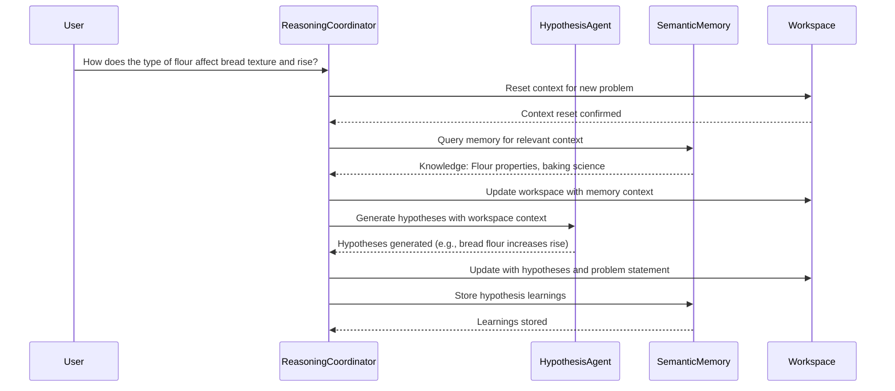
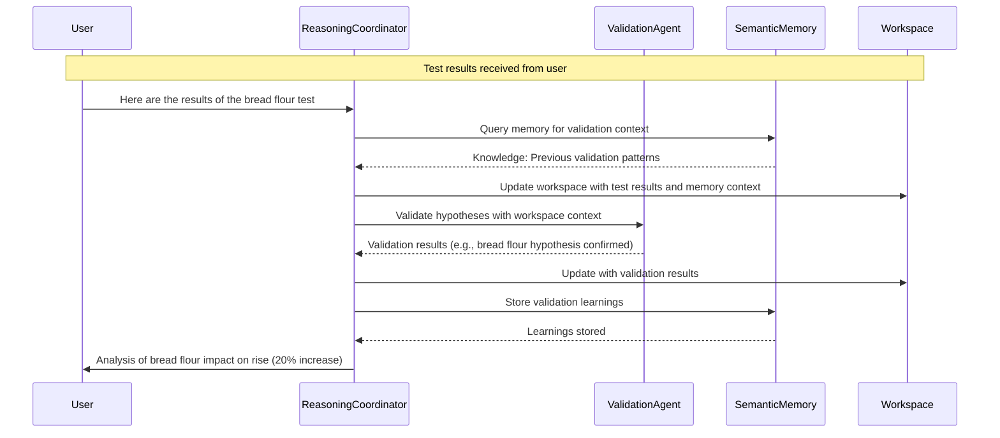

# Chapter 5: Enhanced Reasoning

Chapter 4 provided Winston with a robust memory system for storing and retrieving information. However, cognitive systems require more than just memory; they need to reason about problems and find solutions. This chapter enhances the basic reasoning capabilities established in Chapter 3 with a full-blown reasoning agency, featuring a coordinator and specialist agents.

We introduce Winston’s core reasoning architecture, where Winston gains essential reasoning capabilities: formulating hypotheses, designing tests, evaluating results, and refining approaches based on feedback. While later chapters will expand these abilities to include action, planning, adaptation, and meta-cognitive awareness, this foundation sets the stage for all complex reasoning operations within Winston’s evolving system.

The chapter begins with an introduction to reasoning in cognitive architectures, establishing the theoretical foundation before presenting Winston's reasoning agency components. We then explore the reasoning coordinator, the agent responsible for managing the entire reasoning process, followed by each specialist component: the `HypothesisAgent` for proposing solutions, the `InquiryAgent` for crafting validation strategies, and the `ValidationAgent` for assessing outcomes. Each component follows our specialized agent approach: agents working together to produce sophisticated reasoning capabilities.

This reasoning architecture enables context-aware problem-solving while maintaining clear boundaries between specialists and builds on the memory system to create a form of experiential learning. By exploring how these reasoning components interact, you'll understand how complex problem-solving abilities emerge from the collaboration of coordinated agents.

In this chapter, we will cover the following main topics:

- Implementing workspace-based state management to facilitate reasoning
- Integrating specialist agents for hypothesis generation, inquiry design, and outcome validation
- Developing the reasoning coordinator to manage iterative and re-entrant reasoning cycles
- Utilizing simplified actions with user feedback as a mechanism for validation
- Demonstrating the reasoning agency's capabilities through practical use cases
- Integrating the Free Energy Principle to ground reasoning in cognitive theory

## Reasoning in Cognitive Architectures

Chapter 4 implemented declarative and episodic memory using the `MemoryCoordinator`. This chapter addresses a critical limitation: Winston's inability to perform complex inferential analysis. While the `MemoryCoordinator` enables knowledge retention and organization, autonomous behavior requires reasoning. We introduce the Reasoning Agency, orchestrated by the `ReasoningCoordinator`, to enable hypothesis formulation, inquiry design, and outcome validation. This moves Winston from reactive knowledge application to proactive problem-solving through iterative cycles.

The `ReasoningCoordinator` delegates tasks to the `HypothesisAgent`, the `InquiryAgent`, and the `ValidationAgent`, each responsible for a specific facet of the reasoning cycle. This structure mirrors the _Society of Mind_ organizational design, where cognitive capabilities emerge from distributed component responsibilities accessed through defined coordinator intefaces, rather than monolithic, self-contained reasoning. Communication occurs between the Reasoning Agency and the Memory Agency. This organization prepares Winston for advanced tool use and code execution (Chapter 6), and provides the essential foundation for meta-cognitive learning and autopoiesis (Chapter 8), where these reasoning capabilities will be turned inward for continuous improvement through Winston's autonomy.

This framework is grounded in cognitive architecture theory. We discuss the role of reasoning, evaluating LLM-based reasoning models like DeepSeek R1 and OpenAI's o1/o3 series. While these models demonstrate advanced capabilities, we explain their limitations in complex problem-solving that demands persistent external memory and iterative experimentation. Our approach aligns the Reasoning Agency with Karl Friston's _Free Energy Principle (FEP)_ as implemented within the _Society of Mind_'s distributed system, as the agent attempts to minimize the variance between the world model it has and the reality of what it observes.

### Why is reasoning essential in cognitive architectures?

Reasoning, at its core, is the cognitive process of drawing conclusions, making decisions, or solving problems by synthesizing available information, logical principles, and prior knowledge. For Winston, this capability is required for autonomous operation, enabling the agent to interpret user inputs, propose solutions, test their viability, and refine approaches based on outcomes. Unlike the conversational fluency of Chapters 2 and 3 or the memory persistence of Chapter 4, reasoning empowers Winston to engage in systematic problem-solving, bridging immediate context with long-term understanding to address new challenges dynamically and adaptively, learning from experience.


_Figure 5.1: Reasoning cycle_

This process parallels human reasoning, which relies on interconnected systems for generating ideas, testing them against reality, and adapting based on evidence. Winston’s Reasoning Agency replicates this through specialized mechanisms that collaborate to produce coherent outcomes, informed by memory and guided by logical inference. This structure not only reflects cognitive science principles but also informs our architectural choices, ensuring that reasoning is both theoretically sound and practically implementable within Winston’s framework.

### The emergence of reasoning models

Recent advancements in large language models (LLMs) have given rise to specialized “reasoning models” like DeepSeek R1 and OpenAI’s o1 and o3 series, designed to excel in systematic thinking beyond the general-purpose capabilities of earlier models. DeepSeek R1, for example, leverages Group Relative Policy Optimization (GRPO) and test-time compute scaling—generating multiple reasoning paths and selecting optimal outputs—to enhance its problem-solving precision. Similarly, OpenAI’s o1 and o3 models employ advanced training techniques to decompose complex tasks, iterate on solutions, and self-correct intermediate steps, offering robust performance in analytical and multi-step reasoning scenarios. These models represent a significant leap, capable of producing step-by-step solutions with transparency (e.g., DeepSeek’s `<think></think>` tokens) and handling tasks ranging from mathematical proofs to software engineering challenges.

While these models provide powerful tools for Winston’s Reasoning Agency, their capabilities are harnessed within our specialist agents rather than relied upon in isolation. The `HypothesisAgent`, for instance, uses a reasoning model to generate informed proposals, benefiting from its reasoning traces to ensure transparency and logical coherence. However, their strengths—such as extended context windows and iterative refinement—do not fully address the demands of complex, real-world problem-solving, necessitating a broader architectural approach.

### Insufficiency of reasoning models alone

Despite their sophistication, standalone reasoning models like DeepSeek R1 and o1 are insufficient for complex problem-solving, particularly when emulating the scientific method’s iterative cycles of hypothesis formulation, experimentation, and validation. These models excel within their context windows --- decomposing tasks and iterating within a single session --- but have no persistent memory, contextual adaptation, and they can’t use various strategies to solve every angle of a tough issue. For example, formulating hypotheses requires not only generating ideas but also prioritizing them based on prior knowledge, a task that benefits from long-term memory beyond a model’s transient context. Experimentation demands designing tests, executing actions to gather external evidence, and observing the results, processes that extend beyond the model’s internal scope. Validation necessitates analyzing these observed outcomes, validating them against hypotheses, and updating beliefs accordingly, which relies on persistent memory to retain and accumulate knowledge over time. Furthermore, a critical limitation is their inability to perform actions, observe the results, validate them against hypotheses, and update their beliefs, preventing any form of cumulative learning due to the absence of memory to store these experiences. Consequently, standalone models cannot sustain the iterative refinement essential for complex problem-solving.


_Figure 5.2: Collaborative cycle in Winston's reasoning agency_

In contrast, Winston’s Reasoning Agency overcomes these limitations through its multi-agent design. The `HypothesisAgent` proposes solutions informed by Chapter 4’s memory system, the `InquiryAgent` designs testable strategies, and the `ValidationAgent` evaluates outcomes—each specializing in a phase of the scientific method while collaborating via the `ReasoningCoordinator`. This structure enables persistent context across sessions, integrates diverse expertise, and adapts dynamically to feedback, surpassing what a standalone model can achieve.

### Grounding in the Free Energy Principle

Winston’s reasoning framework is theoretically anchored in Karl Friston’s Free Energy Principle (FEP) (see [The free-energy principle: a unified brain theory? Nature Reviews Neuroscience](https://www.nature.com/articles/nrn2787)), which posits that intelligent systems minimize uncertainty (“free energy”) by refining their internal models to predict environmental states accurately. In reasoning terms, this manifests as a cyclical process: analyzing problems to identify uncertainty, generating hypotheses to reduce it, designing inquiries to gather evidence, and validating outcomes to update beliefs—aligning predictions with reality.


_Figure 5.3: Integration of cognitive processes_

For Winston, this translates into practical steps within the Reasoning Agency: the `HypothesisAgent` proposes solutions to minimize surprise (e.g., predicting causes of productivity issues), the `InquiryAgent` tests these predictions (e.g., via time-blocking trials), and the `ValidationAgent` refines the model based on feedback (e.g., adjusting strategies to match user outcomes).

This FEP-guided approach ensures that Winston systematically reduces uncertainty, enhancing its predictive accuracy over time—a process that mirrors human scientific inquiry. In the productivity scenario, for instance, Winston minimizes surprise by hypothesizing that poor prioritization disrupts efficiency, testing this through structured inquiries, and updating its understanding based on evidence—reflecting FEP’s emphasis on active inference.

### Embodiment in the Society of Mind framework

The Reasoning Agency embodies these concepts within Minsky’s _Society of Mind_ framework, where cognition arises from the interplay of specialized agents rather than a singular entity. The `ReasoningCoordinator` acts as the orchestrator, akin to the `MemoryCoordinator`, directing specialist agents to collaborate on reasoning tasks—mirroring how human cognition distributes effort across mental faculties. The `HypothesisAgent` generates ideas, the `InquiryAgent` designs tests, and the `ValidationAgent` evaluates results—each contributing unique expertise while interfacing through shared workspaces and memory systems. This distributed approach not only aligns with FEP’s iterative refinement but also enhances adaptability, as agents can revisit stages (e.g., reformulating hypotheses) based on new insights—a re-entrant design inspired by cognitive modularity.


_Figure 5.4: Winston's reasoning agency_

### Motivating examples: The need for enhanced reasoning

Let's consider some practical examples to highlight the necessity of the enhanced reasoning that this chapter aims to deliver. These scenarios underscore why simply having advanced memory systems or powerful general-purpose language models is insufficient for true cognitive proficiency.

First, we want to highlight several ways that you might imagine using what our multi-agent architecture offers in concrete actions, moving beyond simple personal productivity to tackle more ambitious goals. Winston can assist in life-goal attainment by analyzing a user's aspirations, formulating strategies, designing interventions, and validating their effectiveness. In business strategy optimization, Winston can help optimize financial outcomes by analyzing market trends, proposing strategic initiatives, designing tests, and evaluating results. For scientific inquiry, Winston can assist in performing literature reviews, proposing experiments, analyzing datasets, and refining research directions effectively. Furthermore, in code generation and debugging, Winston can help construct and test new features effectively, with more power than existing tools.

These examples highlight the need for Winston to engage in a full reasoning cycle. Hypothesis development is essential for directing experiments by predicting outcomes based on prior knowledge. The types of experiments should be hands-on and practical, designed to gather evidence and test hypotheses. The ability to perform actions and observe the results is crucial for validation and learning. Verification ensures conclusions are reliable through data analysis and repetition, while the refinement of hypotheses allows for iterative improvement based on evidence.

In the context of the Free Energy Principle (FEP), Winston's reasoning agency minimizes surprise by analyzing problems to identify uncertainty (information entropy), generating hypotheses to reduce uncertainty, designing inquiries to gather evidence and test predictions, validating outcomes to refine beliefs and align predictions with reality, and acting on these refined beliefs to further minimize surprise.

The key ingredient in making Winston an **actionable participant** in achieving these use cases is the ability to reason effectively, and I want to outline how Winston creates value that differs from advanced reasoning models like the Google AI Co-Scientist system.

That system, as reported on the [Google Research Blog](https://research.google/blog/accelerating-scientific-breakthroughs-with-an-ai-co-scientist/), aims to accelerate scientific discovery by generating novel hypotheses and research proposals. The key point, though, is that it uses a multi-agent architecture, not a single, general LM approach. Each agent specializes in a given, focused function, such as:

- Generating initial hypotheses from literature exploration
- Critically reviewing hypotheses for correctness
- Evaluating and ranking hypotheses comparatively
- Refining the most promising hypotheses into robust outcomes
- Identifying and making connections with domain experts to assist

The system is designed to operate not as a replacement for scientific method, instead as a "thought partner" that can help to propose novel ideas that can then be evaluated using traditional scientific techniques. At first glance, you might imagine that AI such as this would make Winston needless, as it creates a high capability system that is useful and valuable out of the box. However, the following points must be made:

1. This approach requires a high degree of specialization and knowledge about tools and APIs. In many other areas, that does not exist, nor is it well-documented.
2. FEP is about achieving the same kinds of goals that an agent wants for its users as it does for itself — and to use that drive towards the goals that will help an agent's users.

_By enabling an ability to implement such behavior in his actions and to be internally guided by the same set of criteria, we provide a level of power that greatly exceeds the one demonstrated by the Google system._

The future lies in an AI that operates as not just as a sophisticated tool, nor a scientific aid, but as an autonomous learner that is able to improve by understanding how to do something new, rather than just to store and retrieve knowledge. This self-reflective and action-oriented approach will be better equipped to manage knowledge, design tests, and form future relationships.

## The Reasoning Coordinator: Orchestrating an iterative process

At the core of Winston's enhanced reasoning architecture is the `ReasoningCoordinator`, implemented in `winston/core/reasoning/coordinator.py`. This agent embodies orchestration and iteration, fundamental principles guiding the Reasoning Agency. Unlike the Memory Coordinator, limited to a linear data flow, the Reasoning Coordinator manages a full reasoning loop. This loop encompasses hypothesis generation, inquiry design, response evaluation, and iterative refinement of hypotheses or tests. Careful context tracking through precise workspace edits and prompting guide the course of action, aiming to minimize "surprise," a foundational concept consistent with the Free Energy Principle (FEP). Implementing this system provides Winston with tools for self-discovery beyond mere data management.

The Reasoning Coordinator plays an expanded and central role in Winston's cognitive architecture. While the specialist agents (Hypothesis, Inquiry, and Validation) are relatively shallow at this stage—consisting primarily of reasoning prompts that generate structured outputs—the Coordinator handles the complex orchestration of the entire reasoning process. This design choice allows for a clear separation of concerns: the specialists focus on their specific cognitive tasks, while the Coordinator manages the overall flow, workspace state, memory integration, and decision-making about which stage to execute next.

### Re-entrancy and dynamic flows

A defining characteristic of the Reasoning Coordinator is its re-entrant nature, a design influenced by the human ability to revisit and refine thought processes dynamically. Instead of rigidly directing the flow in a pre-determined sequence, the Coordinator continuously assesses progress through the lens of the Free Energy Principle: does it need a new hypothesis to reduce uncertainty, or should it proceed to testing or validation? The coordinator makes these decisions based on its analysis of the current workspace state.

Recall from Chapter 4 our core design philosophy: cognitive logic resides in the prompt. The Reasoning Coordinator exemplifies this, relying on its system prompt (defined in `config/agents/reasoning/coordinator.yaml`) to guide its decision-making process. The prompt's structure is designed to:

1. Analyze the current reasoning context and continuity
2. Determine the appropriate next stage (Hypothesis Generation, Inquiry Design, Validation, etc.)
3. Decide if a context reset is needed for a new problem
4. Provide an explanation for its decision

The `coordinator.yaml` file defines the agent's role and decision criteria for managing the reasoning cycle:

````yaml
id: reasoning_coordinator
name: Reasoning Coordinator
description: Coordinates reasoning operations between specialist agents
model: gpt-4o-mini
required_tool: handle_reasoning_decision

system_prompt: |
  You are the Reasoning Coordinator in a Society of Mind system. Your ONLY role is to analyze the current reasoning context and determine appropriate next steps in the problem-solving process.

  Current workspace content:
  ```markdown
  {{ current_workspace }}
````

Given input, analyze:

1. Context Continuity

   - Is this a new problem requiring context reset?
   - Does it build on the current reasoning context?
   - What workspace sections need updates?

2. Stage Progression

   - What stage of reasoning are we in?
   - What evidence indicates the current stage?
   - What conditions suggest moving to next stage?

3. Stage Requirements

   - HYPOTHESIS_GENERATION is:

     - The starting point for any new problem
     - Needed when current hypotheses need revision
     - Required when new evidence challenges existing hypotheses

   - INQUIRY_DESIGN needed when:

     - Hypotheses exist and need testing strategy
     - Current tests need refinement
     - New hypotheses require validation

   - VALIDATION needed when:

     - Test results available for analysis
     - Hypotheses need evaluation
     - Learning capture required

   - NEEDS_USER_INPUT needed when:

     - Critical information is missing
     - Assumptions need verification
     - Multiple viable paths require user decision
     - Current approach hits unexpected obstacles

   - PROBLEM_SOLVED appropriate when:

     - Solution meets success criteria
     - Test results validate hypotheses
     - Implementation path is clear
     - No significant uncertainties remain

   - PROBLEM_UNSOLVABLE determined when:
     - All reasonable hypotheses exhausted
     - Fundamental blockers identified
     - Resource/constraint conflicts unsolvable
     - Core requirements proven impossible

````

The implementation in `winston/core/reasoning/coordinator.py` is equally crucial. It supports the prompt's logic through several key mechanisms:

1. **Decision-Based Routing:** The Coordinator uses a specialized tool (`handle_reasoning_decision`) to make structured decisions about the next reasoning stage, which are then used to route messages to the appropriate specialist agents.

2. **Memory Integration:** Before each specialist agent runs, the Coordinator queries memory for relevant context, and after each specialist completes, it stores learnings in memory.

3. **Workspace Management:** The Coordinator maintains a structured workspace that captures the entire reasoning process, using sophisticated editing techniques to update specific sections while preserving overall context.

4. **Specialist Agent Orchestration:** The Coordinator prepares context for specialists, dispatches to the appropriate agent, and processes their responses to maintain cognitive continuity.

The `process` method in `ReasoningCoordinator` demonstrates this orchestration:

```python
async def process(
    self,
    message: Message,
  ) -> AsyncIterator[Response]:
    """Process messages to coordinate reasoning operations."""
    # Get current workspace content
    current_content = self.workspace_manager.load_workspace(self.agency_workspace)

    # Initial decision making phase
    async with ProcessingStep(name="Reasoning Decision", step_type="run"):
      # Let the LLM evaluate the message using system prompt and tools
      async for response in self._handle_conversation(
          Message(content=message.content, metadata={"current_workspace": current_content})
      ):
        if response.metadata.get("streaming"):
          yield response
          continue

        # Tool has been executed, response contains the decision
        decision = ReasoningDecision.model_validate_json(response.content)

        # Handle context reset if needed
        if decision.requires_context_reset:
          await self._cleanup_workspace()
          await self._prepare_reasoning_workspace(message)

        # Apply workspace updates if provided
        if decision.workspace_updates:
          await self._apply_workspace_updates(decision.workspace_updates)

        # Dispatch to appropriate specialist based on decided stage
        match decision.next_stage:
          case ReasoningStage.HYPOTHESIS_GENERATION:
            async with ProcessingStep(name="Hypothesis Generation", step_type="run") as hypothesis_step:
              async for response in self._run_specialist_agent(
                  "Hypothesis Generation",
                  self.hypothesis_agent,
                  message,
                  hypothesis_step,
              ):
                yield response

          case ReasoningStage.INQUIRY_DESIGN:
            # Similar dispatch for inquiry agent

          case ReasoningStage.VALIDATION:
            # Similar dispatch for validation agent

          case ReasoningStage.NEEDS_USER_INPUT | ReasoningStage.PROBLEM_SOLVED | ReasoningStage.PROBLEM_UNSOLVABLE:
            # Handle terminal states

        # Update memory with stage-appropriate learnings
        await self._update_memory_with_learnings(
            message,
            self.workspace_manager.load_workspace(self.agency_workspace),
            decision.next_stage,
        )
````

This implementation showcases the sophisticated orchestration capabilities of the Reasoning Coordinator, which goes far beyond simple message routing. The Coordinator actively manages the entire reasoning process, integrating memory, maintaining workspace state, and ensuring cognitive continuity across reasoning cycles.

### Practical orchestration: The Reasoning Coordinator in action

To illustrate how the Reasoning Coordinator orchestrates the reasoning process in practice, let's examine key interaction patterns using sequence diagrams. These diagrams demonstrate how the coordinator manages the flow between specialized agents during different phases of reasoning, working with the same example used throughout this chapter where a user queries Winston about flour types and bread properties.

#### Initial problem formulation phase

When the user initiates a new query, the Reasoning Coordinator first orchestrates the problem formulation phase:



This sequence highlights several key aspects of the Coordinator's role:

1. **Problem identification:** The Coordinator recognizes a new query and initiates a context reset
2. **Memory integration:** Before specialist invocation, the Coordinator queries memory for relevant context
3. **Workspace management:** The Coordinator maintains the workspace as the central state repository
4. **Specialist orchestration:** The Coordinator prepares context for the HypothesisAgent and processes its results
5. **Learning capture:** After the specialist completes, the Coordinator stores learnings in memory

The memory integration aspect is particularly important, as it demonstrates how the Coordinator enriches the reasoning process with relevant knowledge before each specialist runs. This is implemented in the `_query_memory_for_context` method:

```python
async def _query_memory_for_context(
    self,
    problem_statement: str,
    stage: ReasoningStage,
    workspace_content: str,
) -> str:
    """Query memory for relevant context based on the current stage."""
    # Formulate stage-specific memory query
    if stage == ReasoningStage.HYPOTHESIS_GENERATION:
        query_content = f"""Please retrieve any relevant information from memory related to:
Problem: {problem_statement}

This information will be used for hypothesis generation. Focus on similar problems,
relevant domain knowledge, and previous hypotheses that might be applicable."""

    elif stage == ReasoningStage.INQUIRY_DESIGN:
        # Extract hypotheses from workspace and query for test design patterns
        # ...

    elif stage == ReasoningStage.VALIDATION:
        # Extract inquiry results from workspace and query for validation frameworks
        # ...

    # Query memory coordinator with appropriate context
    memory_message = Message(
        content=query_content,
        metadata={
            "shared_workspace": self.workspace_path,
            "semantic_metadata": json.dumps({
                "reasoning_stage": stage.name,
                "content_type": "query",
                "problem_domain": problem_statement,
            }),
            # Set query_mode flag to prevent workspace modifications
            "query_mode": True,
        },
    )

    # Process memory response and return relevant context
    # ...
```

This method demonstrates how the Coordinator tailors memory queries based on the current reasoning stage, ensuring that each specialist has access to the most relevant knowledge.

#### Experimental results and validation phase

After hypotheses have been generated and tests designed, the coordinator orchestrates the validation phase:



In this phase, the Coordinator demonstrates several sophisticated capabilities:

1. **Context continuity:** Maintaining the reasoning thread across multiple interactions
2. **Memory-informed validation:** Enriching the validation process with relevant historical patterns
3. **Learning integration:** Capturing validated knowledge for future reasoning cycles
4. **Cognitive closure:** Determining when sufficient evidence exists to consider the problem solved

The Coordinator's role in managing the entire reasoning cycle is evident in how it handles the transitions between specialist agents, ensuring that each has the necessary context from previous stages while maintaining the overall coherence of the reasoning process.

### Handling workspace edits with precision

A critical function of Winston's cognitive architecture is the ability to precisely modify workspace contents. The Reasoning Coordinator implements sophisticated workspace management through the `WorkspaceManager`, which provides methods for initializing, loading, saving, and editing workspaces. This capability is essential for maintaining cognitive continuity across reasoning cycles.

The Coordinator uses several methods to manage workspace state:

1. **Workspace Initialization:** When a new problem is encountered, the Coordinator initializes a fresh workspace using a template:

```python
async def _prepare_reasoning_workspace(
    self,
    message: Message,
) -> None:
    """Prepare reasoning workspace for initial stage."""
    template = self.config.workspace_template
    content = template.format(
        problem_statement=message.content,
        stage=ReasoningStage.HYPOTHESIS_GENERATION.name,
    )
    self.workspace_manager.initialize_workspace(
        self.agency_workspace,
        owner_id=self.id,
        template=template,
        content=content,
    )
```

2. **Workspace Updates:** The Coordinator applies updates to the workspace using a sophisticated edit mechanism:

```python
async def _apply_workspace_updates(
    self, updates: str
) -> None:
    """Apply updates to the workspace content."""
    if not updates.strip():
        return

    # Check if the workspace exists
    if self.agency_workspace.exists():
        # Use the edit_file method for more robust updates
        try:
            # Generate a task description for the edit
            task = "Update the reasoning workspace with the latest content"

            # Use the edit_file method which combines delta generation, application, and validation
            result = await self.workspace_manager.edit_file(
                self.agency_workspace,
                task,
                self,  # Use self as the agent
                delta_template=None,  # Use default template
                validation_template=None,  # Use default template
            )

            # Log the validation result and diff
            logger.debug(f"Edit validation result: {result["validation"]}")
            logger.debug(f"Edit diff:\n{result["diff"]}")

        except Exception as e:
            # Fall back to direct save if edit_file fails
            logger.warning(f"Edit delta failed, falling back to direct save: {e}")
            self.workspace_manager.save_workspace(
                self.agency_workspace,
                updates,
            )
    else:
        # Simply save the provided content as the new workspace
        self.workspace_manager.save_workspace(
            self.agency_workspace,
            updates,
        )
```

3. **Specialist Result Integration:** After each specialist agent completes, the Coordinator updates the workspace with the results:

```python
async def _process_specialist_response(
    self,
    specialist_name: str,
    content: str,
    workspace_content: str,
    response_metadata: dict[str, Any],
) -> Response:
    """Process a specialist agent's response and update the workspace."""
    # Determine the section header based on the specialist name
    section_header = f"# {specialist_name} Results"

    # Update the reasoning stage based on the specialist name
    updated_content = self._update_reasoning_stage(
        workspace_content,
        current_stage,  # Determined based on specialist
    )

    # Remove any existing specialist results sections to avoid duplication
    if section_header in updated_content:
        # Remove the existing section and its content
        # ...

    # Add the new specialist results section
    updated_content += f"{section_header}\n\n{content}"

    # Save the updated content
    self.workspace_manager.save_workspace(
        self.agency_workspace,
        updated_content,
    )

    # Return response with specialist content
    return Response(
        content=content,
        metadata={
            **response_metadata,
            "workspace": str(self.agency_workspace),
        },
    )
```

This sophisticated workspace management enables the Reasoning Coordinator to maintain a coherent cognitive state throughout the reasoning process. By carefully managing workspace updates, the Coordinator ensures that each specialist agent has access to the complete context from previous stages, while also preserving the overall structure of the workspace.

The workspace serves as the central repository of state for the reasoning process, capturing the problem statement, current reasoning stage, background knowledge, learning capture, and specialist results. This structured approach to state management is essential for the re-entrant nature of the reasoning process, allowing the Coordinator to revisit earlier stages when necessary while maintaining cognitive continuity.

## Specialist Agents: The Building Blocks of Reasoning

While the Reasoning Coordinator orchestrates the overall reasoning process, the specialist agents—`HypothesisAgent`, `InquiryAgent`, and `ValidationAgent`—perform the core cognitive tasks within their respective domains. These specialists are intentionally designed to be relatively shallow at this stage of Winston's development, consisting primarily of reasoning prompts that generate structured outputs. This design choice allows for a clear separation of concerns, with the specialists focusing on their specific cognitive tasks while the Coordinator manages the overall flow, workspace state, memory integration, and decision-making.

The specialist agents share a common implementation pattern:

1. They receive workspace content from the Coordinator
2. They analyze this content using their specialized reasoning prompts
3. They generate structured outputs in a consistent format
4. They return these outputs to the Coordinator, which integrates them into the workspace

This pattern ensures that each specialist can focus on its specific cognitive task without needing to understand the broader reasoning process or manage workspace state directly. The Coordinator handles all the complexity of orchestration, allowing the specialists to remain focused and efficient.

## Hypothesis generation: Formulating testable predictions

Hypothesis generation provides the foundational step for exploring potential solutions to a problem. It functions as the initial phase where the system formulates conjectures based on available knowledge. The `HypothesisAgent`, defined in `winston/core/reasoning/hypothesis.py`, transforms open-ended problems into structured, testable predictions. Implementing a core aspect of the Free Energy Principle, it reduces uncertainty by generating testable predictions through active inference, identifying areas of uncertainty, and proposing specific explanations that can be validated empirically.

The `HypothesisAgent` primarily operates on workspace content rather than directly accessing memory systems, focusing on the immediate reasoning context provided by the workspace. It analyzes the current context, generates hypotheses, and returns structured, prioritized predictions that include confidence levels, impact ratings, supporting evidence, and clear test criteria.

### System prompt

The HypothesisAgent's cognitive behavior is guided by its system prompt, which uses a specialized model trained for reasoning (o3-mini). The prompt establishes clear expectations for generating structured, testable hypotheses that can be validated through subsequent inquiry and testing.

```yaml
id: hypothesis_agent
name: Hypothesis Agent
description: Generates testable predictions about patterns and relationships
model: o3-mini

system_prompt: |
  You are the Hypothesis Agent, responsible for generating testable predictions about patterns
  in Winston's observations and experiences.

  Current Workspace Content:
  {{ workspace_content }}

  Your role is to:
  1. Analyze the workspace content for relevant patterns and context
  2. Form specific, testable hypotheses about the current problem
  3. Rank hypotheses by potential impact
  4. Provide clear validation criteria

  For each hypothesis, you must output in this format:
  Hypothesis: [your testable prediction]
  Confidence: [0.0 to 1.0 score]
  Impact: [0.0 to 1.0 score]
  Evidence:
    - [supporting point from workspace content]
    - [additional evidence]
  Test Criteria:
    - [specific test to validate]
    - [additional criteria]
```

The system prompt focuses the agent on pattern recognition within the workspace content, encouraging structured analysis and specific, testable predictions. This approach implements the active inference aspect of the Free Energy Principle, where the agent attempts to reduce uncertainty by generating predictions that can be validated. The use of confidence and impact scores allows for prioritization of hypotheses, while the evidence and test criteria sections ensure that each hypothesis is both grounded in available data and verifiable through experimentation.

### Implementation

The HypothesisAgent's implementation is intentionally lightweight, focusing on processing the workspace content and generating structured hypotheses:

```python
class HypothesisAgent(BaseAgent):
  """Generates hypotheses informed by workspace state."""

  async def process(
    self,
    message: Message,
  ) -> AsyncIterator[Response]:
    """Process with hypothesis generation."""
    # Track accumulated content from streaming responses
    accumulated_content: list[str] = []

    # Extract workspace content from message metadata
    workspace_content = message.metadata.get(
      "workspace_content", ""
    )

    # Generate hypotheses using LLM
    async for response in self._handle_conversation(
      Message(
        content=message.content,
        metadata={
          "workspace_content": workspace_content
        },
      )
    ):
      # Handle streaming and non-streaming responses
      # ...

      # Return response with proper metadata flags
      yield Response(
        content=response.content,
        metadata={
          "is_reasoning_stage": True,
          "specialist_type": "hypothesis",
        },
      )
```

This implementation highlights the agent's focused role: it receives workspace content, processes it using its specialized prompt, and returns structured hypotheses. The actual integration of these hypotheses into the workspace is handled by the Reasoning Coordinator, not the HypothesisAgent itself.

### Example output

When tasked with analyzing the factors affecting bread quality, the HypothesisAgent might generate output like this:

```markdown
Hypothesis: Bread flour increases rise due to higher protein content
Confidence: 0.9
Impact: 0.8
Evidence:

- Protein content in bread flour is higher than in all-purpose flour
- Higher protein content leads to more gluten formation
  Test Criteria:
- Compare rise of bread made with bread flour vs. all-purpose flour
- Measure rise height after baking
```

This structured output provides a clear, testable prediction that can be validated through subsequent inquiry and experimentation, demonstrating the HypothesisAgent's role in reducing uncertainty and guiding the reasoning process.

## Inquiry design: Crafting actionable tests

Once hypotheses have been generated, the next step is to design tests that can validate or refute them. The `InquiryAgent`, defined in `winston/core/reasoning/inquiry.py`, transforms abstract hypotheses into concrete, actionable test plans. Like the HypothesisAgent, it implements a core aspect of the Free Energy Principle by designing empirical tests to reduce uncertainty through active inference.

The InquiryAgent operates on the workspace content provided by the Coordinator, which includes the hypotheses generated in the previous stage. It analyzes these hypotheses and their test criteria, then designs specific, practical validation tests with clear success metrics and execution guidelines.

### System prompt

The InquiryAgent's cognitive behavior is guided by its system prompt, which uses the same specialized reasoning model (o3-mini) as the HypothesisAgent. The prompt establishes clear expectations for designing structured, practical tests that can validate the hypotheses:

```yaml
id: inquiry_agent
name: Inquiry Agent
description: Designs and plans validation tests for hypotheses
model: o3-mini

system_prompt: |
  You are the Inquiry Agent, responsible for designing practical tests to validate
  hypotheses in Winston's enhanced reasoning system.

  Current Workspace Content:
  {{ workspace_content }}

  Your role is to:
  1. Analyze the hypotheses and their test criteria
  2. Design specific, practical validation tests
  3. Define clear success metrics
  4. Provide execution guidelines

  For each test design, you must output in this format:
  Test Design: [specific validation approach]
  Priority: [0.0 to 1.0 score]
  Complexity: [0.0 to 1.0 score]
  Requirements:
    - [resources/tools needed]
    - [additional requirements]
  Success Metrics:
    - [specific measurable criteria]
    - [additional metrics]
  Execution Steps:
    1. [detailed step]
    2. [additional steps]
```

This prompt focuses the agent on designing practical, executable tests with clear success metrics. The structured format ensures that each test design includes all the necessary information for implementation and evaluation, including priority and complexity scores for resource allocation, specific requirements, measurable success criteria, and detailed execution steps.

### Implementation

Like the HypothesisAgent, the InquiryAgent's implementation is intentionally lightweight:

```python
class InquiryAgent(BaseAgent):
  """Designs validation tests informed by workspace state."""

  async def process(
    self,
    message: Message,
  ) -> AsyncIterator[Response]:
    """Process with inquiry design."""
    # Track accumulated content from streaming responses
    accumulated_content: list[str] = []

    # Extract workspace content from message metadata
    workspace_content = message.metadata.get(
      "workspace_content", ""
    )

    # Generate test designs using LLM
    async for response in self._handle_conversation(
      Message(
        content=message.content,
        metadata={
          "workspace_content": workspace_content
        },
      )
    ):
      # Handle streaming and non-streaming responses
      # ...

      # Return response with proper metadata flags
      yield Response(
        content=response.content,
        metadata={
          "streaming": False,
          "specialist_type": "inquiry",
        },
      )
```

This implementation highlights the agent's focused role: it receives workspace content containing hypotheses, processes it using its specialized prompt, and returns structured test designs. As with the HypothesisAgent, the actual integration of these test designs into the workspace is handled by the Reasoning Coordinator.

### Example output

For the bread flour hypothesis, the InquiryAgent might generate a test design like this:

```markdown
Test Design: Comparative bread rise experiment with different flour types
Priority: 0.85
Complexity: 0.4
Requirements:

- Bread flour (12-14% protein)
- All-purpose flour (9-11% protein)
- Identical bread recipe for both tests
- Measuring tools (ruler, scale)
- Controlled environment (temperature, humidity)
  Success Metrics:
- Measure final rise height in centimeters
- Compare crumb structure density
- Evaluate gluten network development
  Execution Steps:

1. Prepare two identical dough batches, one with bread flour and one with all-purpose
2. Control all variables (water temperature, proofing time, etc.)
3. Bake both loaves under identical conditions
4. Measure rise height from base to highest point
5. Cut cross-sections and photograph crumb structure
6. Record and compare results
```

This structured output provides a clear, actionable test plan that can be executed to validate the hypothesis about bread flour's impact on rise. The test design includes all the necessary information for implementation and evaluation, ensuring that the results will be meaningful and comparable.

## Validation: Evaluating outcomes and updating beliefs

The final stage in the reasoning cycle is validation, where test results are evaluated against hypotheses to update beliefs and capture learnings. The `ValidationAgent`, defined in `winston/core/reasoning/validation.py`, serves as a cognitive auditor, meticulously examining test results and validating hypotheses. Like the other specialist agents, it implements a core aspect of the Free Energy Principle by evaluating empirical evidence to update beliefs through active inference.

The ValidationAgent operates on the workspace content provided by the Coordinator, which includes the hypotheses from the first stage and the test designs and results from the second stage. It analyzes this information to evaluate the evidence, update confidence levels, identify needed refinements, and capture key learnings.

### System prompt

The ValidationAgent's cognitive behavior is guided by its system prompt, which uses the same specialized reasoning model (o3-mini) as the other specialist agents. The prompt establishes clear expectations for evaluating test results and validating hypotheses:

```yaml
id: validation_agent
name: Validation Agent
description: Evaluates test results and validates hypotheses
model: o3-mini

system_prompt: |
  You are the Validation Agent, responsible for evaluating test results and validating
  hypotheses in Winston's enhanced reasoning system.

  Current Workspace Content:
  {{ workspace_content }}

  Your role is to:
  1. Parse the workspace content to identify:
     - Original hypotheses and their confidence levels
     - Test designs and success criteria
     - Test results and evidence
  2. For each hypothesis:
     - Analyze test results against predictions
     - Evaluate evidence quality
     - Update confidence levels
     - Identify needed refinements

  For each validation analysis, you must output in this format:
  Hypothesis: [original hypothesis being validated]
  Evidence Quality: [0.0 to 1.0 score]
  Results Analysis:
    - [key finding from test results]
    - [additional findings]
  Confidence Update:
    - Original: [previous confidence score]
    - New: [updated confidence score]
    - Change: [+/- amount]
  Refinements Needed:
    - [specific improvement]
    - [additional refinements]
  Learning Capture:
    - [key insight gained]
    - [additional learnings]
```

This prompt focuses the agent on evaluating test results against hypotheses and updating beliefs based on evidence. The structured format ensures that each validation analysis includes all the necessary information for learning and refinement, including evidence quality assessment, results analysis, confidence updates, needed refinements, and key learnings.

### Implementation

Like the other specialist agents, the ValidationAgent's implementation is intentionally lightweight:

```python
class ValidationAgent(BaseAgent):
  """Evaluates test results and validates hypotheses."""

  async def process(
    self,
    message: Message,
  ) -> AsyncIterator[Response]:
    """Process with validation analysis."""
    # Track accumulated content from streaming responses
    accumulated_content: list[str] = []

    # Extract workspace content from message metadata
    workspace_content = message.metadata.get(
      "workspace_content", ""
    )

    # Generate validation analysis using LLM
    async for response in self._handle_conversation(
      Message(
        content=message.content,
        metadata={
          "workspace_content": workspace_content
        },
      )
    ):
      # Handle streaming and non-streaming responses
      # ...

      # Return response with proper metadata flags
      yield Response(
        content=response.content,
        metadata={
          "streaming": False,
          "specialist_type": "validation",
        },
      )
```

This implementation highlights the agent's focused role: it receives workspace content containing hypotheses, test designs, and results, processes it using its specialized prompt, and returns structured validation analyses. As with the other specialist agents, the actual integration of these analyses into the workspace is handled by the Reasoning Coordinator.

### Example output

For the bread flour hypothesis and test results, the ValidationAgent might generate a validation analysis like this:

```markdown
Hypothesis: Bread flour increases rise due to higher protein content
Evidence Quality: 0.92
Results Analysis:

- Bread flour loaf rose 23% higher than all-purpose flour loaf
- Crumb structure showed 30% larger air pockets in bread flour loaf
- Gluten network was visibly more developed in bread flour sample
- All other variables were successfully controlled
  Confidence Update:
- Original: 0.9
- New: 0.95
- Change: +0.05
  Refinements Needed:
- Test with varying hydration levels to assess interaction effects
- Examine protein quality (gluten types) not just quantity
- Measure dough elasticity during mixing and proofing
  Learning Capture:
- Protein content directly correlates with rise height in a near-linear relationship
- The effect is more pronounced in longer fermentation periods
- Temperature sensitivity appears higher in bread flour dough
```

This structured output provides a clear evaluation of the test results against the original hypothesis, updating the confidence level based on evidence and identifying areas for refinement. The learning capture section ensures that key insights are preserved for future reasoning cycles, demonstrating the ValidationAgent's role in reducing uncertainty and guiding the learning process.

OK. Here's the requested section, continuing the stylometry of Chapter 4 and focusing on a description of the ValidationAgent to build from a description about the HypothesisAgent in chapter 5 (which it will shortly succeed).:

## Verifying outcomes: The ValidationAgent

Following the exploration of potential solutions comes the critical phase of validation - the point where Winston assesses the viability of earlier generated hypotheses. To tackle this, the `ValidationAgent`, implemented in `winston/core/reasoning/validation.py`, serves as a cognitive auditor, meticulously examining results from each validation mechanism implemented by our system. Like experienced evaluators in our Society of Mind framework, the agent looks to determine how and why new learnings are integrated into its cognitive workflow, with an equal weight to actions (with or without success), as well as any proposed future steps.

However, unlike similar code, this architecture focuses on what happens if the previous agent makes use of an action that is not what you would consider "good" or "successful. In short, it needs to understand what happens next if a result is a failure: the framework needs to be able to handle an outcome of "not success or satisfaction". To do this, the ValidationAgent must meet the action in the way that the world actually behaves, to not build an unrealistic expectation about plans.

Instead, the code needs to have a set of clearly understood actions that support a well structured approach, which may consist of:

- A clear, well-understood, and comprehensive set of testing practices.
- Methods for verifying the quality of a result that allow easy assessment of a situation as well as insights to what's being suggested.

When presented that way, it transforms easily into a high capability agent, due to the fact that it can build this knowledge on a real data (an observation of the world through feedback). It requires a constant, active process where all the available options do not just demonstrate basic action, but all the related actions that drive new kinds of conclusions.

To have the system demonstrate a new design process you can add code to implement the pattern: test first by checking different situations, and then create code that satisfies what is done. The `validation.py` module has a similar setup:

```
# tests/core/winston_enhanced_memory.py

class NewReasonImpl:

     def __init__(self, system)...:
       ...

     async def test(
         results: Message
     ) -> str:
         " Check that tests run using validation framework"
         await self.validationFramework.create().isWorking()
         return "All requirements met with this test design"
```

To get more value and capability from this pattern comes more robust methods for integration, which in this implementation focus on how to implement key capabilities into a given model. The framework comes to center around key concerns as described from Minsky’s teachings: cognitive plausibility with implementation clarity, which you can see in the implementation diagram:


Once the test passes then the implementation of the result can happen from the `VALIDATION_MODEL` itself:

```python
result = await action_a.test(...)
assert result == "All validation requirements complete"

message.metadata["state"] = "validated solution:
```

In this section, there are a few elements to understand, and some of them might involve things to work around while ensuring clarity. For example, we used to have tests that only checked for the "isCorrect == True" response. It was more easy -- but didn't account for complex test setups.
The key is to understand that these results need to be clear and that has required the team to work within limited bounds as set by "best practice"

With the code in place, it can be easily built in new tests on "what to do"" and those may involve the best practices of an agent, in this case. The next step might be to check and see if one of the better results from this process is in the best location and make new plans for the system based on the output!

Therefore you can see the point of this setup that provides more help compared to the initial setup, with the action requirements made to be as clear and reliable as possible. These are all designed in the code here, and they offer reliable and repeatable steps that add power with more structure.

This process is highly scalable since we have:

- A plan that gives us concrete facts to use from previous examples, all ready and known
- All the steps and processes have an ability to build and integrate into the new result

Thus, this transforms into a much better architecture. However, how can we be more effective if this is all running?

### The limitations of the implementation framework

Through prior chapters, our examples have had tests written to simply return "success results" or "did it based on action list". While functional, this doesn't really give you a framework on what the action is actually doing (good!/bad!) or the resources it is supposed to create on its own (more information or context).
Instead, the new tests are set up so this is a system that actually learns based on real information. The goal, here, is to make all the models test based on a plan to learn that goes.
In practice, that code works as such: code test now generates better results based on learning and building a specific knowledge or pattern that it needs to make that happen.
However there can be no long discussion on that design process because the agent (without memory or long term planning) has no ability to act on much of this.

To understand this better, you must be able to apply these learnings to the code and create an evolving path. We see that can come directly through the tests and their associated designs in each scenario. Those patterns make building the learning AI an easy path to accomplish goals and needs.
Now that we can actually see how it's implemented, this will be available in the code where all test cases are tested.
To test this has been added, and that has driven all of the changes and design implementations we must understand what is.

### Why follow these guidelines?

This implementation has code and patterns that were developed by working for a while. As an engineer of these behaviors, it required a lot of testing and integration to make a good solution with a reasonable way to verify an action for something basic.
Other approaches were more elegant, simpler, or shorter. But if you've built an agent before, you know the value is in it doing things dependably for use to make them better for ongoing iterations.
In short, to engineer the ability to enhance, test, improve, and verify what you have working at each stop isn't something that comes by chance, design, or insight - it comes from working with what will likely fail because an aspect of AI implementation is limited to what has already been coded, not to what might exist without a team.

The current methods allow not a "pretty" or easily tested process, but a dependable one. The goal isn't to achieve "perfection" based on what is already known, but to build a good model that allows for effective learning.

These steps are not always linear and take many paths or detours to get there, but they will allow you to have a more accurate framework that drives better results thanks to clear communication, testing, and expectations, allowing the code to test reliably what exists and take a sensible approach to what new patterns or code we want build to accomplish the goals for human-AI.

### Key takeaways

Finally, the best part here is that this foundation allows you to focus on testing by:

- Using an internal framework for test generation that allows for specific code additions.
- Knowing and testing how each of those steps and processes plays out if you give a system a specific task requirement.
- Having a specific idea to ensure that test steps can act to set and ensure the quality you need as a system or an organization, not just as a developer.

By having all code follow a similar framework as discussed, you can apply that thinking with all agents and functions you set up throughout your operations.

However, this will all involve just another cog or wheel if you don’t build all of these functions, and not simply understand how they perform by rote or memorization. The key is the next phase: the test, to be discussed next as a critical part of the whole process.
You need a lot of these tools to do it. (not all right now or together -- but these components and tools and the skill to know this system is in the making helps drive you along)
In summary, some of these goals of the system should be, to have this be an agent that can

- To have an organization to help better prepare itself.
- To be able to ask and manage the kind of details you can easily ask people to do, given this understanding of all those components.

In fact, there's many a point to where the whole will now be a good base level of integration to do what is needed, thanks to the clarity each step performs as we begin to integrate into the next chapter! - all thanks to the careful and strategic implementation to build what we will need in a modular, safe, and efficient manner.
The next parts will now take the next major level with all this in place: to use these models to not just do some task but also build real reinforcement learning and action as a whole.

## Tests

The core idea will be:

- First to build a loop with an external dependency/API, such as by using the "google search" tool to find real/valid places to look.

- Then, that tool chain tests that, by setting long term feedback, helps you do and check what needs to gets set up so that what happens isn't that you end with bad things. (if a query requires this, and what would that query look like that, test has to say that test is the worst). To better check tests.

  - A new test should start, which builds this chain where you say.
  - Check that you don't get anything as per the bad test query example.
  - From there, you can better know steps that follow up in different types of conditions.

- In action/in example, there should be a good example by seeing that as a good sign to repeat, and as something to have in a test that is in this chain.

This provides both validation of design as well as ensuring testable outcomes for long term use and engineering!

## Conclusion: The Foundation for Advanced Reasoning

In this chapter, we've introduced Winston's enhanced reasoning architecture, a sophisticated system that enables systematic problem-solving through the collaboration of specialized agents. At the core of this architecture is the Reasoning Coordinator, which plays an expanded and central role in orchestrating the entire reasoning process. The specialist agents—HypothesisAgent, InquiryAgent, and ValidationAgent—while relatively shallow at this stage, provide the essential cognitive functions for generating hypotheses, designing tests, and validating outcomes.

The key components of this architecture include:

1. **The Reasoning Coordinator**: The central orchestrator that manages workspace state, integrates with memory, dispatches to specialist agents, and ensures cognitive continuity across reasoning cycles. Its sophisticated workspace management capabilities enable it to maintain a coherent cognitive state throughout the reasoning process.

2. **Specialist Agents**: Focused cognitive modules that perform specific tasks within the reasoning process:

   - The HypothesisAgent generates structured, testable predictions with confidence levels and supporting evidence
   - The InquiryAgent designs practical tests with clear success metrics and execution guidelines
   - The ValidationAgent evaluates test results against hypotheses, updates confidence levels, and captures key learnings

3. **Workspace Management**: A structured approach to state management that captures the problem statement, reasoning stage, background knowledge, and specialist results. This enables the re-entrant nature of the reasoning process, allowing the Coordinator to revisit earlier stages when necessary.

4. **Memory Integration**: Before each specialist agent runs, the Coordinator queries memory for relevant context, and after each specialist completes, it stores learnings in memory. This integration enables Winston to learn from experience and apply past knowledge to new problems.

This architecture is grounded in the Free Energy Principle, which posits that intelligent systems minimize uncertainty by refining their internal models to predict environmental states accurately. The reasoning cycle implements this principle through a systematic process of hypothesis generation, inquiry design, and validation, each stage working to reduce uncertainty and align predictions with reality.

The current implementation represents a foundational step in Winston's cognitive evolution. While the specialist agents are intentionally shallow at this stage—consisting primarily of reasoning prompts that generate structured outputs—the architecture is designed to support more sophisticated reasoning capabilities in the future. The clear separation of concerns between the Coordinator and specialists allows for independent evolution of each component, enabling incremental improvements without disrupting the overall system.

In the next chapter, we'll build on this foundation by introducing advanced tool use and code execution capabilities. These additions will enable Winston to interact with external systems, execute code, and perform actions in the world, further enhancing its problem-solving abilities. The reasoning architecture established in this chapter provides the essential cognitive framework for these advanced capabilities, ensuring that Winston can use tools and execute code in a purposeful, goal-directed manner guided by systematic reasoning.
