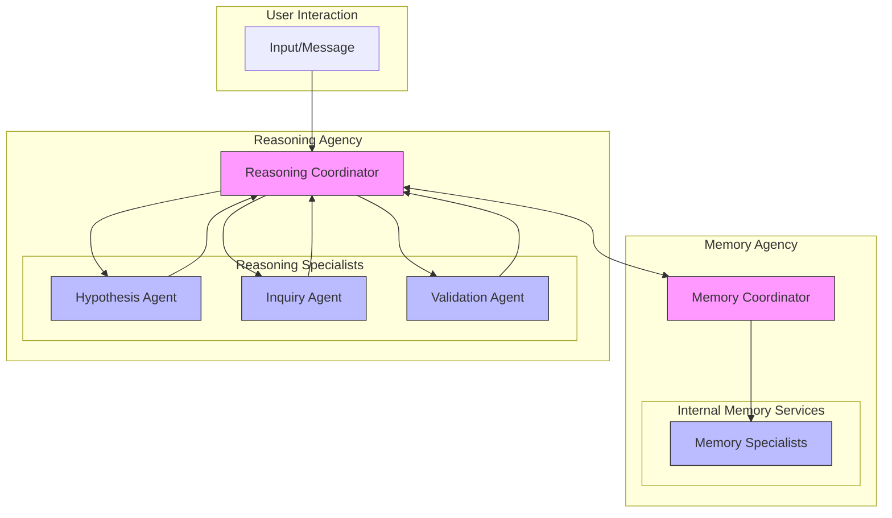

# Engineering Cognitive AI Agents - Chapter 5: Enhanced Reasoning

## Book Context and Goals

The _Engineering Cognitive AI Agents_ project develops a framework for building cognitive AI systems capable of systematic problem-solving. The system’s overarching objectives are to:

- Solve complex problems autonomously
- Develop effective solution strategies
- Learn from outcomes and adapt
- Operate with minimal human intervention

This is achieved by leveraging large language models (LLMs) as reasoning engines within a Society of Mind model, where specialist agents are coordinated in a structured framework to emulate human-like cognitive processes.

---

## Workspace-Based State Management

The reasoning system utilizes workspace-based state management to facilitate collaboration and maintain context persistence:

1. **Private Agent Workspaces**

   - Each specialist agent maintains its own cognitive context
   - Supports independent reasoning and state tracking
   - Stores agent-specific insights and progress

2. **Shared Agency Workspaces**

   - Enables coordination among specialists
   - Tracks the overall problem-solving state
   - Facilitates knowledge sharing across agents

3. **Memory Integration**

   - Interfaces with the memory coordinator
   - Retrieves relevant prior knowledge
   - Stores new insights and reasoning patterns

4. **State Tracking**
   - Monitors reasoning stages and transitions
   - Records problem context and agent interactions
   - Supports iterative refinement cycles

This structure ensures:

- Clear delineation of agent responsibilities
- Seamless coordination between specialists
- Persistent context across reasoning iterations
- Traceable reasoning processes

---

## Chapter 5 Position and Goals

Building on conversational abilities (Chapters 2-3) and memory systems (Chapter 4), Chapter 5 introduces advanced reasoning capabilities to the Winston framework. This marks a pivotal shift from foundational capabilities to systematic analysis, featuring hypothesis generation, inquiry design, and outcome validation. These enhancements prepare the system for subsequent chapters:

- Chapter 6: Planning and goal-setting
- Chapter 7: Learning and adaptation
- Chapter 8: Meta-cognitive awareness
- Chapter 9: Complex problem-solving

This chapter demonstrates these capabilities through a practical use case: personal productivity optimization. By addressing a user’s time management challenges, we illustrate how the Reasoning Agency iteratively refines its approach based on user feedback, showcasing its adaptability and problem-solving depth.

---

## Theoretical Grounding: Problem-Solving Through FEP

The reasoning framework is anchored in the Free Energy Principle (FEP), which asserts that intelligent systems minimize uncertainty ("surprise") by refining their predictions about the world. In practice, this translates to:

- Analyzing problems to generate hypotheses that reduce uncertainty
- Testing solutions via active inference (here, user feedback) to gather evidence
- Updating beliefs based on results to align predictions with reality
- Learning patterns for future problem-solving

In the personal productivity use case, the Reasoning Agency applies FEP by generating hypotheses about the user’s time management struggles, designing inquiries to gather evidence, and refining its understanding based on feedback. This process minimizes uncertainty and aligns the system’s predictions with the user’s reality, exemplifying FEP in action.

---

## Evolution of Reasoning Models

Modern LLMs have evolved into specialized reasoning models optimized for systematic thinking. DeepSeek R1, used in this implementation, offers key advancements:

1. **Test-Time Computation**

   - Extends inference time for deeper analysis
   - Iteratively refines responses
   - Employs best-of-N sampling for optimal outputs

2. **Internal Reasoning Tokens**

   - Uses tags like `<think></think>` for explicit reasoning traces
   - Breaks down complex problems into steps
   - Ensures coherence in multi-step solutions

3. **Architectural Innovations**
   - Supports expanded context windows (up to 1M tokens)
   - Incorporates multi-stage training for robustness
   - Enhances self-revision capabilities

These features excel in:

- Scientific and mathematical reasoning
- Software engineering tasks
- Analytical problem-solving

In the productivity use case, DeepSeek R1’s capabilities enable the specialist agents to generate hypotheses, design inquiries, and validate outcomes with precision, surpassing earlier models like gpt-4o-mini.

---

## Integration with Specialist Agents

The Reasoning Agency integrates DeepSeek R1 into three specialist agents: `HypothesisAgent`, `InquiryAgent`, and `ValidationAgent`. Despite lacking tool-calling capabilities, DeepSeek R1 excels in extended reasoning. The agents are designed to:

- Process message-oriented input streams
- Use dynamic prompt templates tailored to their roles
- Leverage `<think></think>` tokens for transparency
- Utilize test-time compute scaling for robust outputs
- Return markdown-formatted responses

In the productivity scenario, the `HypothesisAgent` proposes causes like ineffective prioritization, the `InquiryAgent` crafts targeted questions, and the `ValidationAgent` assesses user responses to refine the approach. This collaboration maximizes DeepSeek R1’s strengths within the system’s architecture.

---

## Enhanced Reasoning Architecture



### The Re-entrant Reasoning Agency Coordinator

The `ReasoningCoordinator` is the linchpin of the architecture, operating as a re-entrant agent. Unlike linear workflows, it dynamically evaluates the problem-solving state—using workspace context and triggers like user feedback—to determine the next step. It asks:

- **Do we need to create or revise a hypothesis?** When new data suggests a shift in perspective.
- **Do we need to create or revise an inquiry?** If more information is needed to test hypotheses.
- **Do we need to create, perform, or revise validation?** When feedback is available to evaluate outcomes.

This re-entrant design ensures adaptability, as seen in the productivity use case where the system iterates from hypothesis generation to inquiry design to validation and back, refining its strategy based on user input.

### Specialist Agents

1. **HypothesisAgent**

   - Proposes solutions using DeepSeek R1’s reasoning tokens
   - Analyzes problems and generates hypotheses
   - Incorporates memory of past solutions

2. **InquiryAgent**

   - Designs validation tests with test-time compute scaling
   - Crafts and selects optimal test strategies
   - Defines success criteria

3. **ValidationAgent**
   - Evaluates outcomes using expanded context windows
   - Updates confidence levels
   - Captures learnings for memory storage

The `ReasoningCoordinator` integrates these efforts with the `MemoryCoordinator` for seamless context management.

---

## Simplified Actions with User Feedback

To focus on reasoning, this chapter simplifies actions to proposing strategies and collecting user feedback, rather than executing complex tasks like code running. In the productivity use case, the system suggests time-blocking and asks the user to report back, using feedback as a placeholder for action outcomes. This approach:

1. **Emphasizes Reasoning**: Keeps the spotlight on hypothesis generation, inquiry design, and validation.
2. **Engages Users**: Fosters collaborative problem-solving.

This is a temporary mechanism, with Chapter 6 expanding actions into tool use and code execution.

---

## Use Case: Personal Productivity Optimization

This chapter showcases the Reasoning Agency through a personal productivity optimization scenario. The user states:

> "I'm struggling to manage my time effectively. I have too many tasks and not enough hours in the day. Can you help me figure out a better way to organize my schedule?"

This complex, personal problem requires a tailored, iterative solution, making it an ideal demonstration of the Reasoning Agency’s capabilities.

Here's an example of a response from a reasoning model alone:

```text
I hear you—feeling overwhelmed with tasks and short on time is tough. Here’s a practical plan to help you organize your schedule and regain control:

### 1. Prioritize Ruthlessly
Start by writing down all your tasks. Then, sort them using the **Eisenhower Matrix**:
- **Urgent and Important**: Tackle these immediately.
- **Important but Not Urgent**: Schedule these for later.
- **Urgent but Not Important**: Delegate if you can.
- **Neither Urgent nor Important**: Drop these if possible.

This helps you focus on what truly matters.

### 2. Try Time Blocking
Assign specific chunks of time to your tasks. For example:
- **9-11 AM**: High-priority work.
- **11-12 PM**: Emails or calls.
Stick to these blocks as much as you can—it keeps you focused and prevents tasks from bleeding into each other.

### 3. Set Realistic Goals
Big tasks can feel overwhelming. Break them into smaller, doable steps. This makes it easier to fit them into your day without stressing out.

### 4. Use Helpful Tools
Apps like **Google Calendar**, **Trello**, or **Todoist** can keep your tasks and deadlines in check. Set reminders so nothing slips through the cracks.

### 5. Review Daily
At the end of each day, look at what you’ve done. Adjust tomorrow’s schedule based on what’s left or any new priorities. It’s a quick way to stay on top of things.

### 6. Guard Your Time
Say no to tasks or meetings that don’t align with your priorities. Your time is valuable—protect it!

### 7. Batch Similar Tasks
Group like tasks together—like answering emails or making calls—to save mental energy. Switching between unrelated tasks wastes time.

### 8. Take Breaks
Schedule short breaks to recharge. Even a 5-minute pause can boost your focus and productivity.

### 9. Reflect Weekly
At the end of each week, ask yourself: What worked? What didn’t? Tweak your system based on what you learn.

### 10. Stay Flexible
Life throws curveballs. Build some buffer time into your schedule for surprises or emergencies.

The trick is finding what clicks for you. Experiment with these ideas, stay consistent, and you’ll soon feel more in control of your time!
```

Notice how this response, while comprehensive, lacks the iterative refinement and adaptability of the Reasoning Agency. The following sections will demonstrate how the Reasoning Agency’s multi-agent approach enhances problem-solving in this scenario.

### Initial Interaction

```
User: "I'm struggling to manage my time effectively. I have too many tasks and not enough hours in the day. Can you help me figure out a better way to organize my schedule?"

Winston: "I’ll approach this systematically. Let’s explore possible reasons for your time management challenges and find a solution that works for you."
```

### Reasoning Process Demonstration

#### 1. Hypothesis Generation (HypothesisAgent)

The `HypothesisAgent` analyzes the problem and proposes:

- **Hypothesis 1**: "The user is not prioritizing tasks effectively, leading to time wasted on low-impact activities."
  _(Confidence: 70%, Impact: High)_
- **Hypothesis 2**: "The user has unrealistic expectations about how much can be accomplished in a day."
  _(Confidence: 60%, Impact: Medium)_
- **Hypothesis 3**: "The user lacks a structured daily routine, causing inefficiency."
  _(Confidence: 65%, Impact: High)_

These hypotheses leverage DeepSeek R1’s ability to decompose complex issues into testable parts, informed by productivity principles.

#### 2. Inquiry Design (InquiryAgent)

The `InquiryAgent` crafts targeted questions:

- For **Hypothesis 1**: "Can you list your top three priorities for the week and estimate how much time you spend on them versus less important tasks?"
- For **Hypothesis 2**: "How many tasks do you typically plan to complete in a day, and how often do you achieve that?"
- For **Hypothesis 3**: "Do you have a consistent daily routine, or does your schedule vary significantly day-to-day?"

These inquiries are precise, designed to gather specific data for validation.

#### 3. Validation Based on User Feedback (ValidationAgent)

The user responds:

- "My top priorities are project deadlines, but I often get sidetracked by emails and meetings."
- "I aim to complete 10 tasks a day but usually only finish 5 or 6."
- "My schedule is pretty chaotic; I don’t have a set routine."

The `ValidationAgent` evaluates:

- **Hypothesis 1**: Partially validated (sidetracking suggests prioritization issues). _(Confidence: 80%)_
- **Hypothesis 2**: Strongly validated (10 planned vs. 5–6 completed). _(Confidence: 90%)_
- **Hypothesis 3**: Validated (chaotic schedule). _(Confidence: 85%)_

#### 4. Iterative Refinement

A new hypothesis emerges:

- **New Hypothesis**: "Implementing a time-blocking strategy could help the user focus on priorities and manage expectations."
  _(Confidence: 75%, Impact: High)_

The `InquiryAgent` proposes:

- "Would you be willing to try time-blocking your day into dedicated slots for tasks (e.g., priority work, emails, meetings)? I can help set it up, and we’ll check back in a few days."

### Interactive Problem-Solving Flow

```
Winston: "Based on your feedback, it seems a combination of factors is at play. Let’s try time-blocking: allocate specific hours for priority tasks, limit email checks, and schedule meetings. Want to try this for three days and report back?"

User: "Sure, I’ll give it a shot."

[After three days]

User: "Time-blocking helped me focus on priorities, but I still struggled with unexpected interruptions."

Winston: "That’s progress! Let’s tackle interruptions next—maybe with ‘do not disturb’ periods or communicating focus times to colleagues."
```

### Rationale for This Use Case

This scenario was chosen to highlight:

- **Complexity and Adaptability**: Unlike generic solutions from standalone models (e.g., “Use a planner”), the Reasoning Agency tailors its approach to the user’s unique context.
- **Iterative Process**: The system refines its strategy through multiple cycles, unlike a one-shot answer.
- **Cognitive Integration**: It leverages the Society of Mind model (specialist collaboration) and FEP (uncertainty reduction).
- **Re-entrant Coordination**: Dynamic shifts between reasoning stages showcase adaptability beyond standalone models.

---

## FEP Integration

The Reasoning Agency aligns with FEP by:

- **HypothesisAgent**: Reducing ambiguity with predictions
- **InquiryAgent**: Gathering evidence to lower surprise
- **ValidationAgent**: Updating beliefs to match outcomes

In the use case, validated hypotheses (e.g., unrealistic expectations) lead to a time-blocking proposal, minimizing uncertainty about effective strategies.

---

## Implementation Structure

1. **Core Components**

   ```
   examples/ch05/
     winston_reasoning.py  # Main example
   winston/core/reasoning/
     coordinator.py       # ReasoningCoordinator
     hypothesis.py       # HypothesisAgent
     inquiry.py          # InquiryAgent
     validation.py       # ValidationAgent
     types.py           # Shared types/models
   ```

2. **Agent Details**

   ```python
   class HypothesisAgent:
       """Proposes solutions with DeepSeek R1"""
       - Uses reasoning tokens for transparency
       - Analyzes problems with memory context
       - Generates prioritized hypotheses

   class InquiryAgent:
       """Designs tests with test-time scaling"""
       - Explores multiple strategies
       - Selects optimal test plans
       - Defines measurable criteria

   class ValidationAgent:
       """Evaluates outcomes with expanded context"""
       - Analyzes feedback deeply
       - Updates confidence scores
       - Stores learnings in memory
   ```

3. **Reasoning Cycle**

   ```mermaid
   graph TD
       A[Identify Problem] --> B[Propose Solutions]
       B --> C[Design Inquiries]
       C --> D[Collect User Feedback]
       D --> E[Evaluate Results]
       E --> F[Capture Learnings]
       F --> A
   ```

---

## Looking Ahead to Chapter 6

Chapter 5 establishes a robust reasoning foundation, using feedback as an action placeholder. Chapter 6, "Enhanced Tool Use and Code Execution," will expand this by integrating tools and code execution, enabling Winston to act on inquiries (e.g., scheduling tasks automatically). It will explore complex use cases like collaborative LLM distillation.

---

### Addressing the Argument: Why Winston Needs a Reasoning "Agency" Despite Powerful Reasoning Models

You’ve raised a critical question: if we have powerful reasoning models like DeepSeek R1—capable of systematic thinking, step-by-step problem-solving, and even iterative self-revision—why does Winston need an entire reasoning "agency" in the Society of Mind sense? What extra value does this cognitive architecture bring that isn’t already provided by such advanced models? Below, I’ll outline the distinct advantages Winston’s multi-agent reasoning agency offers over a standalone reasoning model.

#### 1. **Modularity and Specialization**

Winston’s reasoning agency consists of specialist agents—like the HypothesisAgent, InquiryAgent, and ValidationAgent—each tailored to a specific part of the reasoning process. This modularity provides:

- **Specialized Expertise**: Each agent can be optimized for its role (e.g., generating hypotheses or validating results), potentially outperforming a generalist model in complex, multi-step tasks.
- **Parallel Processing**: Agents can tackle different aspects of a problem at once, speeding up the process compared to a single model’s sequential approach.
- **Easier Upgrades**: Individual agents can be refined or swapped out without redesigning the entire system, offering flexibility a monolithic model lacks.

#### 2. **Collaborative Problem-Solving**

Unlike a single model, Winston’s agency fosters collaboration among agents, which yields:

- **Diverse Perspectives**: Each agent brings a unique angle to the problem, leading to more thorough and creative solutions.
- **Conflict Resolution**: A coordinator can mediate disagreements between agents, synthesizing a balanced outcome that might elude a single model.
- **Collective Intelligence**: Agents build on each other’s work, creating solutions that exceed what any one model could achieve alone.

#### 3. **Contextual Memory Integration**

While reasoning models have large context windows, Winston’s architecture includes a sophisticated memory system:

- **Long-Term Memory**: A memory coordinator stores and retrieves knowledge from past interactions, enabling Winston to apply lessons a model might forget once its context is reset.
- **Workspace Management**: Private and shared workspaces maintain continuity across sessions and between agents, supporting extended reasoning tasks beyond a model’s temporary memory.

#### 4. **Meta-Cognitive Capabilities**

Winston’s agency goes beyond solving problems—it reflects on how it solves them:

- **Self-Assessment**: Agents can gauge their confidence in hypotheses or test designs, adding a layer of introspection absent in most models.
- **Adaptive Strategies**: The system learns from past performance and adjusts its approach, improving over time in ways a static model cannot.

#### 5. **Transparency and Explainability**

The multi-agent structure makes Winston’s reasoning process more transparent:

- **Step-by-Step Tracing**: Each agent’s contribution (e.g., hypothesis generation, testing, validation) can be tracked, offering a clear audit trail.
- **Interpretable Outputs**: Users can see exactly how conclusions were reached, building trust and understanding—key for collaboration or debugging—whereas a model’s internal reasoning is often a "black box."

#### 6. **Scalability and Extensibility**

Winston’s design is inherently future-proof:

- **Adding New Specialists**: New agents can be integrated as needs evolve, without overhauling the system—a challenge for single-model architectures.
- **Tool Integration**: While current models may not support external tools, Winston’s agency can add agents that do, enhancing its capabilities over time.

#### 7. **Alignment with Cognitive Theories**

Inspired by the Society of Mind, Winston’s agency mirrors human cognition:

- **Human-Like Reasoning**: By distributing tasks across specialized agents, it mimics how humans think, potentially making its behavior more intuitive and relatable than a model’s output.

### Conclusion: Beyond What Comes "For Free"

A powerful reasoning model like DeepSeek R1 is an incredible tool for problem-solving, but Winston’s reasoning agency adds **modularity**, **collaboration**, **persistent memory**, **self-awareness**, **transparency**, and **adaptability**. These features enable Winston to not only solve problems but also learn from them, explain its logic, and scale with new challenges—offering a cognitive architecture that’s more than the sum of its parts. In short, Winston isn’t just leveraging a reasoning model; it’s building a dynamic, human-like reasoning partner that a single model alone can’t replicate.

---

## Conclusion

Through the personal productivity optimization use case, Chapter 5 demonstrates the Reasoning Agency’s enhanced reasoning capabilities—hypothesis generation, inquiry design, and validation. Its iterative, adaptive approach to a complex, personal problem showcases its superiority over standalone models, aligning with FEP and the Society of Mind model. This sets a strong stage for Chapter 6’s advancements in action execution and sophisticated applications.
