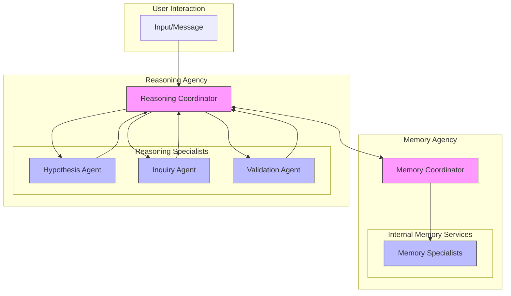

# Engineering Cognitive AI Agents - Chapter 5: Enhanced Reasoning

## Book Context and Goals

The "Engineering Cognitive AI Agents" project creates a framework for building cognitive AI systems that solve problems through systematic reasoning. The system aims to:

- Solve complex problems
- Develop solution strategies
- Learn from outcomes
- Operate autonomously

The approach uses LLMs as reasoning engines and implements the Society of Mind model through specialist agents.

## Workspace-Based State Management

The Society of Mind implementation uses workspace-based state management:

1. **Private Agent Workspaces**

   - Each specialist has its own cognitive context
   - Supports independent processing and state tracking
   - Records agent-specific insights and progress

2. **Shared Agency Workspaces**

   - Coordinates between specialists
   - Maintains problem-solving state
   - Enables knowledge sharing

3. **Memory Integration**

   - Interfaces with memory coordinator
   - Retrieves context-specific knowledge
   - Stores new insights
   - Records problem-solving patterns

4. **State Tracking**
   - Tracks reasoning stages
   - Records problem context
   - Manages specialist transitions
   - Supports refinement cycles

This workspace approach provides:

- State boundaries between agents
- Specialist coordination
- Context persistence
- Problem-solving tracking

## Chapter 5 Position and Goals

Following conversation capabilities (Ch2-3) and memory systems (Ch4), Chapter 5 adds reasoning capabilities. This moves from storing and recalling information to analyzing, testing, and learning from problems. These capabilities support:

- Chapter 6: Planning and goal-setting
- Chapter 7: Learning and adaptation
- Chapter 8: Meta-cognitive awareness
- Chapter 9: Complex problem-solving

## Theoretical Grounding: Problem-Solving Through FEP

The implementation uses the Free Energy Principle (FEP) for problem-solving:

- Problem analysis leads to solution hypotheses
- Solution testing through active inference
- Learning from results
- Building solution patterns

FEP serves as the underlying mechanism, with deeper integration in later chapters on meta-cognition and autopoiesis.

## Enhanced Reasoning Architecture



The ReasoningCoordinator manages three specialist agents, each with its own workspace while sharing an agency workspace:

1. **HypothesisAgent**:

   - Analyzes problems and proposes solutions
   - Records problem analysis and solution generation
   - Uses memory for past experiences

2. **InquiryAgent**:

   - Designs tests to validate solutions
   - Develops testing strategies
   - Records test execution and results

3. **ValidationAgent**:
   - Evaluates results
   - Records validation criteria and outcomes
   - Updates memory with insights

The ReasoningCoordinator uses workspace-based state management to coordinate specialists while interfacing with the MemoryCoordinator.

## Use Case: Cognitive Collaboration Partner

Chapter 5 demonstrates these capabilities through Winston's evolution into a generalized pair programming / deep collaboration partner. This use case provides:

1. **Rich Problem-Solving Opportunities**

   - Understanding technical challenges
   - Proposing solution approaches
   - Testing and validating solutions
   - Learning from implementation outcomes

2. **Natural Memory Integration**

   - Recalling similar problems solved
   - Adapting successful solutions
   - Learning from past failures
   - Building solution patterns

3. **Clear Demonstration of Problem-Solving**
   - Problem analysis and solution generation
   - Practical solution testing
   - Results evaluation and learning
   - Growing solution repertoire

## Implementation Structure

The enhanced reasoning capabilities are implemented through:

1. **Core Components**

   ```
   examples/ch05/
     winston_reasoning.py  # main example
   winston/core/reasoning/
     coordinator.py       # ReasoningCoordinator
     hypothesis.py       # HypothesisAgent
     inquiry.py          # InquiryAgent
     validation.py       # ValidationAgent
     types.py           # shared types/models
   ```

2. **Key Processes and Integration**

   Each specialist agent leverages memory in unique ways:

   ```python
   class HypothesisAgent:
       """Analyzes problems and proposes solutions"""
       - Understands problem context and constraints
       - Draws on past solution experiences
       - Generates potential solutions
       - Prioritizes by feasibility and impact

   class InquiryAgent:
       """Designs practical solution validation"""
       - Develops testing strategies
       - Defines success criteria
       - Plans empirical validation
       - Optimizes information gain

   class ValidationAgent:
       """Evaluates solutions and captures learnings"""
       - Assesses solution effectiveness
       - Identifies improvement areas
       - Captures key learnings
       - Updates solution knowledge
   ```

3. **Core Reasoning Cycle**
   ```mermaid
   graph TD
       A[Identify Problem] --> B[Analyze & Propose Solutions]
       B --> C[Design Solution Tests]
       C --> D[Execute Tests]
       D --> E[Evaluate Results]
       E --> F[Capture Learnings]
       F --> A
   ```

## Example Use Case: Collaborative LLM Distillation Design

In this example, Winston acts as a cognitive collaboration partner helping to solve the challenge of distilling reasoning capabilities from large language models into smaller, more efficient versions.

### Initial Interaction

```
User: "I want to explore approaches for distilling reasoning capabilities
      from large language models into smaller, more efficient versions.
      Let's analyze DeepSeek's recent breakthrough and design our own approach."

Winston: "I'll help analyze this problem. From our previous discussions of
model architectures and training approaches, I recall several relevant insights:
- The importance of preserving reasoning capabilities
- The tradeoff between efficiency and effectiveness
- The role of architecture choices in capability transfer

Let me analyze the problem and propose some potential solutions..."
```

### Reasoning Process Demonstration

#### 1. Problem Analysis and Solution Generation

```python
# HypothesisAgent analyzes the problem and proposes solutions
solutions = [
    {
        "approach": "Reasoning-Focused Distillation",
        "key_aspects": [
            "Preserve core reasoning mechanisms",
            "Optimize for reasoning tasks",
            "Maintain critical model components"
        ],
        "rationale": "Based on DeepSeek's 800K sample success"
    },
    {
        "approach": "Progressive Capability Transfer",
        "key_aspects": [
            "Staged reduction in model size",
            "Continuous validation of reasoning",
            "Targeted architecture optimization"
        ],
        "rationale": "Balances size reduction with capability preservation"
    }
]

# Leverage relevant past experiences
relevant_experience = memory.retrieve(
    context="model_compression",
    aspects=["capability_preservation", "architecture_optimization"]
)
```

### 2. Solution Testing Design

```python
# InquiryAgent designs validation approach
test_plan = [
    {
        "aspect": "Reasoning Preservation",
        "tests": [
            "Compare problem-solving capabilities",
            "Measure solution quality",
            "Assess reasoning depth"
        ]
    },
    {
        "aspect": "Efficiency Gains",
        "tests": [
            "Measure computational requirements",
            "Analyze memory usage",
            "Evaluate inference speed"
        ]
    }
]
```

### 3. Validation Framework

```python
# ValidationAgent defines evaluation criteria
validation_framework = {
    "success_criteria": [
        "Maintained problem-solving ability",
        "Improved computational efficiency",
        "Preserved solution quality",
        "Reduced resource requirements"
    ],
    "evaluation_methods": [
        "Benchmark problem sets",
        "Performance profiling",
        "Quality assessments",
        "Resource monitoring"
    ]
}
```

### Interactive Problem-Solving Flow

```
Winston: "After analyzing DeepSeek's approach and considering our goals,
I've identified several promising solutions:

1. Reasoning-Focused Distillation
   - Prioritize preserving problem-solving capabilities
   - Focus on core reasoning mechanisms
   - Optimize architecture for key functions

2. Progressive Capability Transfer
   - Systematic size reduction while maintaining capabilities
   - Continuous validation of reasoning abilities
   - Targeted optimization of critical components

Which solution direction interests you most? I can design specific
tests to validate the approach."

User: "Let's explore the reasoning-focused distillation approach.
      How would you validate it maintains problem-solving capabilities?"

Winston: "I'll design a validation strategy... Based on our experience with
model evaluation {memory.retrieve(context='capability_testing')},
I propose:

1. Validation Framework
   - Benchmark against complex reasoning tasks
   - Measure solution quality and efficiency
   - Compare problem-solving capabilities

Here's a specific testing plan we can implement..."
```

### Key Benefits of This Use Case

1. **Real-World Problem**

   - Complex technical challenge
   - Clear success criteria
   - Practical constraints

2. **Systematic Problem-Solving**

   - Thorough problem analysis
   - Multiple solution approaches
   - Rigorous validation methods

3. **Experience Integration**

   - Leverages past solutions
   - Applies learned insights
   - Builds solution knowledge

4. **Clear Reasoning Process**
   - Structured problem analysis
   - Solution generation and testing
   - Results evaluation and learning

This use case demonstrates:

- Systematic problem-solving approach
- Integration of past experiences
- Practical solution validation
- Continuous learning and improvement
