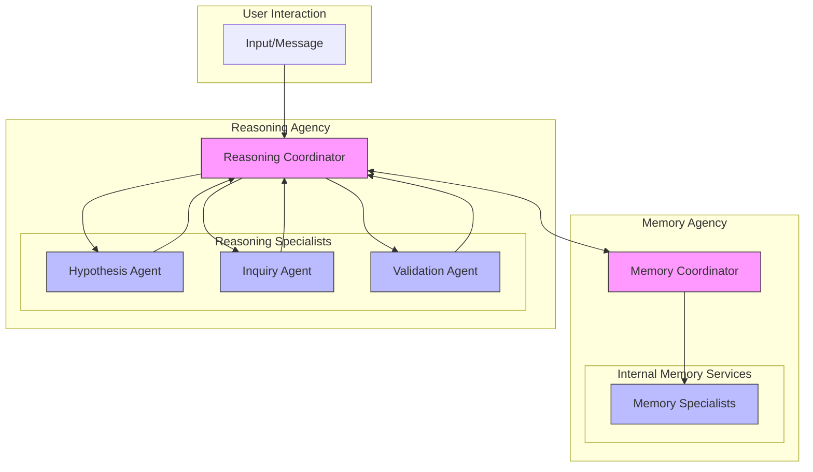

# Engineering Cognitive AI Agents - Chapter 5: Enhanced Reasoning

## Book Context and Goals

The _Engineering Cognitive AI Agents_ project develops a framework for building cognitive AI systems capable of systematic problem-solving. The system’s overarching objectives are to:

- Solve complex problems autonomously
- Develop effective solution strategies
- Learn from outcomes and adapt
- Operate with minimal human intervention

This is achieved by leveraging large language models (LLMs) as reasoning engines within a Society of Mind model, where specialist agents are coordinated in a structured framework to emulate human-like cognitive processes.

---

## Workspace-Based State Management

The reasoning system utilizes workspace-based state management to facilitate collaboration and maintain context persistence:

1. **Private Agent Workspaces**

   - Each specialist agent maintains its own cognitive context
   - Supports independent reasoning and state tracking
   - Stores agent-specific insights and progress

2. **Shared Agency Workspaces**

   - Enables coordination among specialists
   - Tracks the overall problem-solving state
   - Facilitates knowledge sharing across agents

3. **Memory Integration**

   - Interfaces with the memory coordinator
   - Retrieves relevant prior knowledge
   - Stores new insights and reasoning patterns

4. **State Tracking**
   - Monitors reasoning stages and transitions
   - Records problem context and agent interactions
   - Supports iterative refinement cycles

This structure ensures:

- Clear delineation of agent responsibilities
- Seamless coordination between specialists
- Persistent context across reasoning iterations
- Traceable reasoning processes

---

## Chapter 5 Position and Goals

Building on conversational abilities (Chapters 2-3) and memory systems (Chapter 4), Chapter 5 introduces advanced reasoning capabilities to the Winston framework. This marks a pivotal shift from foundational capabilities to systematic analysis, featuring hypothesis generation, inquiry design, and outcome validation. These enhancements prepare the system for subsequent chapters:

- Chapter 6: Planning and goal-setting
- Chapter 7: Learning and adaptation
- Chapter 8: Meta-cognitive awareness
- Chapter 9: Complex problem-solving

This chapter demonstrates these capabilities through a practical use case: personal productivity optimization. By addressing a user’s time management challenges, we illustrate how the Reasoning Agency iteratively refines its approach based on user feedback, showcasing its adaptability and problem-solving depth.

---

## Theoretical Grounding: Problem-Solving Through FEP

The reasoning framework is anchored in the Free Energy Principle (FEP), which asserts that intelligent systems minimize uncertainty ("surprise") by refining their predictions about the world. In practice, this translates to:

- Analyzing problems to generate hypotheses that reduce uncertainty
- Testing solutions via active inference (here, user feedback) to gather evidence
- Updating beliefs based on results to align predictions with reality
- Learning patterns for future problem-solving

In the personal productivity use case, the Reasoning Agency applies FEP by generating hypotheses about the user’s time management struggles, designing inquiries to gather evidence, and refining its understanding based on feedback. This process minimizes uncertainty and aligns the system’s predictions with the user’s reality, exemplifying FEP in action.

---

## Evolution of Reasoning Models

Modern LLMs have evolved into specialized reasoning models optimized for systematic thinking. DeepSeek R1, used in this implementation, offers key advancements:

1. **Test-Time Computation**

   - Extends inference time for deeper analysis
   - Iteratively refines responses
   - Employs best-of-N sampling for optimal outputs

2. **Internal Reasoning Tokens**

   - Uses tags like `<think></think>` for explicit reasoning traces
   - Breaks down complex problems into steps
   - Ensures coherence in multi-step solutions

3. **Architectural Innovations**
   - Supports expanded context windows (up to 1M tokens)
   - Incorporates multi-stage training for robustness
   - Enhances self-revision capabilities

These features excel in:

- Scientific and mathematical reasoning
- Software engineering tasks
- Analytical problem-solving

In the productivity use case, DeepSeek R1’s capabilities enable the specialist agents to generate hypotheses, design inquiries, and validate outcomes with precision, surpassing earlier models like gpt-4o-mini.

---

## Integration with Specialist Agents

The Reasoning Agency integrates DeepSeek R1 into three specialist agents: `HypothesisAgent`, `InquiryAgent`, and `ValidationAgent`. Despite lacking tool-calling capabilities, DeepSeek R1 excels in extended reasoning. The agents are designed to:

- Process message-oriented input streams
- Use dynamic prompt templates tailored to their roles
- Leverage `<think></think>` tokens for transparency
- Utilize test-time compute scaling for robust outputs
- Return markdown-formatted responses

In the productivity scenario, the `HypothesisAgent` proposes causes like ineffective prioritization, the `InquiryAgent` crafts targeted questions, and the `ValidationAgent` assesses user responses to refine the approach. This collaboration maximizes DeepSeek R1’s strengths within the system’s architecture.

---

## Enhanced Reasoning Architecture



### The Re-entrant Reasoning Agency Coordinator

The `ReasoningCoordinator` is the linchpin of the architecture, operating as a re-entrant agent. Unlike linear workflows, it dynamically evaluates the problem-solving state—using workspace context and triggers like user feedback—to determine the next step. It asks:

- **Do we need to create or revise a hypothesis?** When new data suggests a shift in perspective.
- **Do we need to create or revise an inquiry?** If more information is needed to test hypotheses.
- **Do we need to create, perform, or revise validation?** When feedback is available to evaluate outcomes.

This re-entrant design ensures adaptability, as seen in the productivity use case where the system iterates from hypothesis generation to inquiry design to validation and back, refining its strategy based on user input.

### Specialist Agents

1. **HypothesisAgent**

   - Proposes solutions using DeepSeek R1’s reasoning tokens
   - Analyzes problems and generates hypotheses
   - Incorporates memory of past solutions

2. **InquiryAgent**

   - Designs validation tests with test-time compute scaling
   - Crafts and selects optimal test strategies
   - Defines success criteria

3. **ValidationAgent**
   - Evaluates outcomes using expanded context windows
   - Updates confidence levels
   - Captures learnings for memory storage

The `ReasoningCoordinator` integrates these efforts with the `MemoryCoordinator` for seamless context management.

---

## Simplified Actions with User Feedback

To focus on reasoning, this chapter simplifies actions to proposing strategies and collecting user feedback, rather than executing complex tasks like code running. In the productivity use case, the system suggests time-blocking and asks the user to report back, using feedback as a placeholder for action outcomes. This approach:

1. **Emphasizes Reasoning**: Keeps the spotlight on hypothesis generation, inquiry design, and validation.
2. **Engages Users**: Fosters collaborative problem-solving.

This is a temporary mechanism, with Chapter 6 expanding actions into tool use and code execution.

---

## Use Cases

Here are five practical examples that illustrate how the Reasoning Agency can tackle non-trivial problems using the scientific method. Each example includes a problem statement, the importance of hypothesis development, types of experiments to conduct, and methods for verification. These examples demonstrate the system's ability to handle complex, real-world scenarios with household materials.

### 1. Effect of Colored Light on Plant Growth

- **Problem Statement**: How does the color of light affect the growth rate of plants?
- **Why Hypothesis Development is Important**: A hypothesis gives your experiment direction by predicting an outcome based on prior knowledge. For example, you might hypothesize that plants grow best under blue or red light because these wavelengths are absorbed most by chlorophyll for photosynthesis. This prediction helps you design the experiment and make sense of the results.
- **Types of Experiments**: Set up several small plants (e.g., bean sprouts or herbs) in identical pots with the same soil and water conditions. Place each plant under a different colored light (e.g., red, blue, green, white) using colored LED bulbs or filters over a lamp. Keep all other variables (like water and temperature) consistent. Measure growth—such as height, leaf count, or biomass—over 2-4 weeks.
- **How Verification Might Proceed**: Record growth data for each plant under its respective light color. Calculate averages for each condition and compare them. If you have enough plants, use a simple statistical test (like comparing averages or calculating differences) to see if one color stands out. Repeat the experiment to ensure the results are consistent.

### 2. Impact of Flour Type on Bread Texture

- **Problem Statement**: How does the type of flour (e.g., all-purpose, bread flour, whole wheat) affect the texture and rise of bread?
- **Why Hypothesis Development is Important**: A hypothesis helps you predict how flour properties might influence bread based on what you know. For instance, you could hypothesize that bread flour, with higher protein content, will produce a taller, chewier loaf due to stronger gluten formation. This guides your experiment and helps you interpret the outcomes.
- **Types of Experiments**: Use a basic bread recipe (e.g., flour, water, yeast, salt) and make multiple loaves, changing only the type of flour (e.g., all-purpose, bread flour, whole wheat). Bake them under identical conditions (same oven temperature and time). Measure the loaf volume (e.g., by displacing water in a container) and evaluate texture (e.g., chewiness or crumb density) through observation or taste.
- **How Verification Might Proceed**: Compare the loaf volumes and texture assessments. For texture, you could ask family or friends for blind taste-test ratings. Measure consistency by repeating the experiment and averaging the results. If you have a ruler or scale, quantify differences objectively.

### 3. Effectiveness of Natural Cleaning Agents on Oil Stains

- **Problem Statement**: Which natural cleaning agent (e.g., vinegar, baking soda, lemon juice) is most effective at removing oil stains from fabric?
- **Why Hypothesis Development is Important**: Developing a hypothesis lets you predict which agent might work best based on its properties. For example, you might hypothesize that baking soda, with its abrasive and absorbent qualities, will outperform vinegar or lemon juice. This shapes your experiment and gives you a framework to analyze the results.
- **Types of Experiments**: Create identical oil stains (e.g., cooking oil) on pieces of fabric (like old t-shirts). Treat each stain with a different cleaning agent—vinegar, baking soda paste, or lemon juice—using the same amount and method (e.g., rubbing for 2 minutes). Wash and dry the fabrics the same way, then check the stains.
- **How Verification Might Proceed**: Visually assess how much of each stain remains, or use a smartphone camera to compare color differences before and after treatment. Rank the agents by effectiveness. Test additional fabric samples or stain types (e.g., motor oil) to confirm your findings.

### 4. Pendulum Period and Its Dependence on Variables

- **Problem Statement**: What factors affect the period of a pendulum (the time for one swing)?
- **Why Hypothesis Development is Important**: A hypothesis lets you test a scientific principle. Based on physics, you might hypothesize that the period depends only on the pendulum’s length and not on the mass or swing size (for small angles). This prediction drives your experiment and lets you check theory against reality.
- **Types of Experiments**: Make a pendulum with a string and a weight (e.g., a washer or small toy). Test one variable at a time: change the string length (e.g., 20 cm, 40 cm, 60 cm), the weight (e.g., 1 washer vs. 3), or the starting angle (e.g., 10° vs. 30°). Time 10 swings with a stopwatch and divide by 10 for the period.
- **How Verification Might Proceed**: Plot the period against each variable. For length, expect a pattern (longer strings = longer periods). For mass and angle, check if the period stays roughly the same. Do multiple trials and average the times to reduce error. Compare your results to the physics formula (T ≈ 2π√(L/g)) if you’re curious.

### 5. Temperature Effect on Chemical Reaction Rates

- **Problem Statement**: How does temperature affect the rate of the reaction between baking soda and vinegar?
- **Why Hypothesis Development is Important**: A hypothesis applies chemistry basics to predict results. You might hypothesize that higher temperatures speed up the reaction because heat increases molecular energy (per the Arrhenius equation). This guides your setup and helps you understand the data.
- **Types of Experiments**: Mix baking soda and vinegar in equal amounts at different temperatures: cold (refrigerated vinegar), room temperature, and warm (heated vinegar, e.g., to 40°C). Measure the reaction rate by timing how long the fizzing lasts or by collecting CO₂ in a balloon and measuring its size over time.
- **How Verification Might Proceed**: Calculate the reaction rate (e.g., time to stop fizzing or CO₂ volume per minute) for each temperature. Plot the rates against temperature to see if they increase as expected. Run the experiment a few times to ensure the trend holds.

These problems are non-trivial because they involve multiple variables, require careful observation, and connect to real scientific principles—all while being doable at home. Hypothesis development keeps your experiments focused, the experiments themselves are hands-on and practical, and verification ensures your conclusions are reliable. Have fun exploring!

---

## FEP Integration

The Reasoning Agency aligns with FEP by:

- **HypothesisAgent**: Reducing ambiguity with predictions
- **InquiryAgent**: Gathering evidence to lower surprise
- **ValidationAgent**: Updating beliefs to match outcomes

In the use case, validated hypotheses (e.g., unrealistic expectations) lead to a time-blocking proposal, minimizing uncertainty about effective strategies.

---

## Implementation Structure

1. **Core Components**

   ```
   examples/ch05/
     winston_reasoning.py  # Main example
   winston/core/reasoning/
     coordinator.py       # ReasoningCoordinator
     hypothesis.py       # HypothesisAgent
     inquiry.py          # InquiryAgent
     validation.py       # ValidationAgent
     types.py           # Shared types/models
   ```

2. **Agent Details**

   ```python
   class HypothesisAgent:
       """Proposes solutions with DeepSeek R1"""
       - Uses reasoning tokens for transparency
       - Analyzes problems with memory context
       - Generates prioritized hypotheses

   class InquiryAgent:
       """Designs tests with test-time scaling"""
       - Explores multiple strategies
       - Selects optimal test plans
       - Defines measurable criteria

   class ValidationAgent:
       """Evaluates outcomes with expanded context"""
       - Analyzes feedback deeply
       - Updates confidence scores
       - Stores learnings in memory
   ```

3. **Reasoning Cycle**

   ```mermaid
   graph TD
       A[Identify Problem] --> B[Propose Solutions]
       B --> C[Design Inquiries]
       C --> D[Collect User Feedback]
       D --> E[Evaluate Results]
       E --> F[Capture Learnings]
       F --> A
   ```

---

## Looking Ahead to Chapter 6

Chapter 5 establishes a robust reasoning foundation, using feedback as an action placeholder. Chapter 6, "Enhanced Tool Use and Code Execution," will expand this by integrating tools and code execution, enabling Winston to act on inquiries (e.g., scheduling tasks automatically). It will explore complex use cases like collaborative LLM distillation.

---

### Addressing the Argument: Why Winston Needs a Reasoning "Agency" Despite Powerful Reasoning Models

You’ve raised a critical question: if we have powerful reasoning models like DeepSeek R1—capable of systematic thinking, step-by-step problem-solving, and even iterative self-revision—why does Winston need an entire reasoning "agency" in the Society of Mind sense? What extra value does this cognitive architecture bring that isn’t already provided by such advanced models? Below, I’ll outline the distinct advantages Winston’s multi-agent reasoning agency offers over a standalone reasoning model.

#### 1. **Modularity and Specialization**

Winston’s reasoning agency consists of specialist agents—like the HypothesisAgent, InquiryAgent, and ValidationAgent—each tailored to a specific part of the reasoning process. This modularity provides:

- **Specialized Expertise**: Each agent can be optimized for its role (e.g., generating hypotheses or validating results), potentially outperforming a generalist model in complex, multi-step tasks.
- **Parallel Processing**: Agents can tackle different aspects of a problem at once, speeding up the process compared to a single model’s sequential approach.
- **Easier Upgrades**: Individual agents can be refined or swapped out without redesigning the entire system, offering flexibility a monolithic model lacks.

#### 2. **Collaborative Problem-Solving**

Unlike a single model, Winston’s agency fosters collaboration among agents, which yields:

- **Diverse Perspectives**: Each agent brings a unique angle to the problem, leading to more thorough and creative solutions.
- **Conflict Resolution**: A coordinator can mediate disagreements between agents, synthesizing a balanced outcome that might elude a single model.
- **Collective Intelligence**: Agents build on each other’s work, creating solutions that exceed what any one model could achieve alone.

#### 3. **Contextual Memory Integration**

While reasoning models have large context windows, Winston’s architecture includes a sophisticated memory system:

- **Long-Term Memory**: A memory coordinator stores and retrieves knowledge from past interactions, enabling Winston to apply lessons a model might forget once its context is reset.
- **Workspace Management**: Private and shared workspaces maintain continuity across sessions and between agents, supporting extended reasoning tasks beyond a model’s temporary memory.

#### 4. **Meta-Cognitive Capabilities**

Winston’s agency goes beyond solving problems—it reflects on how it solves them:

- **Self-Assessment**: Agents can gauge their confidence in hypotheses or test designs, adding a layer of introspection absent in most models.
- **Adaptive Strategies**: The system learns from past performance and adjusts its approach, improving over time in ways a static model cannot.

#### 5. **Transparency and Explainability**

The multi-agent structure makes Winston’s reasoning process more transparent:

- **Step-by-Step Tracing**: Each agent’s contribution (e.g., hypothesis generation, testing, validation) can be tracked, offering a clear audit trail.
- **Interpretable Outputs**: Users can see exactly how conclusions were reached, building trust and understanding—key for collaboration or debugging—whereas a model’s internal reasoning is often a "black box."

#### 6. **Scalability and Extensibility**

Winston’s design is inherently future-proof:

- **Adding New Specialists**: New agents can be integrated as needs evolve, without overhauling the system—a challenge for single-model architectures.
- **Tool Integration**: While current models may not support external tools, Winston’s agency can add agents that do, enhancing its capabilities over time.

#### 7. **Alignment with Cognitive Theories**

Inspired by the Society of Mind, Winston’s agency mirrors human cognition:

- **Human-Like Reasoning**: By distributing tasks across specialized agents, it mimics how humans think, potentially making its behavior more intuitive and relatable than a model’s output.

### Conclusion: Beyond What Comes "For Free"

A powerful reasoning model like DeepSeek R1 is an incredible tool for problem-solving, but Winston’s reasoning agency adds **modularity**, **collaboration**, **persistent memory**, **self-awareness**, **transparency**, and **adaptability**. These features enable Winston to not only solve problems but also learn from them, explain its logic, and scale with new challenges—offering a cognitive architecture that’s more than the sum of its parts. In short, Winston isn’t just leveraging a reasoning model; it’s building a dynamic, human-like reasoning partner that a single model alone can’t replicate.

---

## Conclusion

Through the personal productivity optimization use case, Chapter 5 demonstrates the Reasoning Agency’s enhanced reasoning capabilities—hypothesis generation, inquiry design, and validation. Its iterative, adaptive approach to a complex, personal problem showcases its superiority over standalone models, aligning with FEP and the Society of Mind model. This sets a strong stage for Chapter 6’s advancements in action execution and sophisticated applications.
