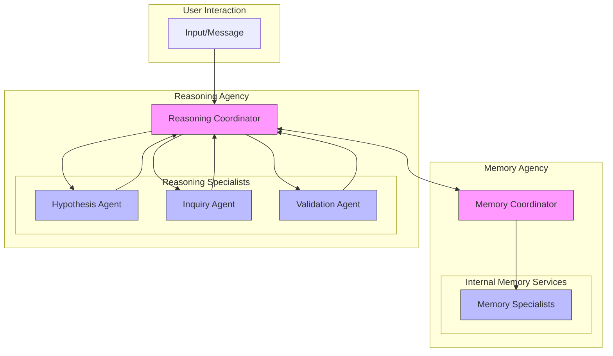

# Engineering Cognitive AI Agents - Chapter 5: Enhanced Reasoning

## Book Context and Goals

The "Engineering Cognitive AI Agents" project develops a framework for building cognitive AI systems that systematically solve problems. The system aims to:

- Solve complex problems autonomously
- Develop effective solution strategies
- Learn from outcomes and adapt
- Operate with minimal human intervention

The approach leverages large language models (LLMs) as reasoning engines, implementing a Society of Mind model through specialist agents coordinated within a structured framework.

---

## Workspace-Based State Management

The reasoning system employs workspace-based state management to ensure effective collaboration and context persistence:

1. **Private Agent Workspaces**

   - Each specialist maintains its own cognitive context
   - Supports independent reasoning and state tracking
   - Stores agent-specific insights and progress

2. **Shared Agency Workspaces**

   - Facilitates coordination between specialists
   - Tracks the overall problem-solving state
   - Enables knowledge sharing across agents

3. **Memory Integration**

   - Interfaces with the memory coordinator
   - Retrieves relevant prior knowledge
   - Stores new insights and reasoning patterns

4. **State Tracking**
   - Monitors reasoning stages and transitions
   - Records problem context and agent interactions
   - Supports iterative refinement cycles

This structure provides:

- Clear boundaries between agent responsibilities
- Coordinated specialist interactions
- Persistent problem-solving context
- Traceability of reasoning processes

---

## Chapter 5 Position and Goals

Building on conversational abilities (Chapters 2-3) and memory systems (Chapter 4), Chapter 5 introduces advanced reasoning capabilities. This shifts the focus from information storage and retrieval to systematic analysis, hypothesis testing, and learning. These capabilities lay the foundation for:

- Chapter 6: Planning and goal-setting
- Chapter 7: Learning and adaptation
- Chapter 8: Meta-cognitive awareness
- Chapter 9: Complex problem-solving

---

## Theoretical Grounding: Problem-Solving Through FEP

The reasoning framework is grounded in the Free Energy Principle (FEP), which posits that intelligent systems minimize uncertainty ("surprise") by refining their predictions. In practice:

- Problems are analyzed to generate hypotheses that reduce uncertainty
- Solutions are tested via active inference to gather evidence
- Results update beliefs, aligning predictions with reality
- Patterns are learned for future problem-solving

FEP provides a theoretical backbone, with practical applications demonstrated here and expanded in later chapters on meta-cognition.

---

## Evolution of Reasoning Models

Modern LLMs have evolved into specialized "reasoning models" optimized for systematic thinking. DeepSeek R1, an open-source leader in this category, introduces key advancements:

1. **Test-Time Computation**

   - Extends inference time for deeper analysis
   - Iteratively refines responses
   - Uses best-of-N sampling to select optimal outputs

2. **Internal Reasoning Tokens**

   - Employs tags like `<think></think>` for explicit reasoning traces
   - Decomposes complex problems into manageable steps
   - Ensures coherence across multi-step solutions

3. **Architectural Innovations**
   - Supports expanded context windows (up to 1M tokens)
   - Incorporates multi-stage training for robustness
   - Enhances self-revision capabilities

These features excel in:

- Scientific and mathematical reasoning
- Software engineering tasks
- Analytical problem-solving

DeepSeek R1 aligns with our goal of structured, transparent reasoning, replacing earlier models like gpt-4o-mini in this implementation.

---

## Integration with Specialist Agents

The reasoning architecture integrates DeepSeek R1 into three specialist agents: `HypothesisAgent`, `InquiryAgent`, and `ValidationAgent`. While DeepSeek R1 lacks tool-calling capabilities, it excels in extended reasoning. The agents:

- Process message-oriented input streams
- Use dynamic prompt templates tailored to their roles
- Leverage `<think></think>` tokens for transparency
- Utilize test-time compute scaling for robust outputs
- Return markdown-formatted responses

This maximizes DeepSeek R1’s strengths within the system’s constraints.

---

## Enhanced Reasoning Architecture



The `ReasoningCoordinator` orchestrates the specialists, each with private workspaces and access to a shared agency workspace:

1. **HypothesisAgent**

   - Uses DeepSeek R1’s reasoning tokens to propose solutions
   - Analyzes problems and generates hypotheses
   - Incorporates memory of past solutions

2. **InquiryAgent**

   - Leverages test-time compute scaling to design validation tests
   - Crafts multiple test strategies and selects the best
   - Defines success criteria and execution plans

3. **ValidationAgent**
   - Employs expanded context windows to evaluate test outcomes
   - Assesses results and updates confidence
   - Captures learnings for memory storage

The `ReasoningCoordinator` integrates these efforts with the `MemoryCoordinator` for context continuity.

---

## Use Case: Cognitive Collaboration Partner for LLM Distillation

Chapter 5 showcases Winston as a collaboration partner designing a distillation process for LLMs, using DeepSeek R1 to analyze its own reasoning capabilities and propose an efficient smaller model.

### Initial Interaction

```
User: "I want to distill reasoning capabilities from large language models into smaller, efficient versions. Let’s analyze DeepSeek’s approach and design our own method."

Winston: "I’ll break this down systematically. Drawing from our prior discussions on model architectures, I note:
- Reasoning preservation is critical
- Efficiency trades off with capability
- Architecture impacts transfer success

Using DeepSeek R1, I’ll analyze the problem and propose solutions..."
```

### Reasoning Process Demonstration

#### 1. Problem Analysis and Solution Generation (HypothesisAgent)

```markdown
<think>Distilling reasoning requires:

- Identifying DeepSeek R1’s key reasoning components (e.g., multi-stage training)
- Preserving these in a smaller model
- Testing gradual vs. direct reduction

Hypothesis: Progressive reduction retains reasoning better than direct compression.
</think>

**Hypothesis**: "Progressive capability transfer preserves reasoning performance."
**Confidence**: 0.85
**Impact**: 0.9
**Evidence**:

- Past success in staged reduction tasks
- DeepSeek’s training efficiency
  **Test Criteria**:
- Compare staged vs. direct reduction
- Measure reasoning retention per stage
```

#### 2. Solution Testing Design (InquiryAgent)

```markdown
<think>Testing options:

- Option 1: Benchmark staged vs. direct reduction
- Option 2: Measure resource and time efficiency
- Option 3: Test across model sizes

Best choice (via test-time scaling): Option 1 for direct reasoning focus.
</think>

**Test Design**: "Validate progressive transfer through staged reduction"
**Priority**: 0.9
**Complexity**: 0.7
**Requirements**:

- Base and target model architectures
- Reasoning benchmark dataset
  **Success Metrics**:
- Reasoning retention (%)
- Resource reduction (%)
- Inference time improvement
  **Steps**:

1. Establish baseline performance
2. Apply staged reduction
3. Measure retention per stage
4. Compare with direct reduction
```

#### 3. Validation Framework (ValidationAgent)

```markdown
<think>Results:

- Staged reduction: 92% retention
- Resource use: 65% decrease
- Inference time: 40% faster

This supports the hypothesis, boosting confidence.
</think>

**Hypothesis**: "Progressive capability transfer preserves reasoning performance"
**Evidence Quality**: 0.85
**Results**:

- Retention: 92%
- Resource use: -65%
- Time: -40%
  **Confidence Update**:
- From 0.85 to 0.90 (+0.05)
  **Refinements**:
- Test larger models
- Cross-domain validation
  **Learnings**:
- Staged reduction outperforms direct methods
- Core reasoning components must be prioritized
```

### Distillation Demonstration

Reasoning traces from DeepSeek R1 are collected and used to train a smaller model:

```python
# Collect traces during reasoning
traces = collect_reasoning_traces(agents=["Hypothesis", "Inquiry", "Validation"])

# Train smaller model with traces
distilled_model = train_model(traces=traces, base="DeepSeek R1", size="small")
```

This demonstrates how traces enhance transparency and enable practical distillation.

---

### Interactive Problem-Solving Flow

```
Winston: "I’ve analyzed the distillation challenge with DeepSeek R1 and propose two approaches:

1. **Reasoning-Focused Distillation**
   - Prioritize reasoning mechanisms
   - Optimize for key functions

2. **Progressive Capability Transfer**
   - Reduce size gradually
   - Validate reasoning at each stage

Which direction should we pursue? I can design detailed tests."

User: "Let’s go with progressive capability transfer. How do we validate it?"

Winston: "I’ll design a validation plan. Recalling our capability testing insights {memory.retrieve('validation_strategies')}, I suggest:

**Validation Plan**:
- Test staged reduction on reasoning benchmarks
- Measure retention and efficiency
- Compare with direct reduction

Here’s a detailed test outline..."
```

---

### FEP Integration

The reasoning process aligns with FEP by minimizing uncertainty:

- **HypothesisAgent**: Generates predictions to reduce problem ambiguity
- **InquiryAgent**: Designs tests to maximize evidence, lowering surprise
- **ValidationAgent**: Updates beliefs (e.g., confidence from 0.85 to 0.90) based on results

For instance, validation adjusts predictions to match observed outcomes, reducing "surprise" as per FEP.

---

## Implementation Structure

1. **Core Components**

   ```
   examples/ch05/
     winston_reasoning.py  # Main example
   winston/core/reasoning/
     coordinator.py       # ReasoningCoordinator
     hypothesis.py       # HypothesisAgent
     inquiry.py          # InquiryAgent
     validation.py       # ValidationAgent
     types.py           # Shared types/models
   ```

2. **Agent Details**

   ```python
   class HypothesisAgent:
       """Proposes solutions with DeepSeek R1"""
       - Uses reasoning tokens for transparency
       - Analyzes problems with memory context
       - Generates prioritized hypotheses

   class InquiryAgent:
       """Designs tests with test-time scaling"""
       - Explores multiple strategies
       - Selects optimal test plans
       - Defines measurable criteria

   class ValidationAgent:
       """Evaluates outcomes with expanded context"""
       - Analyzes test results deeply
       - Updates confidence scores
       - Stores learnings in memory
   ```

3. **Reasoning Cycle**

   ```mermaid
   graph TD
       A[Identify Problem] --> B[Propose Solutions]
       B --> C[Design Tests]
       C --> D[Execute Tests]
       D --> E[Evaluate Results]
       E --> F[Capture Learnings]
       F --> A
   ```

---

### Addressing the Argument: Why Winston Needs a Reasoning "Agency" Despite Powerful Reasoning Models

You’ve raised a critical question: if we have powerful reasoning models like DeepSeek R1—capable of systematic thinking, step-by-step problem-solving, and even iterative self-revision—why does Winston need an entire reasoning "agency" in the Society of Mind sense? What extra value does this cognitive architecture bring that isn’t already provided by such advanced models? Below, I’ll outline the distinct advantages Winston’s multi-agent reasoning agency offers over a standalone reasoning model.

#### 1. **Modularity and Specialization**

Winston’s reasoning agency consists of specialist agents—like the HypothesisAgent, InquiryAgent, and ValidationAgent—each tailored to a specific part of the reasoning process. This modularity provides:

- **Specialized Expertise**: Each agent can be optimized for its role (e.g., generating hypotheses or validating results), potentially outperforming a generalist model in complex, multi-step tasks.
- **Parallel Processing**: Agents can tackle different aspects of a problem at once, speeding up the process compared to a single model’s sequential approach.
- **Easier Upgrades**: Individual agents can be refined or swapped out without redesigning the entire system, offering flexibility a monolithic model lacks.

#### 2. **Collaborative Problem-Solving**

Unlike a single model, Winston’s agency fosters collaboration among agents, which yields:

- **Diverse Perspectives**: Each agent brings a unique angle to the problem, leading to more thorough and creative solutions.
- **Conflict Resolution**: A coordinator can mediate disagreements between agents, synthesizing a balanced outcome that might elude a single model.
- **Collective Intelligence**: Agents build on each other’s work, creating solutions that exceed what any one model could achieve alone.

#### 3. **Contextual Memory Integration**

While reasoning models have large context windows, Winston’s architecture includes a sophisticated memory system:

- **Long-Term Memory**: A memory coordinator stores and retrieves knowledge from past interactions, enabling Winston to apply lessons a model might forget once its context is reset.
- **Workspace Management**: Private and shared workspaces maintain continuity across sessions and between agents, supporting extended reasoning tasks beyond a model’s temporary memory.

#### 4. **Meta-Cognitive Capabilities**

Winston’s agency goes beyond solving problems—it reflects on how it solves them:

- **Self-Assessment**: Agents can gauge their confidence in hypotheses or test designs, adding a layer of introspection absent in most models.
- **Adaptive Strategies**: The system learns from past performance and adjusts its approach, improving over time in ways a static model cannot.

#### 5. **Transparency and Explainability**

The multi-agent structure makes Winston’s reasoning process more transparent:

- **Step-by-Step Tracing**: Each agent’s contribution (e.g., hypothesis generation, testing, validation) can be tracked, offering a clear audit trail.
- **Interpretable Outputs**: Users can see exactly how conclusions were reached, building trust and understanding—key for collaboration or debugging—whereas a model’s internal reasoning is often a "black box."

#### 6. **Scalability and Extensibility**

Winston’s design is inherently future-proof:

- **Adding New Specialists**: New agents can be integrated as needs evolve, without overhauling the system—a challenge for single-model architectures.
- **Tool Integration**: While current models may not support external tools, Winston’s agency can add agents that do, enhancing its capabilities over time.

#### 7. **Alignment with Cognitive Theories**

Inspired by the Society of Mind, Winston’s agency mirrors human cognition:

- **Human-Like Reasoning**: By distributing tasks across specialized agents, it mimics how humans think, potentially making its behavior more intuitive and relatable than a model’s output.

### Conclusion: Beyond What Comes "For Free"

A powerful reasoning model like DeepSeek R1 is an incredible tool for problem-solving, but Winston’s reasoning agency adds **modularity**, **collaboration**, **persistent memory**, **self-awareness**, **transparency**, and **adaptability**. These features enable Winston to not only solve problems but also learn from them, explain its logic, and scale with new challenges—offering a cognitive architecture that’s more than the sum of its parts. In short, Winston isn’t just leveraging a reasoning model; it’s building a dynamic, human-like reasoning partner that a single model alone can’t replicate.

---

## Conclusion

Chapter 5 enhances Winston’s reasoning capabilities using DeepSeek R1 within a multi-agent architecture. By leveraging reasoning tokens, test-time compute scaling, and expanded context, the system achieves transparent, systematic problem-solving aligned with FEP. The LLM distillation use case illustrates practical applications, from analyzing reasoning processes to training smaller models with collected traces, positioning Winston as a powerful cognitive collaboration partner.
